## Object Layer Token: A Semantic Interoperability Protocol for Composable Digital Entities

<p align="center">
  
</p>

<div align="center">

<h3> CYBERIA </h3>

Network Object Layers

*The Cyberian frontier tokenomics*

Stackable Rendering Layers as a Unified Tokenized Reality

[](https://www.npmjs.com/package/cyberia) [](https://www.npmjs.org/package/cyberia)

</div>

---

**Version:** 1.0

**Status:** Draft

**Authors:** Underpost Engineering

---

## Abstract

This paper introduces the **Object Layer Protocol** — a semantic interoperability standard that defines digital entities as literally stackable rendering layers, each associated with a presentation, UX, economic, and mechanical reality. The protocol enables composable, verifiable, and interoperable digital objects across decentralized runtimes by binding four distinct semantic layers into a single atomic unit. A reference implementation is provided through **Cyberia Online**, a browser-based MMORPG deployed on Hyperledger Besu, where the protocol is realized as an ERC-1155 multi-token contract managed through Kubernetes infrastructure via the Underpost CI/CD CLI.

The Object Layer Protocol is not a token standard — it is a **semantic interoperability layer** that happens to use ERC-1155 as its on-chain ledger binding. The innovation lies in the composable, layer-first architecture where every entity in a runtime is a stack of independently addressable, independently renderable, and independently ownable layers — each carrying its own mechanical, presentational, experiential, and economic meaning.

---

## Table of Contents

1. **Executive Summary**
2. **Introduction**
    - 2.1 [Overview of the gaming industry and Cyberia Online](#header-2.1)
    - 2.2 [Problem statement: the absence of semantic interoperability in digital asset ownership](#header-2.2)
3. **The Object Layer Protocol**
    - 3.1 [Semantic interoperability through stackable layers](#header-3.1)
    - 3.2 [Four realities of an Object Layer](#header-3.2)
    - 3.3 [AtomicPrefab and layer-first rendering](#header-3.3)
    - 3.4 [Canonical Object Layer schema](#header-3.4)
    - 3.5 [Composability: entities as layer stacks](#header-3.5)
4. **Technology Stack**
    - 4.1 [Hyperledger Besu](#header-4.1)
    - 4.2 [Hardhat](#header-4.2)
    - 4.3 [OpenZeppelin ERC-1155 contracts](#header-4.3)
    - 4.4 [MongoDB schemas](#header-4.4)
    - 4.5 [IPFS storage](#header-4.5)
5. **Tokenomics**
    - 5.1 [ObjectLayerToken: unified multi-token contract](#header-5.1)
    - 5.2 [Token ID semantics: fungible, semi-fungible, and non-fungible](#header-5.2)
    - 5.3 [Token distribution and allocation](#header-5.3)
    - 5.4 [Governance and circulation](#header-5.4)
6. **Blockchain Network and Deployment**
    - 6.1 [Hyperledger Besu IBFT2/QBFT consensus](#header-6.1)
    - 6.2 [Kubernetes deployment architecture (kubeadm)](#header-6.2)
    - 6.3 [Hardhat deployment workflow](#header-6.3)
7. **On-Chain Lifecycle and Game Mechanics**
    - 7.1 [On-chain lifecycle: register → mint → transfer → burn](#header-7.1)
    - 7.2 [Decentralized player progression](#header-7.2)
    - 7.3 [Item crafting, trading, and incubation](#header-7.3)
8. **Security and Transparency**
    - 8.1 [Blockchain security measures](#header-8.1)
    - 8.2 [Smart contract audits](#header-8.2)
9. **Future Directions**
10. **References**

---

### 1. Executive Summary

Current approaches to digital asset tokenization treat tokens as isolated ledger entries — a balance, a URI, a metadata pointer. They lack a coherent semantic model that binds what an object *does*, what it *looks like*, how a *human understands it*, and what it *is worth* into a single interoperable unit.

The **Object Layer Protocol** solves this by defining a **semantic interoperability standard** where each digital entity is composed of literally stackable rendering layers, and each layer carries four bound realities:

| Reality | Semantic Role | Schema Path |
|---------|---------------|-------------|
| **Mechanical** | What the layer *does* — statistical attributes governing behavior | `data.stats` |
| **Presentational** | What the layer *looks like* — IPFS-addressed atlas sprite sheets | `data.render` |
| **Experiential (UX)** | What the layer *means to a human* — identifiers, descriptions, activation | `data.item` |
| **Economic** | What the layer *is worth* — on-chain ledger binding and ownership proof | `data.ledger` |

These four realities are not metadata annotations on a token. They are the **constitutive semantic dimensions** of the entity itself. A layer without mechanics is decorative. A layer without presentation is invisible. A layer without UX is incomprehensible. A layer without economics is unownable. The protocol requires all four.

The result is a composable, interoperable digital object format where:

- **Entities are stacks.** A player character is skin + armor + weapon + effect layers, each independently addressable and ownable.
- **Layers are atoms.** Each layer is a self-contained AtomicPrefab with its own four-reality representation, content hash, and IPFS persistence.
- **Ownership is semantic.** Holding an ERC-1155 token proves ownership not just of a balance — but of a complete four-dimensional semantic object.
- **Interoperability is structural.** Any runtime that understands the Object Layer schema can render, simulate, display, and trade any layer from any source.

The reference implementation deploys a single `ObjectLayerToken` (ERC-1155) contract on a Hyperledger Besu private network, managing both fungible in-game currency (CryptoKoyn) and all Object Layer items within one deployment. Infrastructure is orchestrated through Kubernetes clusters initialized via `kubeadm` and managed through the **Underpost CI/CD CLI**.

---

### 2. Introduction

<a name="header-2.1"/>

#### 2.1 Overview of the Gaming Industry and Cyberia Online

**The Rise of Multi-Platform Gaming, Procedural Algorithms, and AI Content Generation**

The gaming industry has experienced explosive growth in recent years, driven by the proliferation of mobile devices and the increasing demand for cross-platform gaming experiences (<a target="_top" href='https://www2.deloitte.com/us/en/insights/industry/technology/future-crossplay-gaming-demand.html'>1</a>,<a target="_top" href='https://unity.com/resources/gaming-report'>2</a>,<a target="_top" href='https://www.servers.com/news/blog/is-cross-platform-the-future-of-gaming'>3</a>,<a target="_top" href='https://www.servers.com/news/blog/my-6-big-takeaways-from-gdc-2023'>4</a>). Games like _Albion Online_ (<a target="_top" href='https://www.affinitymediagroup.co/albion'>case study</a>) have demonstrated the potential of non-linear MMORPGs by allowing players to build their own economies and explore vast virtual worlds.

A key factor in this growth has been the adoption of procedural content generation technologies. Games such as _Minecraft_ (<a target="_top" href='https://www.kodeby.com/blog/post/exploring-the-impact-of-procedural-generation-in-modern-game-development-techniques'>source</a>) have popularized the idea of randomly generated worlds, offering players unique and infinite experiences. These technologies, combined with advancements in artificial intelligence, have democratized content creation in video games.

**Artificial Intelligence and Content Generation**

Large language models (LLMs) and diffusion models are innovating how content is created for video games. These AI tools enable the rapid and efficient generation of:

- **Stories and scripts:** LLMs can create compelling and personalized narratives for each player.
- **Art assets:** Diffusion models generate a wide variety of art assets, such as characters, environments, and objects, at a significantly lower cost than traditional methods.
- **Virtual worlds:** The combination of LLMs and diffusion models enables the creation of coherent and dynamic virtual worlds, where every element is interconnected and responds to player actions.

**Impact on Cyberia Online**

Cyberia Online is poised to capitalize on these trends by offering a unique browser-based MMORPG set in a cyberpunk universe. As a non-linear sandbox game, Cyberia Online empowers players to explore a dynamic world and shape their own narratives. By procedurally generating vast areas of its cyberpunk world, Cyberia Online ensures that each player has a unique and personalized experience. Additionally, AI will be used to create dynamic stories and characters that players can interact with meaningfully.

**Key Features of Cyberia Online**

- Browser-based, cross-platform accessibility
- Open source auditable
- Trusted character and items ownership via the Object Layer Protocol
- Sandbox non-linear gameplay
- Free-to-play
- Pixel art aesthetic
- Action RPG mechanics
- Cyberpunk setting
- Content AI scalable

<a name="header-2.2"/>

#### 2.2 Problem Statement: The Absence of Semantic Interoperability in Digital Asset Ownership

The fundamental problem with existing digital asset standards is that they conflate **ownership** with **identity**. Owning an ERC-721 or ERC-1155 token proves you hold a balance — but it says nothing structural about what the asset *is*, what it *does*, how it *renders*, or how a human *understands* it. Metadata URIs are an afterthought, not a constitutive part of the asset's semantic identity.

This creates several cascading failures:

- **No structural interoperability:** Two games cannot share assets because there is no common semantic schema — only opaque metadata blobs.
- **Presentation is disconnected from ownership:** The visual representation of an asset lives on a server or IPFS with no formal binding to the token's mechanical or economic identity.
- **UX is an afterthought:** Human-readable names, descriptions, and interaction flags are buried in unstructured JSON, not part of the asset's protocol-level definition.
- **Composition is impossible:** There is no standard way to say "this entity is composed of these five independently-owned layers stacked in this order."

Traditional MMORPGs compound these problems with centralized servers that raise concerns about (<a target="_top" href='https://ieeexplore.ieee.org/abstract/document/10585540'>source</a>):

- **Lack of ownership:** Players invest significant time but lack true ownership of digital assets. Server shutdowns erase player progress.
- **Opacity and manipulation:** Game developers hold power over in-game economies, potentially manipulating item value or introducing pay-to-win mechanics.
- **Security risks:** Centralized servers are vulnerable to hacks or exploits.

The Object Layer Protocol addresses all of these by defining a **semantic interoperability standard** where every digital entity is a stack of layers, each layer carries four bound realities, and ownership is proven on-chain through a single ERC-1155 contract deployment.

---

### 3. The Object Layer Protocol

<a name="header-3.1"/>

#### 3.1 Semantic Interoperability Through Stackable Layers

The core innovation of the Object Layer Protocol is the recognition that a digital entity is not a single atomic thing — it is a **stack of semantically complete layers**.

Consider a player character in an MMORPG. It is not one object. It is:

```
┌─────────────────────────────────┐
│  Effect Layer (glow, particles) │  ← z-order: 4
├─────────────────────────────────┤
│  Weapon Layer (hatchet)         │  ← z-order: 3
├─────────────────────────────────┤
│  Armor Layer (cyber-vest)       │  ← z-order: 2
├─────────────────────────────────┤
│  Skin Layer (base character)    │  ← z-order: 1
└─────────────────────────────────┘
```

Each layer in this stack is an **independently complete semantic unit**. The weapon layer has its own stats (damage, range), its own sprite sheet (render), its own human-readable identity (item), and its own on-chain token (ledger). It can be:

- **Rendered independently** — draw just the weapon on a trading screen.
- **Owned independently** — transfer the weapon to another player without affecting the skin.
- **Simulated independently** — apply the weapon's stats in a combat calculation.
- **Understood independently** — display the weapon's name, type, and description in a tooltip.

This is what we mean by **semantic interoperability**: any system that understands the Object Layer schema can fully render, simulate, display, and trade any layer from any source. The interoperability is not at the token level (any ERC-1155 reader can see balances) — it is at the **semantic level** (any Object Layer reader can understand the complete four-dimensional meaning of the asset).

**Stackability is literal.** The client renderer composes layers by drawing lower layers first (skin) then higher layers (weapon), respecting transparency and z-order. This makes layering developer-friendly (simple stack semantics) and operable (many layers per entity). An entity with 10 layers simply has 10 independently addressable, independently ownable, independently renderable semantic units stacked in z-order.

<a name="header-3.2"/>

#### 3.2 Four Realities of an Object Layer

Every Object Layer binds four semantic realities into a single atomic unit:

| Reality | Schema Path | Role | Example |
|---------|-------------|------|---------|
| **Mechanical** | `data.stats` | Governs behavior in the runtime simulation | `{ effect: 7, resistance: 8, agility: 0, range: 4, intelligence: 8, utility: 2 }` |
| **Presentational** | `data.render` | Governs visual appearance via IPFS-addressed atlas sprite sheets | `{ cid: "bafkrei...atlas.png", metadataCid: "bafkreia...meta" }` |
| **Experiential (UX)** | `data.item` | Governs human comprehension — names, types, descriptions, activation | `{ id: "hatchet", type: "weapon", description: "A rusted hatchet", activable: true }` |
| **Economic** | `data.ledger` | Governs ownership and value via on-chain token binding | `{ type: "ERC1155", address: "0x...", tokenId: "uint256" }` |

These four realities are **constitutive**, not decorative. They define what the layer *is*:

- **Without mechanics**, a layer is decorative — it has no effect on the simulation.
- **Without presentation**, a layer is invisible — it cannot be rendered.
- **Without UX**, a layer is incomprehensible — no human can identify or interact with it.
- **Without economics**, a layer is unownable — it exists only as ephemeral server state.

The protocol requires all four realities to be present for an Object Layer to be considered complete and interoperable.

<a name="header-3.3"/>

#### 3.3 AtomicPrefab and Layer-First Rendering

An **AtomicPrefab** is the protocol's atomic unit — a self-contained Object Layer with all four realities, content-addressed on IPFS:

```
AtomicPrefab = {
  data: {
    stats:  { effect, resistance, agility, range, intelligence, utility },
    item:   { id, type, description, activable },
    ledger: { type, address, tokenId },
    render: { cid, metadataCid }
  },
  cid:    "bafk...json",       // IPFS CID of the stable JSON
  sha256: "a1b2c3..."          // Content hash for integrity verification
}
```

**Layer = Render.** A layer exists because it has a renderable presentation. The `data.render.cid` points to the atlas sprite sheet PNG; `data.render.metadataCid` points to the atlas metadata JSON (frame coordinates, dimensions, animation sequences).

**The client runtime operates as follows:**

1. **Receive** Object Layer references from the server or on-chain events (`tokenId` → `metadataCid`).
2. **Fetch** atlas metadata from IPFS, load atlas PNG(s).
3. **Compose** layers in z-order for each entity — lower layers drawn first, respecting transparency.
4. **Simulate** using `data.stats` for game mechanics.
5. **Display** using `data.item` for UX tooltips, inventory screens, and interaction prompts.

<a name="header-3.4"/>

#### 3.4 Canonical Object Layer Schema

**Stable JSON representation:**

```json
{
  "data": {
    "stats": {
      "effect": 7,
      "resistance": 8,
      "agility": 0,
      "range": 4,
      "intelligence": 8,
      "utility": 2
    },
    "item": {
      "id": "hatchet",
      "type": "weapon",
      "description": "A rusted hatchet found in the cyberpunk wastes",
      "activable": true
    },
    "ledger": {
      "type": "ERC1155",
      "address": "0x...",
      "tokenId": "uint256"
    },
    "render": {
      "cid": "bafkrei...atlas.png",
      "metadataCid": "bafkreia...meta"
    }
  },
  "cid": "bafk...json",
  "sha256": "a1b2c3..."
}
```

**Off-chain ↔ On-chain Mapping:**

| Off-chain (Object Layer) | On-chain (ERC-1155) |
|--------------------------|---------------------|
| `data.item.id` (e.g., "hatchet") | Token ID = `uint256(keccak256("cyberia.object-layer:hatchet"))` |
| `data.render.metadataCid` | `_tokenCIDs[tokenId]` → URI resolves to `ipfs://{metadataCid}` |
| `data.stats` | Off-chain only (MongoDB); referenced by token metadata |
| `data.ledger.type` | `"ERC1155"` |
| `data.ledger.address` | ObjectLayerToken contract address |
| `data.ledger.tokenId` | The deterministic uint256 token ID |

<a name="header-3.5"/>

#### 3.5 Composability: Entities as Layer Stacks

The protocol's composability model is defined by a simple principle: **an entity is an ordered stack of Object Layers**.

```
Entity(player_42) = [
  ObjectLayer("cyber-punk-skin-001"),    // z: 0 — base skin
  ObjectLayer("cyber-vest-armor"),       // z: 1 — armor
  ObjectLayer("hatchet"),                // z: 2 — weapon
  ObjectLayer("neon-glow-effect"),       // z: 3 — visual effect
]
```

Each layer in the stack is independently:

- **Ownable:** Each has its own ERC-1155 token ID. Transferring the weapon does not affect the skin.
- **Renderable:** The renderer draws layers in z-order. Removing a layer removes its visual contribution.
- **Simulatable:** The runtime composes stats from all layers for the entity's aggregate mechanical identity.
- **Tradeable:** Players can trade individual layers or use `safeBatchTransferFrom` for atomic multi-layer trades.

This composability is what makes the Object Layer Protocol a **semantic interoperability standard** rather than just a token scheme. Any system that understands the schema can:

1. Parse any Object Layer JSON.
2. Render its sprite sheet.
3. Apply its stats.
4. Display its UX identity.
5. Verify its on-chain ownership.
6. Compose it into entity stacks with other layers from other sources.

---

### 4. Technology Stack

<a name="header-4.1"/>

#### 4.1 Hyperledger Besu

- **Overview:** Hyperledger Besu is an enterprise-grade Ethereum client that provides a robust and secure platform for executing smart contracts. It supports IBFT2 and QBFT consensus algorithms, ensuring deterministic finality with low latency — ideal for a game economy requiring fast, reliable transactions.
- **Key Benefits:**
  - **Privacy and Security:** Offers advanced privacy features and security protocols for permissioned networks.
  - **Performance and Scalability:** Optimized for high-throughput and low-latency transactions with configurable block periods.
  - **Enterprise-Grade:** Designed for production environments with robust governance, monitoring (Prometheus/Grafana), and Kubernetes-native deployment support.
  - **EVM Compatibility:** Full Ethereum Virtual Machine compatibility enables standard Solidity smart contracts and OpenZeppelin libraries.

<a href='https://besu.hyperledger.org/' target='_top'>See official Hyperledger Besu documentation.</a>

<a name="header-4.2"/>

#### 4.2 Hardhat

- **Overview:** Hardhat is a powerful development environment for Ethereum. It streamlines the development, testing, and deployment of smart contracts, significantly accelerating the development cycle. The project uses Hardhat to compile, test, and deploy the ObjectLayerToken contract to Besu RPC endpoints.
- **Key Benefits:**
  - **Rapid Development:** Provides a rich set of tools and plugins for efficient development.
  - **Robust Testing:** Offers a comprehensive testing framework with snapshot-based fixtures to ensure code quality and security.
  - **Simplified Deployment:** Facilitates seamless deployment of smart contracts to multiple Besu network configurations (IBFT2, QBFT, Kubernetes).
  - **CLI Integration:** Deploy scripts produce JSON artifacts consumed by the Cyberia CLI (`bin/cyberia.js`) for end-to-end lifecycle management.

<a href='https://hardhat.org/docs' target='_top'>See official Hardhat documentation.</a>

<a name="header-4.3"/>

#### 4.3 OpenZeppelin ERC-1155 Contracts

- **Overview:** OpenZeppelin Contracts is a library of reusable, audited smart contract code. The ObjectLayerToken contract inherits from:
  - `ERC1155` — Core multi-token standard.
  - `ERC1155Burnable` — Allows token holders to destroy their tokens.
  - `ERC1155Pausable` — Allows the owner to freeze all transfers (emergency governance).
  - `ERC1155Supply` — On-chain total supply tracking per token ID.
  - `Ownable` — Access control for administrative functions (mint, pause, register).
- **Key Benefits:**
  - **Security:** Rigorously audited and battle-tested code.
  - **Efficiency:** Optimized for gas efficiency with batch operations.
  - **Flexibility:** Modular design allows combining multiple extensions in a single contract.

<a href='https://docs.openzeppelin.com/contracts/5.x/erc1155' target='_top'>See official OpenZeppelin ERC-1155 documentation.</a>

<a name="header-4.4"/>

#### 4.4 MongoDB Schemas

- **Overview:** MongoDB is a flexible, high-performance NoSQL database that enables efficient storage and retrieval of data. The Object Layer system stores the canonical four-reality representation (`data.stats`, `data.item`, `data.ledger`, `data.render`) in MongoDB, with `data.ledger` referencing the on-chain ERC-1155 token.
- **Ledger Schema:**
  ```json
  {
    "type": "ERC1155",
    "address": "0x...",
    "tokenId": "uint256 string"
  }
  ```
- **Key Benefits:**
  - **Scalability:** Easily horizontal scales to handle increasing data volumes and user loads.
  - **Flexibility:** Schema-less design allows for dynamic data structures.
  - **High Performance:** Optimized for fast read and write operations.

<a href='https://www.mongodb.com/docs/' target='_top'>See official MongoDB documentation.</a>

<a name="header-4.5"/>

#### 4.5 IPFS Storage

- **Overview:** IPFS (InterPlanetary File System) is a distributed storage and file-sharing network. Object Layer assets are stored on IPFS with two CID references per item:
  - `data.render.cid` — The consolidated atlas sprite sheet PNG.
  - `data.render.metadataCid` — The atlas sprite sheet metadata JSON (frame coordinates, dimensions).
  - The ObjectLayerToken contract maps each token ID to its `metadataCid` on-chain, enabling trustless metadata resolution.
- **Key Benefits:**
  - **Decentralization:** Reduces reliance on centralized servers and improves data resilience.
  - **Content Addressing:** Efficiently stores and retrieves data based on its content hash, guaranteeing integrity.
  - **Global Distribution:** Distributes data across a network of nodes, enhancing availability.

<a href='https://docs.ipfs.tech/' target='_top'>See official IPFS documentation.</a>

---

### 5. Tokenomics

<a name="header-5.1"/>

#### 5.1 ObjectLayerToken: Unified Multi-Token Contract

The `ObjectLayerToken` is a single ERC-1155 contract that serves as the **economic reality binding** for the Object Layer Protocol. It manages the entire Cyberia Online token economy — not as the protocol itself, but as the on-chain ledger layer (`data.ledger`) that anchors ownership of semantically complete Object Layers.

This design adds to the standard OpenZeppelin ERC-1155 implementation:

- **On-chain item registry:** Maps token IDs to human-readable item identifiers and IPFS metadata CIDs.
- **Deterministic token IDs:** `computeTokenId(itemId) = uint256(keccak256("cyberia.object-layer:" || itemId))`.
- **Batch registration:** Register and mint multiple item types in one transaction.
- **Pause/unpause:** Emergency governance to freeze all transfers.
- **Supply tracking:** On-chain total supply per token ID via `ERC1155Supply`.

**Proposed Smart Contract**

```solidity
// SPDX-License-Identifier: MIT
// Compatible with OpenZeppelin Contracts ^5.0.0
pragma solidity ^0.8.20;

import '@openzeppelin/contracts/token/ERC1155/ERC1155.sol';
import '@openzeppelin/contracts/token/ERC1155/extensions/ERC1155Burnable.sol';
import '@openzeppelin/contracts/token/ERC1155/extensions/ERC1155Pausable.sol';
import '@openzeppelin/contracts/token/ERC1155/extensions/ERC1155Supply.sol';
import '@openzeppelin/contracts/access/Ownable.sol';

/**
 * @title ObjectLayerToken
 * @dev Unified ERC-1155 multi-token contract for the Cyberia Online Object Layer ecosystem.
 *
 * Token ID 0 (CRYPTOKOYN): Fungible in-game currency.
 * Token IDs >= 1: Object Layer items — unique (supply 1) or stackable (supply > 1).
 *
 * Features: mint, batch-mint, burn, batch-burn, pause/unpause, supply tracking,
 * on-chain item registry with IPFS metadata CID resolution.
 */
contract ObjectLayerToken is ERC1155, ERC1155Burnable, ERC1155Pausable, ERC1155Supply, Ownable {
  uint256 public constant CRYPTOKOYN = 0;
  uint256 public constant INITIAL_CRYPTOKOYN_SUPPLY = 10_000_000 * 1e18;

  string private _baseTokenURI;
  mapping(uint256 => string) private _tokenCIDs;
  mapping(uint256 => string) private _itemIds;
  mapping(bytes32 => uint256) private _itemIdToTokenId;
  uint256 private _nextTokenId;

  event ObjectLayerRegistered(
    uint256 indexed tokenId, string itemId, string metadataCid, uint256 initialSupply
  );
  event MetadataUpdated(uint256 indexed tokenId, string metadataCid);

  constructor(address initialOwner, string memory baseURI)
    ERC1155(baseURI)
    Ownable(initialOwner)
  {
    _baseTokenURI = baseURI;
    _nextTokenId = 1;
    _itemIds[CRYPTOKOYN] = 'cryptokoyn';
    _itemIdToTokenId[keccak256(abi.encodePacked('cryptokoyn'))] = CRYPTOKOYN;
    _mint(initialOwner, CRYPTOKOYN, INITIAL_CRYPTOKOYN_SUPPLY, '');
    emit ObjectLayerRegistered(CRYPTOKOYN, 'cryptokoyn', '', INITIAL_CRYPTOKOYN_SUPPLY);
  }

  function uri(uint256 tokenId) public view override returns (string memory) {
    string memory tokenCid = _tokenCIDs[tokenId];
    if (bytes(tokenCid).length > 0) {
      return string(abi.encodePacked(_baseTokenURI, tokenCid));
    }
    return super.uri(tokenId);
  }

  function computeTokenId(string calldata itemId) public pure returns (uint256) {
    return uint256(keccak256(abi.encodePacked('cyberia.object-layer:', itemId)));
  }

  function registerObjectLayer(
    address to,
    string calldata itemId,
    string calldata metadataCid,
    uint256 initialSupply,
    bytes calldata data
  ) external onlyOwner returns (uint256 tokenId) {
    tokenId = computeTokenId(itemId);
    require(bytes(_itemIds[tokenId]).length == 0, 'ObjectLayerToken: item already registered');
    _itemIds[tokenId] = itemId;
    _itemIdToTokenId[keccak256(abi.encodePacked(itemId))] = tokenId;
    if (bytes(metadataCid).length > 0) _tokenCIDs[tokenId] = metadataCid;
    if (initialSupply > 0) _mint(to, tokenId, initialSupply, data);
    emit ObjectLayerRegistered(tokenId, itemId, metadataCid, initialSupply);
  }

  function mint(address to, uint256 tokenId, uint256 amount, bytes calldata data)
    external onlyOwner
  {
    _mint(to, tokenId, amount, data);
  }

  function mintBatch(address to, uint256[] calldata ids, uint256[] calldata amounts, bytes calldata data)
    external onlyOwner
  {
    _mintBatch(to, ids, amounts, data);
  }

  function pause() external onlyOwner { _pause(); }
  function unpause() external onlyOwner { _unpause(); }

  function getItemId(uint256 tokenId) external view returns (string memory) { return _itemIds[tokenId]; }
  function getTokenIdByItemId(string calldata itemId) external view returns (uint256) {
    return _itemIdToTokenId[keccak256(abi.encodePacked(itemId))];
  }
  function getMetadataCID(uint256 tokenId) external view returns (string memory) { return _tokenCIDs[tokenId]; }

  function _update(address from, address to, uint256[] memory ids, uint256[] memory values)
    internal override(ERC1155, ERC1155Pausable, ERC1155Supply)
  {
    super._update(from, to, ids, values);
  }
}
```

**Understanding the ObjectLayerToken Smart Contract**

This Solidity smart contract implements the ERC-1155 multi-token standard as the **economic reality layer** of the Object Layer Protocol:

**Inherited Contracts:**
- **ERC1155:** Core multi-token standard for fungible and non-fungible tokens.
- **ERC1155Burnable:** Allows token holders to burn (destroy) their tokens.
- **ERC1155Pausable:** Allows the owner to pause all token transfers for emergency governance.
- **ERC1155Supply:** Tracks on-chain total supply per token ID.
- **Ownable:** Access control ensuring only the contract owner can mint, register, and pause.

**Constructor:**
- Mints 10 million CryptoKoyn (token ID 0) to the deployer with 18-decimal precision.
- Registers "cryptokoyn" as the item identifier for token ID 0.
- Sets the base IPFS URI prefix for metadata resolution.

**Key Functions:**
- `registerObjectLayer(to, itemId, metadataCid, initialSupply, data)` — Registers a new Object Layer item on-chain, assigns a deterministic token ID, stores the IPFS metadata CID, and mints the initial supply.
- `computeTokenId(itemId)` — Pure function returning the deterministic `uint256` token ID for any item identifier.
- `mint(to, tokenId, amount, data)` — Mints additional supply for an existing token.
- `mintBatch(to, ids, amounts, data)` — Batch-mints multiple token types in one transaction.
- `burn(account, tokenId, amount)` — Holders destroy their own tokens (inherited from ERC1155Burnable).
- `pause()` / `unpause()` — Emergency freeze/unfreeze of all transfers.
- `uri(tokenId)` — Resolves metadata URI: `ipfs://{per-token-CID}` or falls back to the base URI.

**Key Advantages:**
- **Single deployment** manages the entire game economy (currency + all item types).
- **Batch operations** reduce gas costs for multi-asset transfers and minting.
- **Deterministic token IDs** from `keccak256` enable off-chain → on-chain mapping without a registry lookup.
- **IPFS metadata integration** via per-token CIDs links each on-chain token to its Object Layer atlas sprite sheet.

<a name="header-5.2"/>

#### 5.2 Token ID Semantics: Fungible, Semi-Fungible, and Non-Fungible

| Token Type | Token ID | Supply | Example |
|------------|----------|--------|---------|
| Fungible currency | 0 (CRYPTOKOYN) | 10,000,000 × 10^18 | In-game gold / CKY |
| Semi-fungible resource | `computeTokenId("gold-ore")` | 1,000,000 | Stackable crafting material |
| Semi-fungible consumable | `computeTokenId("health-potion")` | 100,000 | Stackable consumable |
| Non-fungible unique gear | `computeTokenId("legendary-hatchet")` | 1 | Unique weapon |
| Non-fungible skin | `computeTokenId("cyber-punk-skin-001")` | 1 | Unique character skin |

The ERC-1155 standard treats all token IDs uniformly. The distinction between fungible, semi-fungible, and non-fungible is purely semantic based on the minted supply:
- **Fungible:** Large supply, divisible via balance transfers.
- **Semi-fungible:** Moderate supply, stackable but each unit is interchangeable.
- **Non-fungible:** Supply of exactly 1, making it unique and non-interchangeable.

**Fungibility semantics within the Object Layer Protocol:**
- **Supply = 1** → Non-fungible (unique gear, legendary items). The Object Layer is one-of-a-kind.
- **Supply > 1** → Semi-fungible (stackable resources like wood, stone, gold ore). Multiple instances of the same semantic layer.
- **Token ID 0 (CRYPTOKOYN)** → Fully fungible in-game currency with 18-decimal precision.

<a name="header-5.3"/>

#### 5.3 Token Distribution and Allocation

**CryptoKoyn (CKY) — Token ID 0**

- **Total Supply:** 10,000,000 CKY (with 18-decimal precision)
- **Initial Allocation:**
  - **90% Airdrop and Mint Pool:** Allocated to an airdrop pool and a minting pool to distribute tokens to players through gameplay activities, events, and rewards.
  - **10% Direct Investor Wallets:** Distributed to investor wallets proportionally to their financial participation.

**Object Layer Items — Token IDs ≥ 1**

- **Total Supply:** Variable per item type, based on game design requirements.
- **Distribution:**
  - **In-Game Activities:** Players can earn items by completing quests, achievements, or participating in events. Items are minted on-chain via `registerObjectLayer` or `mint`.
  - **Crafting:** Players craft items in-game; the server calls `mint` to issue the corresponding ERC-1155 token.
  - **Marketplace Trading:** ERC-1155 tokens can be freely traded via `safeTransferFrom` and `safeBatchTransferFrom`, enabling peer-to-peer item trading.

**Token Mechanics:**

- **Token Burning:** Players or the governance address can burn tokens via `burn` or `burnBatch`. Burning CryptoKoyn reduces circulating supply. Burning item tokens destroys the corresponding in-game item.
- **Staking:**
  - **Asset Freezing:** Staked tokens are frozen (held in a staking contract or governance address), removing them from circulation.
  - **Voting Rights:** Vote weight is proportional to staked amount and staking duration:

```
Vote Weight = 0.5 × (Amount Staked / Total Staked Amount) + 0.5 × (Staking Duration / Max Staking Duration)
```

**Item Incubation Time**

- **Variable Incubation:** The incubation time for items earned in-game varies based on item characteristics. Rarer or more powerful items have longer incubation periods before they can be minted as on-chain tokens.
- **Active Time:** The incubation period reflects active in-game usage, ensuring players have genuinely engaged with the item.

**Minting and On-Chain Conversion**

- **Earned In-Game Items:** Must undergo an incubation period before the server registers them on-chain via `registerObjectLayer`.
- **Crafted Items:** Farm, dropped, craft, and default items must undergo an incubation period and a CryptoKoyn minting fee before on-chain registration.

<a name="header-5.4"/>

#### 5.4 Governance and Circulation

```mermaid
flowchart LR

subgraph Circulation["Circulation"]
    Transformation["Transformation:<br> batch transfers<br> between players"]
    subgraph Players["Cyberia Online<br>players"]
    end
end

subgraph Governance-Runtime["Governance<br> Runtime Node <br> Server"]
    subgraph Sync["<br> <br> <br> <br> <br> <br> <br> <br> <br>Sync drain <br> burning protocol"]
        Stacking["Voting power"]
        Unlock-Features["Unlock Features"]
        subgraph Withdrawal["**Withdrawal Protocol** <br> Token to Fiat"]
        end
    end

    subgraph Faucet["<br><br><br><br><br><br><br>Faucet <br>validation <br> emitter protocol"]
        ERC-1155["**Token emitter** <br> ERC-1155 ObjectLayerToken <br> (CKY + Items)"]
        Airdrop-Mint["Airdrop Mint <br> pool"]
    end
    subgraph Coinbase["Coinbase <br> address"]
    end
end

Black-Market-Sales["External Markets <br>Sales"]
Burn["Burn"]

subgraph Legends["<span style='color: yellow'>&rarr; Virtual Currency/Items </span> <br> <span style='color: green'>&rarr; Fiat</span>"]
end

Investors ==> Coinbase
ERC-1155 ==> Airdrop-Mint
Players ==> |Stacking|Stacking
Players ==> |Buy <br> Consumption|Unlock-Features
Players <==> Black-Market-Sales
Players <==> Transformation
Sync ==> Burn
Coinbase==>|ICO|ERC-1155
Withdrawal==>|Sell<br>withdrawal<br>|Players
Players==>Withdrawal
Coinbase=======>|Liquidity Pool|Withdrawal
Sync==>|Supply renewal|Airdrop-Mint
Players==>Unlock-Features
ERC-1155==>Airdrop-Mint
Airdrop-Mint<==>Players
Airdrop-Mint==>|ICO|Investors
Investors==>Players

linkStyle 0 font-size: 25px, color: black, back: white,stroke: green;
linkStyle 1 font-size: 25px, color: black, back: white,stroke: yellow;
linkStyle 2 font-size: 25px, color: black, back: white,stroke: yellow;
linkStyle 3 font-size: 25px, color: black, back: white,stroke: yellow;
linkStyle 4 font-size: 25px, color: black, back: white,stroke: green;
linkStyle 5 font-size: 25px, color: black, back: white,stroke: yellow;
linkStyle 6 font-size: 25px, color: black, back: white,stroke: yellow;
linkStyle 7 font-size: 25px, color: black, back: white,stroke: yellow;
linkStyle 8 font-size: 25px, color: black, back: white,stroke: green;
linkStyle 9 font-size: 25px, color: black, back: white,stroke: yellow;
linkStyle 10 font-size: 25px, color: black, back: white,stroke: green;
linkStyle 11 font-size: 25px, color: black, back: white,stroke: yellow;
linkStyle 12 font-size: 25px, color: black, back: white,stroke: yellow;
linkStyle 13 font-size: 25px, color: black, back: white,stroke: yellow;
linkStyle 14 font-size: 25px, color: black, back: white,stroke: yellow;

classDef H1 font-size: 40px, pxline-height:10px;
classDef H2 font-size: 30px;
classDef H3 font-size: 25px;

classDef SR fill: gray, color: black;
classDef SR0 fill:#222222;
classDef SR1 height: 500px;

class Players H1;
class Players SR;

class Withdrawal H3;
class Legends H3;
class Governance-Runtime H2;
class Circulation H2;
class Circulation SR0;
class Coinbase H1;
class Faucet H2;
class Faucet SR1;
class ERC-1155 H3;
class Sync H2;
class Sync SR1;
class Stacking H3;
class Burn H3;
class Unlock-Features H3;
class Black-Market-Sales H3;
class Transformation H3;
class Investors H2;
class Airdrop-Mint H1;
```



---

### 6. Blockchain Network and Deployment

<a name="header-6.1"/>

#### 6.1 Hyperledger Besu IBFT2/QBFT Consensus

The ObjectLayerToken is deployed on a **Hyperledger Besu** private network using **IBFT2** or **QBFT** consensus algorithms:

- **IBFT2 (Istanbul Byzantine Fault Tolerance 2.0):** Provides immediate finality with configurable block periods (default: 2-5 seconds). Validators propose and vote on blocks; 2/3+1 agreement is required. Suitable for permissioned networks with known validators.
- **QBFT (Quorum Byzantine Fault Tolerance):** Evolution of IBFT2 with improved liveness guarantees and better handling of validator set changes. Recommended for production deployments.

**Network Configuration (genesis):**

```json
{
  "config": {
    "chainId": 777771,
    "berlinBlock": 0,
    "londonBlock": 0,
    "qbft": {
      "epochLength": 30000,
      "blockPeriodSeconds": 5,
      "requestTimeoutSeconds": 10
    }
  },
  "gasLimit": "0x1fffffffffffff",
  "difficulty": "0x1",
  "coinbase": "0x44e298766B94B53AdA033FE920748a398CC7cE63"
}
```

**Key Design Decisions:**
- **Gas price = 0:** On a private permissioned network, gas fees are not required for economic scarcity — the permissioning layer handles access control.
- **Deterministic finality:** IBFT2/QBFT guarantee that once a block is committed, it will never be reverted — critical for game item ownership.
- **Fast block times:** 2-5 second block periods provide near-real-time transaction confirmation for game interactions.

<a name="header-6.2"/>

#### 6.2 Kubernetes Deployment Architecture (kubeadm)

The Besu network runs as a Kubernetes deployment orchestrated via **kubeadm** clusters managed through the **Underpost CI/CD CLI** (`underpost cluster`). The Underpost CLI (`src/cli/index.js`) provides comprehensive cluster lifecycle management including initialization, configuration, component deployment, and teardown.

| Component | K8s Resource | Count | Description |
|-----------|--------------|-------|-------------|
| Validators | StatefulSet | 4 | Consensus-participating Besu nodes with persistent keys. |
| Members | StatefulSet | 3 | Transaction-submitting nodes (RPC endpoints). |
| Prometheus | Deployment | 1 | Metrics collection from all Besu nodes. |
| Grafana | Deployment | 1 | Dashboard for network monitoring. |

**Port Mapping:**
- `8545` — JSON-RPC (HTTP) — Hardhat connects here.
- `8546` — WebSocket — Real-time event subscriptions.
- `8547` — GraphQL.
- `30303` — P2P discovery (TCP + UDP).

**Cluster Initialization with Underpost CLI:**

The Underpost CLI wraps `kubeadm` initialization with automated host configuration, Calico CNI installation, and local-path provisioner setup:

```bash
# Install host prerequisites (Docker, Podman, kubeadm, kubelet, kubectl, Helm)
underpost cluster --init-host

# Apply base host configuration (SELinux, containerd, sysctl, firewall)
underpost cluster --config

# Initialize a kubeadm control plane with Calico CNI
underpost cluster --kubeadm --pod-network-cidr 192.168.0.0/16

# Set kubectl ownership for current user
underpost cluster --chown

# Deploy IPFS cluster for Object Layer asset storage
underpost cluster --ipfs --kubeadm

# Deploy MongoDB for off-chain Object Layer storage
underpost cluster --mongodb --kubeadm

# Deploy Prometheus monitoring
underpost cluster --prom node1:9100,node2:9100

# Deploy Grafana dashboards
underpost cluster --grafana --hosts besu-monitor.cyberia.online

# Switch namespace context
underpost cluster --ns-use cyberia

# Deploy the Besu IBFT2/QBFT network
cd quorum-kubernetes/playground/kubectl/quorum-besu/ibft2
./deploy.sh

# Verify nodes are communicating
kubectl exec -it besu-validator-0 -- curl -X POST \
  --data '{"jsonrpc":"2.0","method":"net_peerCount","params":[],"id":1}' \
  localhost:8545
```

**Deployment Management:**

```bash
# Build and deploy application pods
underpost deploy default-cyberia production --kubeadm --build-manifest

# Synchronize deployment environment
underpost deploy default-cyberia --sync --kubeadm

# View deployment status and network traffic
underpost deploy --status --kubeadm

# Port-forward Besu RPC for local Hardhat access
underpost deploy besu-validator-0 --port 8545:8545 --kubeadm
```

**Cluster Reset and Teardown:**

```bash
# Full cluster reset (kubeadm reset + filesystem cleanup)
underpost cluster --reset --kubeadm --remove-volume-host-paths

# Uninstall all host components
underpost cluster --uninstall-host
```

The `UnderpostCluster` module (`src/cli/cluster.js`) handles the complete lifecycle:
- **`--init-host`**: Installs Docker, Podman, Kind, kubeadm, kubelet, kubectl, and Helm on Rocky Linux hosts.
- **`--config`**: Configures SELinux (permissive), containerd (SystemdCgroup), swap (disabled), sysctl (bridge-nf-call-iptables), and firewalld (disabled).
- **`--kubeadm`**: Runs `kubeadm init`, installs Calico CNI, untaints control plane, installs local-path-provisioner.
- **`--reset`**: Executes `kubeadm reset --force`, cleans filesystem artifacts, restores SELinux contexts, purges container storage.

<a name="header-6.3"/>

#### 6.3 Hardhat Deployment Workflow

The `hardhat.config.cjs` defines multiple Besu network targets:

| Network Name | RPC URL | Description |
|--------------|---------|-------------|
| `besu-ibft2` | `http://127.0.0.1:8545` | Local IBFT2 (kubeadm port-forward or docker-compose). |
| `besu-qbft` | `http://127.0.0.1:8545` | Local QBFT network. |
| `besu-k8s` | `http://127.0.0.1:30545` | Kubernetes NodePort exposure. |

**Deploy the contract:**

```bash
cd hardhat
npx hardhat run scripts/deployObjectLayerToken.cjs --network besu-ibft2
```

The deployment script:
1. Connects to the Besu RPC endpoint using the coinbase private key.
2. Deploys the `ObjectLayerToken` contract.
3. Mints 10M CryptoKoyn to the deployer.
4. Writes a JSON deployment artifact to `hardhat/deployments/` for consumption by the Cyberia CLI and server.

**CLI Integration (`bin/cyberia.js`):**

The Cyberia CLI provides Besu chain lifecycle commands:

```bash
# Deploy the Besu k8s network
cyberia chain deploy

# Deploy the ObjectLayerToken contract
cyberia chain deploy-contract --network besu-ibft2

# Register an Object Layer item on-chain
cyberia chain register --item-id hatchet --metadata-cid bafkrei... --supply 1

# Mint additional tokens
cyberia chain mint --token-id 0 --to 0x... --amount 1000

# Query chain status
cyberia chain status
```

---

### 7. On-Chain Lifecycle and Game Mechanics

<a name="header-7.1"/>

#### 7.1 On-Chain Lifecycle: Register → Mint → Transfer → Burn

The full lifecycle of an Object Layer item through the ERC-1155 system:

```
┌─────────────────────────────────────────────────────────────────────────┐
│                         GAME SERVER (off-chain)                        │
│                                                                        │
│  1. buildObjectLayerDataFromDirectory() → { stats, item, render }      │
│  2. computeSha256(data) → sha256                                       │
│  3. Pin atlas PNG + metadata JSON to IPFS → { cid, metadataCid }       │
│  4. Store ObjectLayer document in MongoDB                              │
│                                                                        │
│                         ▼ INCUBATION PERIOD ▼                          │
│                                                                        │
│  5. registerObjectLayer(to, itemId, metadataCid, supply, data)         │
│     → ERC-1155 tokenId assigned                                        │
│  6. Update ObjectLayer.data.ledger = { type:"ERC1155", address, tokenId}│
│                                                                        │
└────────────────────────────┬────────────────────────────────────────────┘
                             │
                             ▼
┌─────────────────────────────────────────────────────────────────────────┐
│                     BESU BLOCKCHAIN (on-chain)                         │
│                                                                        │
│  ObjectLayerRegistered(tokenId, "hatchet", "bafkrei...", 1)            │
│                                                                        │
│  owner.balanceOf(tokenId) = 1                                          │
│                                                                        │
│  ── GAMEPLAY ──                                                        │
│  safeTransferFrom(server, player1, tokenId, 1, "0x")  ← quest reward  │
│  safeBatchTransferFrom(player1, player2, [...], [...]) ← player trade  │
│  mint(player1, resourceId, 500, "0x")                  ← enemy loot    │
│  burn(player2, resourceId, 25)                         ← crafting cost │
│                                                                        │
│  ── GOVERNANCE ──                                                      │
│  pause()                                               ← emergency     │
│  setTokenMetadataCID(tokenId, "new-cid")               ← content update│
│  unpause()                                             ← resume        │
│                                                                        │
└─────────────────────────────────────────────────────────────────────────┘
```

**Events emitted for indexing:**
- `ObjectLayerRegistered(tokenId, itemId, metadataCid, initialSupply)` — New item type registered.
- `TransferSingle(operator, from, to, id, value)` — Single token transfer.
- `TransferBatch(operator, from, to, ids, values)` — Batch token transfer.
- `MetadataUpdated(tokenId, metadataCid)` — Item metadata updated.

<a name="header-7.2"/>

#### 7.2 Decentralized Player Progression

A player's complete game state can be reconstructed from:

1. **CryptoKoyn balance:** `balanceOf(playerAddress, 0)` → in-game currency.
2. **Item ownership:** For each registered Object Layer token ID, `balanceOf(playerAddress, tokenId)` → inventory.
3. **Off-chain metadata:** Each token ID resolves to an IPFS metadata CID containing atlas sprite sheet coordinates, stats, and item descriptions.

This means a player's character — including all equipped layers (skin, weapon, armor, effects) and their economic standing — is verifiably anchored on-chain without requiring a centralized database for ownership records. The **semantic completeness** of each Object Layer ensures that the player's inventory is not just a list of token balances, but a collection of fully-defined four-reality entities that any interoperable runtime can render, simulate, and display.

<a name="header-7.3"/>

#### 7.3 Item Crafting, Trading, and Incubation

- **Crafting:** Players combine resources (semi-fungible tokens) in-game. The server burns the consumed resource tokens and mints the crafted item token. The new item is a complete Object Layer with all four realities.
- **Trading:** Players use `safeTransferFrom` for single-layer trades or `safeBatchTransferFrom` for multi-layer trades (e.g., weapon layer + 100 gold ore for a rare shield layer).
- **Incubation:** Items earned in-game undergo a variable incubation period based on rarity before the server mints them on-chain. This prevents instant sell-off and rewards sustained gameplay.
- **Minting Fee:** Converting off-chain items to on-chain ERC-1155 tokens requires a CryptoKoyn (token ID 0) fee, creating a CKY sink that supports token value.

---

### 8. Security and Transparency

<a name="header-8.1"/>

#### 8.1 Blockchain Security Measures

- **Permissioned Network:** Hyperledger Besu with IBFT2/QBFT runs as a permissioned network where only authorized validators can produce blocks.
- **Smart Contract Access Control:** `Ownable` restricts minting, registration, and pause functions to the governance address.
- **Pausability:** Emergency pause freezes all token transfers, providing a circuit breaker for security incidents.
- **Deterministic Finality:** IBFT2/QBFT guarantees blocks are never reverted once committed.
- **IPFS Content Addressing:** Asset integrity is guaranteed by content-addressed CIDs — any modification changes the hash.
- **Semantic Integrity:** The four-reality binding ensures that no single dimension of an Object Layer can be tampered with independently — the `sha256` hash covers the complete AtomicPrefab.

<a name="header-8.2"/>

#### 8.2 Smart Contract Audits

- The ObjectLayerToken contract inherits from battle-tested OpenZeppelin implementations that have undergone extensive security audits.
- The contract follows the principle of minimal custom logic — most functionality is inherited from audited OpenZeppelin modules.
- Automated testing via Hardhat covers the full lifecycle: deployment, registration, minting, transfers, burning, pausing, batch operations, and access control.

---

### 9. Future Directions

The Object Layer Protocol and its Cyberia Online reference implementation establish a foundation for semantic interoperability in decentralized digital worlds. Future development will extend the protocol along several axes:

- **Staking contract:** A companion contract for CryptoKoyn staking with governance voting weight.
- **Marketplace contract:** An on-chain order book for ERC-1155 peer-to-peer trading with escrow, enabling atomic multi-layer trades.
- **Cross-network bridges:** Enable Object Layer tokens to be bridged to public Ethereum networks, allowing external runtimes to consume the semantic layer format.
- **Layer 2 scaling:** Explore rollup solutions for high-frequency game transactions while anchoring state to the Besu chain.
- **DAO governance:** Transition ownership from a single address to a decentralized autonomous organization controlled by stakers.
- **Protocol extensions:** Define additional semantic realities (e.g., audio, physics, narrative) as optional protocol extensions that maintain backward compatibility.
- **Cross-game interoperability:** Publish the Object Layer schema as an open standard that other games and virtual worlds can adopt, enabling true cross-platform asset portability based on shared semantic structure rather than shared token balances.

---

### 10. References

- <a href='https://eips.ethereum.org/EIPS/eip-1155' target='_top'>EIP-1155: Multi Token Standard</a>
- <a href='https://docs.openzeppelin.com/contracts/5.x/erc1155' target='_top'>OpenZeppelin ERC-1155 Documentation</a>
- <a href='https://besu.hyperledger.org/' target='_top'>Hyperledger Besu Documentation</a>
- <a href='https://hardhat.org/docs' target='_top'>Hardhat Documentation</a>
- <a href='https://docs.ipfs.tech/' target='_top'>IPFS Documentation</a>
- <a href='https://kubernetes.io/docs/' target='_top'>Kubernetes Documentation</a>
- <a href='https://kubernetes.io/docs/setup/production-environment/tools/kubeadm/' target='_top'>kubeadm Documentation</a>
- <a href='https://www.mongodb.com/docs/' target='_top'>MongoDB Documentation</a>
- <a href='https://github.com/underpostnet/engine' target='_top'>Underpost Engine — CI/CD CLI and Infrastructure</a>
