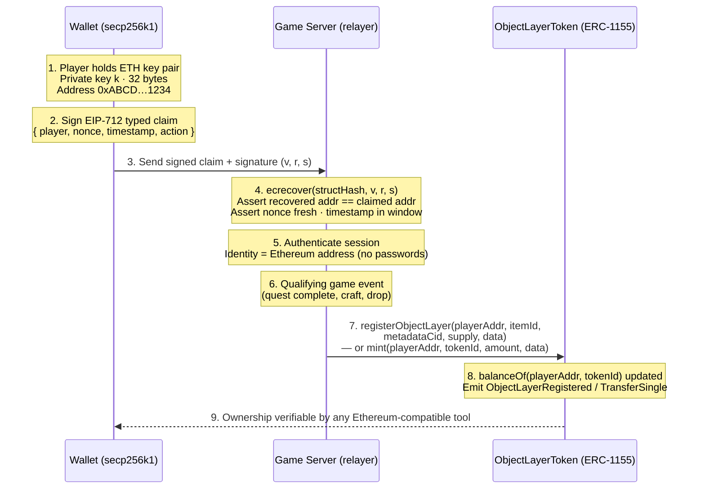
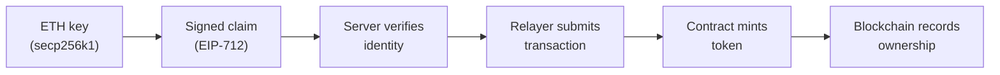
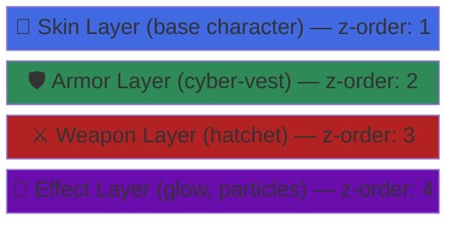
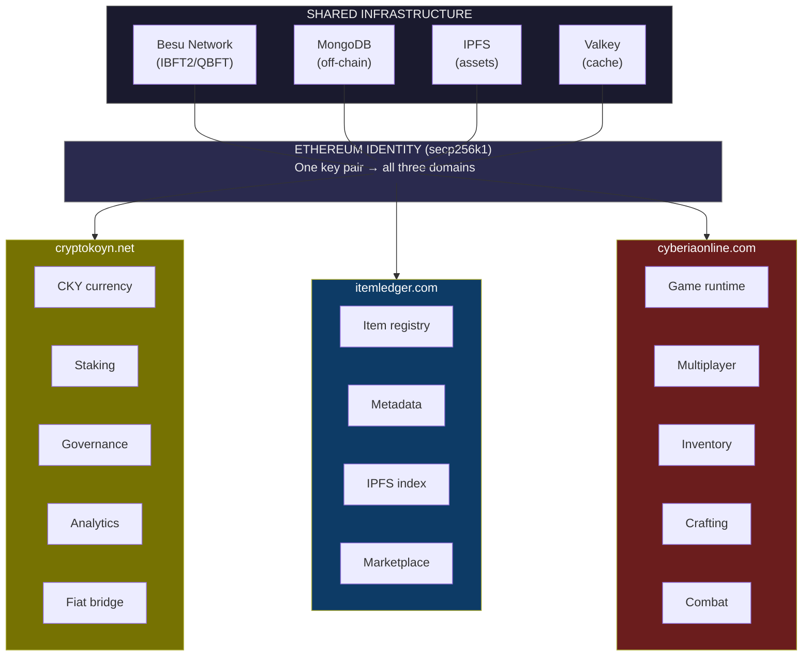
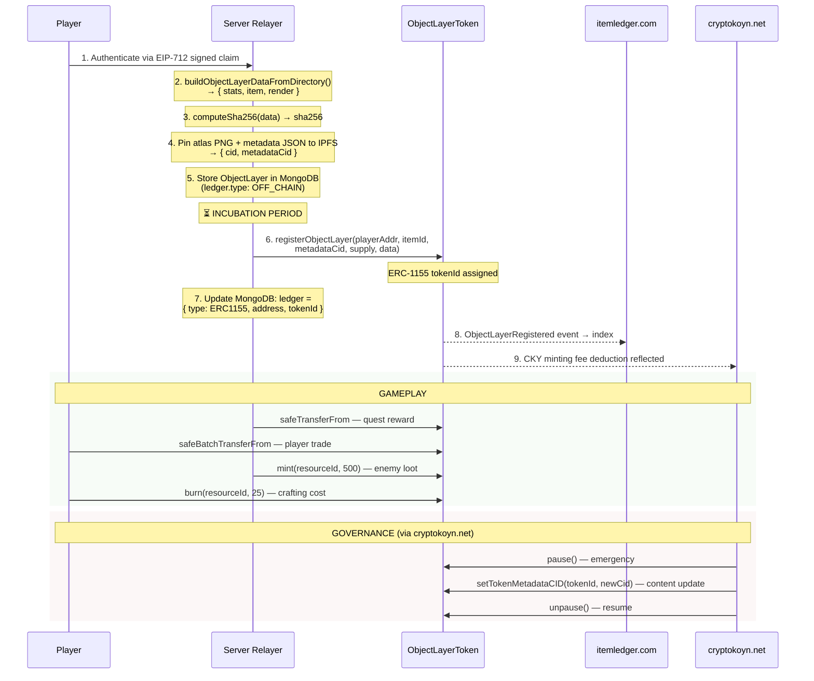

## Object Layer Token: A Semantic Interoperability Protocol for Composable Digital Entities

<p align="center">
  
</p>

<div align="center">

<h3> CYBERIA </h3>

Network Object Layers

*The Cyberian frontier Entity*

Stackable Rendering Layers as a Unified Tokenized Reality

[](https://www.npmjs.com/package/cyberia) [](https://www.npmjs.org/package/cyberia)

</div>

---

**Version:** 3.0.3

**Status:** Draft

**Authors:** Underpost Engineering

---

## Abstract

This paper introduces the **Object Layer Protocol** — a semantic interoperability standard that defines digital entities as literally stackable rendering layers, each associated with a presentation, UX, economic, and mechanical reality. The protocol enables composable, verifiable, and interoperable digital objects across decentralized runtimes by binding four distinct semantic layers into a single atomic unit. A reference implementation is provided through **Cyberia Online**, a browser-based MMORPG deployed on Hyperledger Besu, where the protocol is realized as an ERC-1155 multi-token contract managed through Kubernetes infrastructure via the Underpost CI/CD CLI.

The protocol leverages the **Ethereum secp256k1** key pair as the universal identity primitive. A single Ethereum key pair authenticates players, proves ownership on-chain, and authorizes off-chain actions via **EIP-712 typed structured data signatures**. The on-chain economy is split across two dedicated service domains: **cryptokoyn.net** (fungible CKY currency hub) and **itemledger.com** (semi-fungible and non-fungible Object Layer registry), both backed by the same `ObjectLayerToken` ERC-1155 contract on Hyperledger Besu.

The Object Layer Protocol is not a token standard — it is a **semantic interoperability layer** that happens to use ERC-1155 as its on-chain ledger binding. The innovation lies in the composable, layer-first architecture where every entity in a runtime is a stack of independently addressable, independently renderable, and independently ownable layers — each carrying its own mechanical, presentational, experiential, and economic meaning.

---

## Table of Contents

1. **Executive Summary**
2. **Introduction**
    - 2.1 [Problem statement: the Ethereum ecosystem and the absence of semantic interoperability](#header-2.1)
    - 2.2 [Solution: the Object Layer Protocol and Ethereum-native identity](#header-2.2)
3. **Ethereum Identity and Authentication**
    - 3.1 [secp256k1 key pairs as universal identity](#header-3.1)
    - 3.2 [EIP-712 signed claims and gasless authentication](#header-3.2)
    - 3.3 [Authentication flow: key → claim → verify → mint → own](#header-3.3)
4. **The Object Layer Protocol**
    - 4.1 [Semantic interoperability through stackable layers](#header-4.1)
    - 4.2 [Four realities of an Object Layer](#header-4.2)
    - 4.3 [AtomicPrefab and layer-first rendering](#header-4.3)
    - 4.4 [Canonical Object Layer schema](#header-4.4)
    - 4.5 [Composability: entities as layer stacks](#header-4.5)
5. **Service Architecture**
    - 5.1 [Three-domain topology](#header-5.1)
    - 5.2 [cryptokoyn.net — Financial portal and CKY token hub](#header-5.2)
    - 5.3 [itemledger.com — Object Layer registry and metadata indexer](#header-5.3)
    - 5.4 [cyberiaonline.com — Game runtime and player portal](#header-5.4)
6. **Technology Stack**
    - 6.1 [Hyperledger Besu](#header-6.1)
    - 6.2 [Hardhat](#header-6.2)
    - 6.3 [OpenZeppelin ERC-1155 contracts](#header-6.3)
    - 6.4 [MongoDB schemas](#header-6.4)
    - 6.5 [IPFS storage](#header-6.5)
7. **Tokenomics**
    - 7.1 [ObjectLayerToken: unified multi-token contract](#header-7.1)
    - 7.2 [Token classification: fungible, semi-fungible, and non-fungible](#header-7.2)
    - 7.3 [Token distribution and allocation](#header-7.3)
    - 7.4 [Governance and circulation](#header-7.4)
8. **Blockchain Network and Deployment**
    - 8.1 [Hyperledger Besu IBFT2/QBFT consensus](#header-8.1)
    - 8.2 [Kubernetes deployment architecture (kubeadm)](#header-8.2)
    - 8.3 [Hardhat deployment workflow](#header-8.3)
9. **On-Chain Lifecycle and Game Mechanics**
    - 9.1 [On-chain lifecycle: register → mint → transfer → burn](#header-9.1)
    - 9.2 [Decentralized player progression](#header-9.2)
    - 9.3 [Item crafting, trading, and incubation](#header-9.3)
10. **Security and Transparency**
    - 10.1 [Blockchain security measures](#header-10.1)
    - 10.2 [Smart contract audits](#header-10.2)
11. **Future Directions**
12. **References**

---

### 1. Executive Summary

Current approaches to digital asset tokenization treat tokens as isolated ledger entries — a balance, a URI, a metadata pointer. They lack a coherent semantic model that binds what an object *does*, what it *looks like*, how a *human understands it*, and what it *is worth* into a single interoperable unit. The Ethereum ecosystem provides the cryptographic and economic primitives to solve this, but existing standards (ERC-721, ERC-1155) leave semantic structure as an afterthought.

The **Object Layer Protocol** solves this by defining a **semantic interoperability standard** where each digital entity is composed of literally stackable rendering layers, and each layer carries four bound realities:

| Reality | Semantic Role | Schema Path |
|---------|---------------|-------------|
| **Mechanical** | What the layer *does* — statistical attributes governing behavior | `data.stats` |
| **Presentational** | What the layer *looks like* — IPFS-addressed atlas sprite sheets | `data.render` |
| **Experiential (UX)** | What the layer *means to a human* — identifiers, descriptions, activation | `data.item` |
| **Economic** | What the layer *is worth* — on-chain ledger binding and ownership proof | `data.ledger` |

These four realities are not metadata annotations on a token. They are the **constitutive semantic dimensions** of the entity itself. A layer without mechanics is decorative. A layer without presentation is invisible. A layer without UX is incomprehensible. A layer without economics is unownable. The protocol requires all four.

**Key architectural decisions:**

- **Ethereum secp256k1 keys** serve as the single identity primitive — the same key pair authenticates with the game server, signs EIP-712 claims, and owns on-chain tokens.
- **Fungible currency (CKY)** is managed via **cryptokoyn.net** — a dedicated financial portal for staking, governance, analytics, and fiat bridges.
- **Semi-fungible and non-fungible Object Layers** are managed via **itemledger.com** — the canonical registry, metadata resolver, and IPFS indexer for all item tokens.
- **A single `ObjectLayerToken` (ERC-1155) contract** on Hyperledger Besu backs both domains, managing the entire token economy in one deployment.

The result is a composable, interoperable digital object format where:

- **Entities are stacks.** A player character is skin + armor + weapon + effect layers, each independently addressable and ownable.
- **Layers are atoms.** Each layer is a self-contained AtomicPrefab with its own four-reality representation, content hash, and IPFS persistence.
- **Ownership is semantic.** Holding an ERC-1155 token proves ownership not just of a balance — but of a complete four-dimensional semantic object.
- **Interoperability is structural.** Any runtime that understands the Object Layer schema can render, simulate, display, and trade any layer from any source.

The reference implementation deploys the `ObjectLayerToken` contract on a Hyperledger Besu private network. Infrastructure is orchestrated through Kubernetes clusters initialized via `kubeadm` and managed through the **Underpost CI/CD CLI**.

---

### 2. Introduction

<a name="header-2.1"></a>

#### 2.1 Problem Statement: The Ethereum Ecosystem and the Absence of Semantic Interoperability

The Ethereum ecosystem established the foundational primitives for digital ownership — accounts derived from secp256k1 key pairs, smart contracts executing deterministic state transitions, and token standards (ERC-20, ERC-721, ERC-1155) encoding fungible and non-fungible balances. These primitives solved the *ownership* problem: a private key holder can provably own, transfer, and burn on-chain tokens without trusting a central authority.

However, the ecosystem has failed to solve the *meaning* problem. Existing token standards conflate **ownership** with **identity**. Owning an ERC-721 or ERC-1155 token proves you hold a balance — but it says nothing structural about what the asset *is*, what it *does*, how it *renders*, or how a human *understands* it. Metadata URIs are an afterthought, not a constitutive part of the asset's semantic identity.

This creates several cascading failures across the Ethereum ecosystem:

**At the token standard level:**

- **No structural interoperability.** Two applications cannot share assets because there is no common semantic schema — only opaque metadata blobs stored behind a `uri()` function call.
- **Presentation is disconnected from ownership.** The visual representation of an asset lives on a centralized server or IPFS with no formal binding to the token's mechanical or economic identity. The `tokenURI` is a hint, not a guarantee.
- **UX is an afterthought.** Human-readable names, descriptions, and interaction flags are buried in unstructured JSON with no protocol-level validation or composition rules.
- **Composition is impossible.** There is no standard way to express "this entity is composed of these five independently-owned layers stacked in this order."

**At the infrastructure level:**

- **Key management fragmentation.** Users manage separate identities for wallets, game accounts, and platform logins. The Ethereum key pair — already a strong cryptographic identity — is underutilized as a universal authentication primitive.
- **Gas cost barriers.** Public Ethereum mainnet gas fees make per-item minting economically infeasible for game economies with thousands of in-game items. This pushes projects toward centralized databases, negating the ownership guarantees of the blockchain.
- **Metadata availability.** When IPFS pins expire or centralized metadata servers go offline, tokens become opaque pointers to nothing — the semantic content is lost even though the ownership record persists.

**At the application level (digital worlds, MMORPGs):**

- **Lack of true ownership.** Players invest significant time and real-world value but hold no cryptographic proof of their digital assets. Server shutdowns erase player progress permanently.
- **Opacity and manipulation.** Centralized game operators unilaterally control in-game economies — adjusting drop rates, devaluing items, or introducing pay-to-win mechanics without accountability or transparency.
- **Security risks.** Centralized servers concentrate attack surface. A single breach can compromise the entire player economy.

<a name="header-2.2"></a>

#### 2.2 Solution: The Object Layer Protocol and Ethereum-Native Identity

The Object Layer Protocol addresses every layer of the problem stack by leveraging Ethereum's existing cryptographic primitives — secp256k1 keys, EIP-712 typed data signatures, and ERC-1155 multi-token contracts — and extending them with a **semantic interoperability standard** that gives tokens structural meaning.

**Identity solved: one key pair, universal authentication.**

A player generates a single Ethereum secp256k1 key pair. That key pair:

1. **Authenticates** with the game server via EIP-712 signed claims (no passwords, no OAuth).
2. **Owns** on-chain tokens in the `ObjectLayerToken` ERC-1155 contract.
3. **Authorizes** off-chain actions (crafting, trading, staking) via signed messages verified server-side.
4. **Interoperates** across all three service domains (cryptokoyn.net, itemledger.com, cyberiaonline.com) with a single identity.

**Ownership solved: semantic tokens, not opaque balances.**

Every on-chain token maps to a complete **AtomicPrefab** — a four-reality semantic unit (mechanics, presentation, UX, economics) content-addressed on IPFS. Owning a token means owning a fully-defined digital entity, not just a ledger entry.

**Gas solved: permissioned Besu network with zero gas fees.**

The `ObjectLayerToken` is deployed on a Hyperledger Besu private network with IBFT2/QBFT consensus and gas price zero. The game server acts as a trusted relayer — verifying player EIP-712 signatures and submitting transactions on their behalf. Players never pay gas; the permissioned validator set provides the economic security model.

**Composition solved: entities as layer stacks.**

The protocol defines entities as ordered stacks of independently-owned Object Layers. A player character is not one token — it is a stack of skin + armor + weapon + effect layers, each with its own token ID, its own stats, its own sprite sheet, and its own owner. Any layer can be transferred, traded, or burned independently.

**Service architecture solved: domain-separated concerns.**

The token economy is served through dedicated domains:

- **cryptokoyn.net** — Financial portal for CKY fungible currency: balances, staking, governance, analytics, and fiat on-ramps.
- **itemledger.com** — Canonical registry for Object Layer items: metadata resolution, IPFS pinning, on-chain event indexing, item search, and marketplace.
- **cyberiaonline.com** — Game runtime: real-time multiplayer, inventory management, crafting, and the live rendering engine.

All three domains share the same Besu blockchain, the same MongoDB off-chain store, and the same Ethereum key-based identity system.

---

### 3. Ethereum Identity and Authentication

<a name="header-3.1"></a>

#### 3.1 secp256k1 Key Pairs as Universal Identity

The Ethereum ecosystem standardizes on the **secp256k1 elliptic curve** (defined in SEC 2, also used by Bitcoin) for all cryptographic identity operations. A key pair consists of:

- **Private key:** A 256-bit random scalar `k` (32 bytes).
- **Public key:** The corresponding point `K = k × G` on the secp256k1 curve (64 bytes uncompressed, 33 bytes compressed).
- **Ethereum address:** The rightmost 20 bytes of `keccak256(publicKey)`, prefixed with `0x`.

In the Object Layer Protocol, this single key pair serves as the **universal identity primitive** across all system layers:

| Layer | Function | How the Key Is Used |
|-------|----------|---------------------|
| **On-chain** | Token ownership | The Ethereum address holds ERC-1155 balances |
| **Authentication** | Server login | EIP-712 signed claim replaces username/password |
| **Authorization** | Action signing | Off-chain crafting, trading, staking requests carry a signature |
| **Cross-domain** | Unified identity | Same key authenticates across cryptokoyn.net, itemledger.com, cyberiaonline.com |

This eliminates the key management fragmentation described in the problem statement. Players generate one key, store it in a standard Ethereum wallet (MetaMask, hardware wallet, or the game's built-in key manager), and use it everywhere.

<a name="header-3.2"></a>

#### 3.2 EIP-712 Signed Claims and Gasless Authentication

**EIP-712** (Ethereum typed structured data hashing and signing) defines a standard for signing structured data that is both human-readable (wallets display the typed fields before signing) and machine-verifiable (the structured hash prevents cross-domain replay attacks).

The Object Layer Protocol uses EIP-712 for **gasless authentication and authorization**. The player's wallet signs a typed claim; the game server verifies the signature; a trusted relayer submits the on-chain transaction.

**EIP-712 Domain Separator:**

```json
{
  "name": "CyberiaObjectLayer",
  "version": "1",
  "chainId": 777771,
  "verifyingContract": "0x<ObjectLayerToken address>"
}
```

**Example: Authentication Claim**

```json
{
  "types": {
    "EIP712Domain": [
      { "name": "name", "type": "string" },
      { "name": "version", "type": "string" },
      { "name": "chainId", "type": "uint256" },
      { "name": "verifyingContract", "type": "address" }
    ],
    "AuthClaim": [
      { "name": "player", "type": "address" },
      { "name": "nonce", "type": "uint256" },
      { "name": "timestamp", "type": "uint256" },
      { "name": "action", "type": "string" }
    ]
  },
  "primaryType": "AuthClaim",
  "message": {
    "player": "0xABCD...1234",
    "nonce": 42,
    "timestamp": 1719500000,
    "action": "login"
  }
}
```

The wallet signs this structured data, producing a 65-byte `(v, r, s)` ECDSA signature. The server recovers the signer address via `ecrecover` and matches it against the player's registered Ethereum address.

**Why EIP-712 instead of plain `personal_sign`:**

- **Human-readable.** The wallet displays "AuthClaim → player: 0x…, action: login" instead of an opaque hex blob.
- **Replay-proof.** The domain separator binds the signature to a specific contract, chain, and protocol version.
- **Typed.** The structured hash prevents ambiguity in how the signed data is encoded.

<a name="header-3.3"></a>

#### 3.3 Authentication Flow: Key → Claim → Verify → Mint → Own

The complete authentication and token minting flow using Ethereum secp256k1 keys and EIP-712 signed claims:



**Summary of the flow:**



This architecture means:

- **Players never pay gas.** The Besu network runs with gas price zero; the server relays transactions.
- **Players never expose private keys to the server.** Authentication is purely signature-based.
- **Players own their assets cryptographically.** The private key is the sole proof of ownership, not a database row.
- **Sessions are stateless.** Each request carries a fresh EIP-712 signature; no session cookies or JWTs required (though the server may cache sessions for performance).

---

### 4. The Object Layer Protocol

<a name="header-4.1"></a>

#### 4.1 Semantic Interoperability Through Stackable Layers

The core innovation of the Object Layer Protocol is the recognition that a digital entity is not a single atomic thing — it is a **stack of semantically complete layers**.

Consider a player character in an MMORPG. It is not one object. It is:



Each layer in this stack is an **independently complete semantic unit**. The weapon layer has its own stats (damage, range), its own sprite sheet (render), its own human-readable identity (item), and its own on-chain token (ledger). It can be:

- **Rendered independently** — draw just the weapon on a trading screen.
- **Owned independently** — transfer the weapon to another player without affecting the skin.
- **Simulated independently** — apply the weapon's stats in a combat calculation.
- **Understood independently** — display the weapon's name, type, and description in a tooltip.

This is what we mean by **semantic interoperability**: any system that understands the Object Layer schema can fully render, simulate, display, and trade any layer from any source. The interoperability is not at the token level (any ERC-1155 reader can see balances) — it is at the **semantic level** (any Object Layer reader can understand the complete four-dimensional meaning of the asset).

**Stackability is literal.** The client renderer composes layers by drawing lower layers first (skin) then higher layers (weapon), respecting transparency and z-order. This makes layering developer-friendly (simple stack semantics) and operable (many layers per entity). An entity with 10 layers simply has 10 independently addressable, independently ownable, independently renderable semantic units stacked in z-order.

<a name="header-4.2"></a>

#### 4.2 Four Realities of an Object Layer

Every Object Layer binds four semantic realities into a single atomic unit:

| Reality | Schema Path | Role | Example |
|---------|-------------|------|---------|
| **Mechanical** | `data.stats` | Governs behavior in the runtime simulation | `{ effect: 7, resistance: 8, agility: 0, range: 4, intelligence: 8, utility: 2 }` |
| **Presentational** | `data.render` | Governs visual appearance via IPFS-addressed atlas sprite sheets | `{ cid: "bafkrei...atlas.png", metadataCid: "bafkreia...meta" }` |
| **Experiential (UX)** | `data.item` | Governs human comprehension — names, types, descriptions, activation | `{ id: "hatchet", type: "weapon", description: "A rusted hatchet", activable: true }` |
| **Economic** | `data.ledger` | Governs ownership and value via on-chain token binding | `{ type: "ERC1155", address: "0x...", tokenId: "uint256" }` |

These four realities are **constitutive**, not decorative. They define what the layer *is*:

- **Without mechanics**, a layer is decorative — it has no effect on the simulation.
- **Without presentation**, a layer is invisible — it cannot be rendered.
- **Without UX**, a layer is incomprehensible — no human can identify or interact with it.
- **Without economics**, a layer is unownable — it exists only as ephemeral server state.

The protocol requires all four realities to be present for an Object Layer to be considered complete and interoperable.

<a name="header-4.3"></a>

#### 4.3 AtomicPrefab and Layer-First Rendering

An **AtomicPrefab** is the protocol's atomic unit — a self-contained Object Layer with all four realities, content-addressed on IPFS:

```
AtomicPrefab = {
  data: {
    stats:  { effect, resistance, agility, range, intelligence, utility },
    item:   { id, type, description, activable },
    ledger: { type, address, tokenId },
    render: { cid, metadataCid }
  },
  cid:    "bafk...json",       // IPFS CID of the stable JSON
  sha256: "a1b2c3..."          // Content hash for integrity verification
}
```

**Layer = Render.** A layer exists because it has a renderable presentation. The `data.render.cid` points to the atlas sprite sheet PNG; `data.render.metadataCid` points to the atlas metadata JSON (frame coordinates, dimensions, animation sequences).

**The client runtime operates as follows:**

1. **Receive** Object Layer references from the server or on-chain events (`tokenId` → `metadataCid`).
2. **Fetch** atlas metadata from IPFS (resolved via itemledger.com's caching layer or directly).
3. **Compose** layers in z-order for each entity — lower layers drawn first, respecting transparency.
4. **Simulate** using `data.stats` for game mechanics.
5. **Display** using `data.item` for UX tooltips, inventory screens, and interaction prompts.

<a name="header-4.4"></a>

#### 4.4 Canonical Object Layer Schema

**Stable JSON representation (AtomicPrefab):**

```json
{
  "data": {
    "stats": {
      "effect": 7,
      "resistance": 8,
      "agility": 0,
      "range": 4,
      "intelligence": 8,
      "utility": 2
    },
    "item": {
      "id": "hatchet",
      "type": "weapon",
      "description": "A rusted hatchet found in the cyberpunk wastes",
      "activable": true
    },
    "ledger": {
      "type": "ERC1155",
      "address": "0x...",
      "tokenId": "uint256"
    },
    "render": {
      "cid": "bafkrei...atlas.png",
      "metadataCid": "bafkreia...meta"
    }
  },
  "cid": "bafk...json",
  "sha256": "a1b2c3..."
}
```

**Off-chain ↔ On-chain Mapping:**

| Off-chain (Object Layer) | On-chain (ERC-1155) |
|--------------------------|---------------------|
| `data.item.id` (e.g., "hatchet") | Token ID = `uint256(keccak256("cyberia.object-layer:hatchet"))` |
| `data.render.metadataCid` | `_tokenCIDs[tokenId]` → URI resolves to `ipfs://{metadataCid}` |
| `data.stats` | Off-chain only (MongoDB); referenced by token metadata |
| `data.ledger.type` | `"ERC1155"` |
| `data.ledger.address` | ObjectLayerToken contract address |
| `data.ledger.tokenId` | The deterministic uint256 token ID |

**Token classification by `data.ledger`:**

| `ledger.type` | Managed By | Domain | Example |
|---------------|------------|--------|---------|
| `"ERC1155"` (tokenId = 0) | cryptokoyn.net | Fungible CKY currency | In-game gold |
| `"ERC1155"` (supply > 1) | itemledger.com | Semi-fungible resource | Wood, stone, gold ore |
| `"ERC1155"` (supply = 1) | itemledger.com | Non-fungible unique item | Legendary weapon |
| `"OFF_CHAIN"` | cyberiaonline.com | Pre-incubation item | Newly dropped loot |

<a name="header-4.5"></a>

#### 4.5 Composability: Entities as Layer Stacks

The protocol's composability model is defined by a simple principle: **an entity is an ordered stack of Object Layers**.

```
Entity(player_42) = [
  ObjectLayer("cyber-punk-skin-001"),    // z: 0 — base skin
  ObjectLayer("cyber-vest-armor"),       // z: 1 — armor
  ObjectLayer("hatchet"),                // z: 2 — weapon
  ObjectLayer("neon-glow-effect"),       // z: 3 — visual effect
]
```

Each layer in the stack is independently:

- **Ownable:** Each has its own ERC-1155 token ID. Transferring the weapon does not affect the skin.
- **Renderable:** The renderer draws layers in z-order. Removing a layer removes its visual contribution.
- **Simulatable:** The runtime composes stats from all layers for the entity's aggregate mechanical identity.
- **Tradeable:** Players can trade individual layers or use `safeBatchTransferFrom` for atomic multi-layer trades.

This composability is what makes the Object Layer Protocol a **semantic interoperability standard** rather than just a token scheme. Any system that understands the schema can:

1. Parse any Object Layer JSON.
2. Render its sprite sheet.
3. Apply its stats.
4. Display its UX identity.
5. Verify its on-chain ownership.
6. Compose it into entity stacks with other layers from other sources.

---

### 5. Service Architecture

<a name="header-5.1"></a>

#### 5.1 Three-Domain Topology

The Object Layer Protocol's service layer is organized across three dedicated domains, each serving a distinct concern while sharing the same underlying Besu blockchain, MongoDB instance, and Ethereum-based identity system:



All three services are configured in the Underpost deployment manifest (`conf.dd-cyberia.js`) and share the same API service modules: `core`, `file`, `user`, `crypto`, `document`, `instance`, `object-layer`, `object-layer-render-frames`, `atlas-sprite-sheet`, and `ipfs`.

<a name="header-5.2"></a>

#### 5.2 cryptokoyn.net — Financial Portal and CKY Token Hub

**cryptokoyn.net** is the dedicated financial portal for the **CryptoKoyn (CKY)** fungible currency — token ID 0 in the `ObjectLayerToken` ERC-1155 contract. It provides all currency-related services: balance queries, staking, governance voting, issuance analytics, and (optionally) fiat on-ramps/off-ramps.

**Scope:** Exclusively manages the **unique fungible Object Layer** — CKY. All operations on token ID 0 route through this domain.

**Client application:** The `cryptokoyn` client module includes components for wallet management, CKY-specific UI, and financial dashboards:

- `MenuCryptokoyn` — Navigation and layout
- `RoutesCryptokoyn` — Client-side routing (`/`, `/wallet`, `/settings`, `/account`)
- `ElementsCryptokoyn` — CKY-specific UI elements (balance displays, staking forms)
- `SocketIoCryptokoyn` — Real-time CKY balance and event updates
- `SettingsCryptokoyn` — User preferences and key management

**API Services:**

| Endpoint | Method | Description |
|----------|--------|-------------|
| `/api/balance/{address}` | GET | Returns CKY balance and staking summary for a player address |
| `/api/stake` | POST | Stakes CKY tokens (interacts with staking contract or governance escrow) |
| `/api/unstake` | POST | Initiates CKY unstaking with cooldown period |
| `/api/transfer` | POST | Transfers CKY between player addresses (relayed to Besu) |
| `/api/explorer/transactions` | GET | Paginated CKY transaction history |
| `/api/analytics/supply` | GET | Circulating supply, burn rate, staking ratio analytics |
| `/api/analytics/governance` | GET | Active proposals, voting weight distribution |

**Staking and governance** are core to the CKY tokenomics. Vote weight is proportional to staked amount and duration:

```
Vote Weight = 0.5 × (Amount Staked / Total Staked) + 0.5 × (Staking Duration / Max Duration)
```

**Server configuration** (`conf.dd-cyberia.js`):

```javascript
'cryptokoyn.net': {
  '/': {
    client: 'cryptokoyn',
    runtime: 'nodejs',
    apis: ['core', 'file', 'user', 'crypto', 'document',
           'instance', 'object-layer', 'object-layer-render-frames',
           'atlas-sprite-sheet', 'ipfs'],
    ws: 'core',
    peer: true,
    proxy: [80, 443],
    db: { provider: 'mongoose', host: 'mongodb://127.0.0.1:27017', name: 'default' },
    valkey: { port: 6379, host: '127.0.0.1' },
  }
}
```

<a name="header-5.3"></a>

#### 5.3 itemledger.com — Object Layer Registry and Metadata Indexer

**itemledger.com** is the canonical registry, metadata resolver, and IPFS indexer for all **semi-fungible and non-fungible Object Layer items** — token IDs ≥ 1 in the `ObjectLayerToken` contract. It serves as the authoritative source for mapping `itemId` → `tokenId`, resolving AtomicPrefab metadata from IPFS, and providing a search and marketplace interface for all game items.

**Scope:** Manages all non-currency Object Layers — semi-fungible resources (wood, stone, potions) and non-fungible unique items (legendary weapons, skins).

**Client application:** The `itemledger` client module includes components for item browsing, metadata inspection, and marketplace interactions:

- `MenuItemledger` — Navigation with item category filters
- `RoutesItemledger` — Client-side routing (`/`, `/wallet`, `/settings`, `/account`)
- `ElementsItemledger` — Item card renders, provenance views, atlas sprite preview
- `SocketIoItemledger` — Real-time `ObjectLayerRegistered` event feed
- `TranslateItemledger` — Internationalization for item descriptions and UI

**API Services:**

| Endpoint | Method | Description |
|----------|--------|-------------|
| `/api/token/{tokenId}` | GET | Returns the full AtomicPrefab JSON (Object Layer data) for a token ID |
| `/api/item/{itemId}` | GET | Resolves `itemId` → `tokenId` and returns the AtomicPrefab |
| `/api/metadata/{tokenId}` | GET | Returns IPFS-resolved metadata (atlas sprite sheet coordinates, dimensions) |
| `/api/search` | GET | Full-text search across item names, types, descriptions |
| `/api/registry/events` | GET | Paginated `ObjectLayerRegistered` event log |
| `/api/ipfs/pin` | POST | Pins an Object Layer's atlas PNG and metadata JSON to IPFS |
| `/api/ipfs/resolve/{cid}` | GET | IPFS CID resolver with local cache (avoids gateway latency) |
| `/api/marketplace/listings` | GET | Active item listings for peer-to-peer trading |
| `/api/marketplace/buy` | POST | Executes a `safeTransferFrom` via server relayer |
| `/api/marketplace/provenance/{tokenId}` | GET | Full ownership history (transfer events) for an item |

**Webhook subscriptions** for on-chain events allow external services to react to item registration and transfers:

- `ObjectLayerRegistered(tokenId, itemId, metadataCid, initialSupply)` — New item type on-chain.
- `TransferSingle(operator, from, to, id, value)` — Item ownership change.
- `MetadataUpdated(tokenId, metadataCid)` — Item metadata updated.

**Server configuration** (`conf.dd-cyberia.js`):

```javascript
'itemledger.com': {
  '/': {
    client: 'itemledger',
    runtime: 'nodejs',
    apis: ['core', 'file', 'user', 'crypto', 'document',
           'instance', 'object-layer', 'object-layer-render-frames',
           'atlas-sprite-sheet', 'ipfs'],
    ws: 'core',
    peer: true,
    proxy: [80, 443],
    iconsBuild: false,
    db: { provider: 'mongoose', host: 'mongodb://127.0.0.1:27017', name: 'default' },
    valkey: { port: 6379, host: '127.0.0.1' },
  }
}
```

<a name="header-5.4"></a>

#### 5.4 cyberiaonline.com — Game Runtime and Player Portal

**cyberiaonline.com** is the live game client and server — the runtime where Object Layers are rendered, stacked, simulated, and interacted with in real time. It consumes data from both cryptokoyn.net (CKY balances) and itemledger.com (item metadata) while managing the real-time multiplayer game state.

**Scope:** Game runtime, player sessions, real-time multiplayer, inventory management, crafting, combat, and the Object Layer rendering engine.

**Key runtime operations:**

1. **Authentication:** Player signs EIP-712 claim → server verifies → session established.
2. **Inventory loading:** Server queries `balanceOf` for the player's address across all registered token IDs, then resolves each token's AtomicPrefab via itemledger.com's API.
3. **Layer rendering:** The `ObjectLayerEngine` (`src/server/object-layer.js`) processes atlas sprite sheets, frame matrices, and direction codes into renderable layer stacks.
4. **Crafting:** Player combines resources → server burns consumed tokens + mints crafted item → itemledger.com indexes the new Object Layer.
5. **Trading:** Player-to-player `safeBatchTransferFrom` via the server relayer.

**Server configuration** (`conf.dd-cyberia.js`):

```javascript
'www.cyberiaonline.com': {
  '/': {
    client: 'cyberia-portal',
    runtime: 'nodejs',
    apis: ['core', 'file', 'user', 'crypto', 'document',
           'instance', 'object-layer', 'object-layer-render-frames',
           'atlas-sprite-sheet', 'ipfs'],
    ws: 'core',
    peer: true,
    proxy: [80, 443],
    db: { provider: 'mongoose', host: 'mongodb://127.0.0.1:27017', name: 'default' },
    valkey: { port: 6379, host: '127.0.0.1' },
  }
}
```

---

### 6. Technology Stack

<a name="header-6.1"></a>

#### 6.1 Hyperledger Besu

- **Overview:** Hyperledger Besu is an enterprise-grade Ethereum client that provides a robust and secure platform for executing smart contracts. It supports IBFT2 and QBFT consensus algorithms, ensuring deterministic finality with low latency — ideal for a game economy requiring fast, reliable transactions with zero gas fees.
- **Key Benefits:**
  - **Privacy and Security:** Offers advanced privacy features and security protocols for permissioned networks.
  - **Performance and Scalability:** Optimized for high-throughput and low-latency transactions with configurable block periods (2–5 seconds).
  - **Enterprise-Grade:** Designed for production environments with robust governance, monitoring (Prometheus/Grafana), and Kubernetes-native deployment support.
  - **EVM Compatibility:** Full Ethereum Virtual Machine compatibility enables standard Solidity smart contracts, OpenZeppelin libraries, and the full EIP-712 signature verification stack.
  - **secp256k1 Native:** All Besu accounts use the same secp256k1 curve as mainnet Ethereum, ensuring key compatibility and standard wallet support.

<a href='https://besu.hyperledger.org/' target='_top'>See official Hyperledger Besu documentation.</a>

<a name="header-6.2"></a>

#### 6.2 Hardhat

- **Overview:** Hardhat is a development environment for Ethereum that streamlines the development, testing, and deployment of smart contracts. The project uses Hardhat to compile, test, and deploy the ObjectLayerToken contract to Besu RPC endpoints.
- **Key Benefits:**
  - **Rapid Development:** Rich plugin ecosystem and built-in Solidity debugging.
  - **Robust Testing:** Comprehensive testing framework with snapshot-based fixtures.
  - **Simplified Deployment:** Deployment scripts produce JSON artifacts consumed by the Cyberia CLI (`bin/cyberia.js`) for end-to-end lifecycle management.
  - **Network Configuration:** `hardhat.config.js` defines multiple Besu targets (IBFT2, QBFT, Kubernetes) with coinbase key management from a secure private key file.

<a href='https://hardhat.org/docs' target='_top'>See official Hardhat documentation.</a>

<a name="header-6.3"></a>

#### 6.3 OpenZeppelin ERC-1155 Contracts

- **Overview:** OpenZeppelin Contracts is a library of reusable, audited smart contract code. The ObjectLayerToken contract inherits from:
  - `ERC1155` — Core multi-token standard.
  - `ERC1155Burnable` — Allows token holders to destroy their tokens.
  - `ERC1155Pausable` — Allows the owner to freeze all transfers (emergency governance).
  - `ERC1155Supply` — On-chain total supply tracking per token ID.
  - `Ownable` — Access control for administrative functions (mint, pause, register).
- **Key Benefits:**
  - **Security:** Rigorously audited and battle-tested code.
  - **Efficiency:** Optimized for gas efficiency with batch operations.
  - **Flexibility:** Modular design allows combining multiple extensions in a single contract.

<a href='https://docs.openzeppelin.com/contracts/5.x/erc1155' target='_top'>See official OpenZeppelin ERC-1155 documentation.</a>

<a name="header-6.4"></a>

#### 6.4 MongoDB Schemas

- **Overview:** MongoDB stores the canonical four-reality representation (`data.stats`, `data.item`, `data.ledger`, `data.render`) off-chain, with `data.ledger` referencing the on-chain ERC-1155 token. The `ObjectLayerEngine` (`src/server/object-layer.js`) manages document creation and updates.
- **Ledger Schema:**
  ```json
  {
    "type": "ERC1155",
    "address": "0x...",
    "tokenId": "uint256 string"
  }
  ```
  Items that have not yet completed incubation carry `"type": "OFF_CHAIN"` and are upgraded to `"ERC1155"` upon on-chain registration.
- **Key Benefits:**
  - **Scalability:** Horizontal scaling for increasing data volumes.
  - **Flexibility:** Schema-less design accommodates dynamic Object Layer structures.
  - **High Performance:** Optimized for fast read/write operations required by real-time game state.

<a href='https://www.mongodb.com/docs/' target='_top'>See official MongoDB documentation.</a>

<a name="header-6.5"></a>

#### 6.5 IPFS Storage

- **Overview:** IPFS (InterPlanetary File System) provides content-addressed distributed storage. Object Layer assets are stored on IPFS with three CID references per item:
  - `cid` (top-level) — The **canonical CID**: IPFS hash of `fast-json-stable-stringify(objectLayer.data)`. This is the CID stored on-chain as the token's `metadataCid`, enabling any party to independently reproduce the same content address from the semantic payload (stats, item, ledger, render).
  - `data.render.cid` — The consolidated atlas sprite sheet PNG.
  - `data.render.metadataCid` — The atlas sprite sheet metadata JSON (frame coordinates, dimensions).
  - The `ObjectLayerToken` contract maps each token ID to the **canonical CID** (`objectLayer.cid`) on-chain via `_tokenCIDs[tokenId]`, enabling trustless metadata resolution. The URI resolves to `ipfs://{canonicalCid}`, which returns the full stable-JSON Object Layer data document.
- **Key Benefits:**
  - **Decentralization:** Reduces reliance on centralized servers.
  - **Content Addressing:** Data integrity guaranteed by hash-based CIDs.
  - **Global Distribution:** Assets distributed across IPFS nodes; itemledger.com provides a caching resolver layer.

<a href='https://docs.ipfs.tech/' target='_top'>See official IPFS documentation.</a>

---

### 7. Tokenomics

<a name="header-7.1"></a>

#### 7.1 ObjectLayerToken: Unified Multi-Token Contract

The `ObjectLayerToken` is a single ERC-1155 contract that serves as the **economic reality binding** for the Object Layer Protocol. It manages the entire Cyberia Online token economy — not as the protocol itself, but as the on-chain ledger layer (`data.ledger`) that anchors ownership of semantically complete Object Layers.

This design adds to the standard OpenZeppelin ERC-1155 implementation:

- **On-chain item registry:** Maps token IDs to human-readable item identifiers and IPFS metadata CIDs.
- **Deterministic token IDs:** `computeTokenId(itemId) = uint256(keccak256("cyberia.object-layer:" || itemId))`.
- **Batch registration:** `batchRegisterObjectLayers` registers and mints multiple item types in one transaction.
- **Per-token metadata management:** `setBaseURI` and `setTokenMetadataCID` allow the owner to update IPFS metadata CIDs post-deployment.
- **Pause/unpause:** Emergency governance to freeze all transfers.
- **Supply tracking:** On-chain total supply per token ID via `ERC1155Supply`.

**Proposed Smart Contract**

```solidity
// SPDX-License-Identifier: MIT
// Compatible with OpenZeppelin Contracts ^5.0.0
pragma solidity ^0.8.20;

import '@openzeppelin/contracts/token/ERC1155/ERC1155.sol';
import '@openzeppelin/contracts/token/ERC1155/extensions/ERC1155Burnable.sol';
import '@openzeppelin/contracts/token/ERC1155/extensions/ERC1155Pausable.sol';
import '@openzeppelin/contracts/token/ERC1155/extensions/ERC1155Supply.sol';
import '@openzeppelin/contracts/access/Ownable.sol';

/**
 * @title ObjectLayerToken
 * @dev Unified ERC-1155 multi-token contract for the Cyberia Online Object Layer ecosystem.
 *
 * Token ID 0 (CRYPTOKOYN): Fungible in-game currency — managed via cryptokoyn.net.
 * Token IDs >= 1: Object Layer items — managed via itemledger.com.
 *   - Supply = 1: Non-fungible unique items (legendary weapons, unique skins).
 *   - Supply > 1: Semi-fungible stackable resources (wood, stone, potions).
 *
 * Authentication: Players authenticate via secp256k1 EIP-712 signed claims.
 * The game server acts as a trusted relayer, submitting transactions on behalf
 * of verified players (gasless for end users on the permissioned Besu network).
 *
 * Features: mint, batch-mint, burn, batch-burn, pause/unpause, supply tracking,
 * on-chain item registry with IPFS metadata CID resolution.
 */
contract ObjectLayerToken is ERC1155, ERC1155Burnable, ERC1155Pausable, ERC1155Supply, Ownable {
  uint256 public constant CRYPTOKOYN = 0;
  uint256 public constant INITIAL_CRYPTOKOYN_SUPPLY = 10_000_000 * 1e18;

  string private _baseTokenURI;
  mapping(uint256 => string) private _tokenCIDs;
  mapping(uint256 => string) private _itemIds;
  mapping(bytes32 => uint256) private _itemIdToTokenId;

  event ObjectLayerRegistered(
    uint256 indexed tokenId, string itemId, string metadataCid, uint256 initialSupply
  );
  event MetadataUpdated(uint256 indexed tokenId, string metadataCid);

  constructor(address initialOwner, string memory baseURI)
    ERC1155(baseURI)
    Ownable(initialOwner)
  {
    _baseTokenURI = baseURI;
    _itemIds[CRYPTOKOYN] = 'cryptokoyn';
    _itemIdToTokenId[keccak256(abi.encodePacked('cryptokoyn'))] = CRYPTOKOYN;
    _mint(initialOwner, CRYPTOKOYN, INITIAL_CRYPTOKOYN_SUPPLY, '');
    emit ObjectLayerRegistered(CRYPTOKOYN, 'cryptokoyn', '', INITIAL_CRYPTOKOYN_SUPPLY);
  }

  function uri(uint256 tokenId) public view override returns (string memory) {
    string memory tokenCid = _tokenCIDs[tokenId];
    if (bytes(tokenCid).length > 0) {
      return string(abi.encodePacked(_baseTokenURI, tokenCid));
    }
    return super.uri(tokenId);
  }

  function setBaseURI(string calldata newBaseURI) external onlyOwner {
    _baseTokenURI = newBaseURI;
    _setURI(newBaseURI);
  }

  function setTokenMetadataCID(uint256 tokenId, string calldata metadataCid) external onlyOwner {
    _tokenCIDs[tokenId] = metadataCid;
    emit MetadataUpdated(tokenId, metadataCid);
    emit URI(uri(tokenId), tokenId);
  }

  function computeTokenId(string calldata itemId) public pure returns (uint256) {
    return uint256(keccak256(abi.encodePacked('cyberia.object-layer:', itemId)));
  }

  function registerObjectLayer(
    address to,
    string calldata itemId,
    string calldata metadataCid,
    uint256 initialSupply,
    bytes calldata data
  ) external onlyOwner returns (uint256 tokenId) {
    bytes32 itemHash = keccak256(abi.encodePacked(itemId));
    require(
      (_itemIdToTokenId[itemHash] == 0 && bytes(_itemIds[0]).length > 0) || _itemIdToTokenId[itemHash] == 0,
      'ObjectLayerToken: item already registered'
    );
    tokenId = computeTokenId(itemId);
    require(bytes(_itemIds[tokenId]).length == 0, 'ObjectLayerToken: token ID collision');
    _itemIds[tokenId] = itemId;
    _itemIdToTokenId[itemHash] = tokenId;
    if (bytes(metadataCid).length > 0) _tokenCIDs[tokenId] = metadataCid;
    if (initialSupply > 0) _mint(to, tokenId, initialSupply, data);
    emit ObjectLayerRegistered(tokenId, itemId, metadataCid, initialSupply);
  }

  function batchRegisterObjectLayers(
    address to,
    string[] calldata itemIds,
    string[] calldata metadataCids,
    uint256[] calldata supplies,
    bytes calldata data
  ) external onlyOwner returns (uint256[] memory tokenIds) {
    require(
      itemIds.length == metadataCids.length && itemIds.length == supplies.length,
      'ObjectLayerToken: array length mismatch'
    );
    tokenIds = new uint256[](itemIds.length);
    uint256[] memory mintIds = new uint256[](itemIds.length);
    uint256[] memory mintAmounts = new uint256[](itemIds.length);
    for (uint256 i = 0; i < itemIds.length; i++) {
      uint256 tokenId = computeTokenId(itemIds[i]);
      require(bytes(_itemIds[tokenId]).length == 0, 'ObjectLayerToken: item already registered or token ID collision');
      bytes32 itemHash = keccak256(abi.encodePacked(itemIds[i]));
      _itemIds[tokenId] = itemIds[i];
      _itemIdToTokenId[itemHash] = tokenId;
      if (bytes(metadataCids[i]).length > 0) _tokenCIDs[tokenId] = metadataCids[i];
      tokenIds[i] = tokenId;
      mintIds[i] = tokenId;
      mintAmounts[i] = supplies[i];
      emit ObjectLayerRegistered(tokenId, itemIds[i], metadataCids[i], supplies[i]);
    }
    _mintBatch(to, mintIds, mintAmounts, data);
  }

  function mint(address to, uint256 tokenId, uint256 amount, bytes calldata data)
    external onlyOwner
  {
    _mint(to, tokenId, amount, data);
  }

  function mintBatch(address to, uint256[] calldata ids, uint256[] calldata amounts, bytes calldata data)
    external onlyOwner
  {
    _mintBatch(to, ids, amounts, data);
  }

  function pause() external onlyOwner { _pause(); }
  function unpause() external onlyOwner { _unpause(); }

  function getItemId(uint256 tokenId) external view returns (string memory) { return _itemIds[tokenId]; }
  function getTokenIdByItemId(string calldata itemId) external view returns (uint256) {
    return _itemIdToTokenId[keccak256(abi.encodePacked(itemId))];
  }
  function getMetadataCID(uint256 tokenId) external view returns (string memory) { return _tokenCIDs[tokenId]; }

  function _update(address from, address to, uint256[] memory ids, uint256[] memory values)
    internal override(ERC1155, ERC1155Pausable, ERC1155Supply)
  {
    super._update(from, to, ids, values);
  }
}
```

**Understanding the ObjectLayerToken Smart Contract**

This Solidity smart contract implements the ERC-1155 multi-token standard as the **economic reality layer** of the Object Layer Protocol:

**Inherited Contracts:**
- **ERC1155:** Core multi-token standard for fungible and non-fungible tokens.
- **ERC1155Burnable:** Allows token holders to burn (destroy) their tokens.
- **ERC1155Pausable:** Allows the owner to pause all token transfers for emergency governance.
- **ERC1155Supply:** Tracks on-chain total supply per token ID.
- **Ownable:** Access control ensuring only the contract owner (server relayer) can mint, register, and pause.

**Constructor:**
- Mints 10 million CryptoKoyn (token ID 0) to the deployer with 18-decimal precision.
- Registers "cryptokoyn" as the item identifier for token ID 0.
- Sets the base IPFS URI prefix for metadata resolution.

**Key Functions:**
- `registerObjectLayer(to, itemId, metadataCid, initialSupply, data)` — Registers a new Object Layer item on-chain, assigns a deterministic token ID via `computeTokenId`, guards against duplicate item IDs and token ID collisions, stores the IPFS metadata CID, and mints the initial supply.
- `batchRegisterObjectLayers(to, itemIds, metadataCids, supplies, data)` — Registers and mints multiple Object Layer items in a single transaction, reducing gas overhead for bulk operations.
- `computeTokenId(itemId)` — Pure function returning the deterministic `uint256` token ID for any item identifier.
- `setBaseURI(newBaseURI)` — Updates the IPFS base URI prefix for all token metadata resolution.
- `setTokenMetadataCID(tokenId, metadataCid)` — Updates the per-token IPFS metadata CID; emits `MetadataUpdated` and `URI` events.
- `mint(to, tokenId, amount, data)` — Mints additional supply for an existing token.
- `mintBatch(to, ids, amounts, data)` — Batch-mints multiple token types in one transaction.
- `burn(account, tokenId, amount)` — Holders destroy their own tokens (inherited from ERC1155Burnable).
- `pause()` / `unpause()` — Emergency freeze/unfreeze of all transfers.
- `uri(tokenId)` — Resolves metadata URI: `ipfs://{per-token-CID}` or falls back to the base URI.

**Key Advantages:**
- **Single deployment** manages the entire game economy (CKY currency via cryptokoyn.net + all item types via itemledger.com).
- **Batch operations** reduce gas costs for multi-asset registration, transfers, and minting via `batchRegisterObjectLayers` and `mintBatch`.
- **Deterministic token IDs** from `keccak256` enable off-chain → on-chain mapping without a registry lookup.
- **IPFS metadata integration** via per-token CIDs links each on-chain token to its Object Layer atlas sprite sheet (resolved by itemledger.com). Metadata CIDs can be updated post-deployment via `setTokenMetadataCID`.

<a name="header-7.2"></a>

#### 7.2 Token Classification: Fungible, Semi-Fungible, and Non-Fungible

| Token Type | Token ID | Supply | Managed By | Example |
|------------|----------|--------|------------|---------|
| Fungible currency | 0 (CRYPTOKOYN) | 10,000,000 × 10^18 | cryptokoyn.net | In-game gold / CKY |
| Semi-fungible resource | `computeTokenId("gold-ore")` | 1,000,000 | itemledger.com | Stackable crafting material |
| Semi-fungible consumable | `computeTokenId("health-potion")` | 100,000 | itemledger.com | Stackable consumable |
| Non-fungible unique gear | `computeTokenId("legendary-hatchet")` | 1 | itemledger.com | Unique weapon |
| Non-fungible skin | `computeTokenId("cyber-punk-skin-001")` | 1 | itemledger.com | Unique character skin |

The ERC-1155 standard treats all token IDs uniformly. The distinction between fungible, semi-fungible, and non-fungible is purely semantic based on the minted supply:
- **Fungible:** Large supply, divisible via balance transfers. Managed by **cryptokoyn.net**.
- **Semi-fungible:** Moderate supply, stackable but each unit is interchangeable (e.g., wood, stone). Managed by **itemledger.com**.
- **Non-fungible:** Supply of exactly 1, making it unique and non-interchangeable (e.g., legendary weapons). Managed by **itemledger.com**.

<a name="header-7.3"></a>

#### 7.3 Token Distribution and Allocation

**CryptoKoyn (CKY) — Token ID 0 — cryptokoyn.net**

- **Total Supply:** 10,000,000 CKY (with 18-decimal precision)
- **Initial Allocation:**
  - **90% Airdrop and Mint Pool:** Allocated to an airdrop pool and a minting pool to distribute tokens to players through gameplay activities, events, and rewards.
  - **10% Direct Investor Wallets:** Distributed to investor wallets proportionally to their financial participation.

**Object Layer Items — Token IDs ≥ 1 — itemledger.com**

- **Total Supply:** Variable per item type, based on game design requirements.
- **Distribution:**
  - **In-Game Activities:** Players earn items by completing quests, achievements, or participating in events. Items are minted on-chain via `registerObjectLayer` or `mint`.
  - **Crafting:** Players craft items in-game; the server calls `mint` to issue the corresponding ERC-1155 token.
  - **Marketplace Trading:** ERC-1155 tokens can be freely traded via `safeTransferFrom` and `safeBatchTransferFrom`, enabling peer-to-peer item trading through itemledger.com's marketplace.

**Token Mechanics:**

- **Token Burning:** Players or the governance address can burn tokens via `burn` or `burnBatch`. Burning CryptoKoyn reduces circulating supply. Burning item tokens destroys the corresponding in-game item.
- **Staking (via cryptokoyn.net):**
  - **Asset Freezing:** Staked tokens are frozen (held in a staking contract or governance address), removing them from circulation.
  - **Voting Rights:** Vote weight is proportional to staked amount and staking duration:

```
Vote Weight = 0.5 × (Amount Staked / Total Staked Amount) + 0.5 × (Staking Duration / Max Staking Duration)
```

**Item Incubation Time**

- **Variable Incubation:** The incubation time for items earned in-game varies based on item characteristics. Rarer or more powerful items have longer incubation periods before they can be minted as on-chain tokens.
- **Active Time:** The incubation period reflects active in-game usage, ensuring players have genuinely engaged with the item.

**Minting and On-Chain Conversion**

- **Earned In-Game Items:** Must undergo an incubation period before the server registers them on-chain via `registerObjectLayer`. During incubation, items carry `ledger.type: "OFF_CHAIN"` in MongoDB.
- **Crafted Items:** Farm, dropped, craft, and default items must undergo an incubation period and a CryptoKoyn minting fee before on-chain registration. Upon registration, itemledger.com indexes the new Object Layer.

<a name="header-7.4"></a>

#### 7.4 Governance and Circulation

```mermaid
flowchart LR

subgraph Circulation["Circulation"]
    Transformation["Transformation:<br> batch transfers<br> between players"]
    subgraph Players["Cyberia Online<br>players"]
    end
end

subgraph Governance-Runtime["Governance<br> Runtime Node <br> Server"]
    subgraph Sync["<br> <br> <br> <br> <br> <br> <br> <br> <br>Sync drain <br> burning protocol"]
        Stacking["Voting power<br>(cryptokoyn.net)"]
        Unlock-Features["Unlock Features"]
        subgraph Withdrawal["**Withdrawal Protocol** <br> Token to Fiat"]
        end
    end

    subgraph Faucet["<br><br><br><br><br><br><br>Faucet <br>validation <br> emitter protocol"]
        ERC-1155["**Token emitter** <br> ERC-1155 ObjectLayerToken <br> (CKY via cryptokoyn.net<br>+ Items via itemledger.com)"]
        Airdrop-Mint["Airdrop Mint <br> pool"]
    end
    subgraph Coinbase["Coinbase <br> address"]
    end
end

Black-Market-Sales["External Markets <br>Sales"]
Burn["Burn"]

subgraph Legends["<span style='color: yellow'>&rarr; Virtual Currency/Items </span> <br> <span style='color: green'>&rarr; Fiat</span>"]
end

Investors ==> Coinbase
ERC-1155 ==> Airdrop-Mint
Players ==> |Stacking|Stacking
Players ==> |Buy <br> Consumption|Unlock-Features
Players <==> Black-Market-Sales
Players <==> Transformation
Sync ==> Burn
Coinbase==>|ICO|ERC-1155
Withdrawal==>|Sell<br>withdrawal<br>|Players
Players==>Withdrawal
Coinbase=======>|Liquidity Pool|Withdrawal
Sync==>|Supply renewal|Airdrop-Mint
Players==>Unlock-Features
ERC-1155==>Airdrop-Mint
Airdrop-Mint<==>Players
Airdrop-Mint==>|ICO|Investors
Investors==>Players

linkStyle 0 font-size: 25px, color: black, back: white,stroke: green;
linkStyle 1 font-size: 25px, color: black, back: white,stroke: yellow;
linkStyle 2 font-size: 25px, color: black, back: white,stroke: yellow;
linkStyle 3 font-size: 25px, color: black, back: white,stroke: yellow;
linkStyle 4 font-size: 25px, color: black, back: white,stroke: green;
linkStyle 5 font-size: 25px, color: black, back: white,stroke: yellow;
linkStyle 6 font-size: 25px, color: black, back: white,stroke: yellow;
linkStyle 7 font-size: 25px, color: black, back: white,stroke: yellow;
linkStyle 8 font-size: 25px, color: black, back: white,stroke: green;
linkStyle 9 font-size: 25px, color: black, back: white,stroke: yellow;
linkStyle 10 font-size: 25px, color: black, back: white,stroke: green;
linkStyle 11 font-size: 25px, color: black, back: white,stroke: yellow;
linkStyle 12 font-size: 25px, color: black, back: white,stroke: yellow;
linkStyle 13 font-size: 25px, color: black, back: white,stroke: yellow;
linkStyle 14 font-size: 25px, color: black, back: white,stroke: yellow;

classDef H1 font-size: 40px, pxline-height:10px;
classDef H2 font-size: 30px;
classDef H3 font-size: 25px;

classDef SR fill: gray, color: black;
classDef SR0 fill:#222222;
classDef SR1 height: 500px;

class Players H1;
class Players SR;

class Withdrawal H3;
class Legends H3;
class Governance-Runtime H2;
class Circulation H2;
class Circulation SR0;
class Coinbase H1;
class Faucet H2;
class Faucet SR1;
class ERC-1155 H3;
class Sync H2;
class Sync SR1;
class Stacking H3;
class Burn H3;
class Unlock-Features H3;
class Black-Market-Sales H3;
class Transformation H3;
class Investors H2;
class Airdrop-Mint H1;
```



---

### 8. Blockchain Network and Deployment

<a name="header-8.1"></a>

#### 8.1 Hyperledger Besu IBFT2/QBFT Consensus

The ObjectLayerToken is deployed on a **Hyperledger Besu** private network using **IBFT2** or **QBFT** consensus algorithms:

- **IBFT2 (Istanbul Byzantine Fault Tolerance 2.0):** Provides immediate finality with configurable block periods (default: 2-5 seconds). Validators propose and vote on blocks; 2/3+1 agreement is required. Suitable for permissioned networks with known validators.
- **QBFT (Quorum Byzantine Fault Tolerance):** Evolution of IBFT2 with improved liveness guarantees and better handling of validator set changes. Recommended for production deployments.

**Network Configuration (genesis):**

```json
{
  "config": {
    "chainId": 777771,
    "berlinBlock": 0,
    "londonBlock": 0,
    "qbft": {
      "epochLength": 30000,
      "blockPeriodSeconds": 5,
      "requestTimeoutSeconds": 10
    }
  },
  "gasLimit": "0x1fffffffffffff",
  "difficulty": "0x1",
  "coinbase": "0x44e298766B94B53AdA033FE920748a398CC7cE63"
}
```

**Key Design Decisions:**
- **Gas price = 0:** On a private permissioned network, gas fees are not required for economic scarcity — the permissioning layer handles access control. This enables the gasless relayer model where the server submits transactions on behalf of EIP-712-authenticated players.
- **Deterministic finality:** IBFT2/QBFT guarantee that once a block is committed, it will never be reverted — critical for game item ownership.
- **Fast block times:** 2-5 second block periods provide near-real-time transaction confirmation for game interactions.
- **secp256k1 compatibility:** All Besu accounts use the same elliptic curve as mainnet Ethereum, so player key pairs work identically on both networks (enabling future bridging).

<a name="header-8.2"></a>

#### 8.2 Kubernetes Deployment Architecture (kubeadm)

The Besu network runs as a Kubernetes deployment orchestrated via **kubeadm** clusters managed through the **Underpost CI/CD CLI** (`underpost cluster`). The Underpost CLI (`src/cli/index.js`) provides comprehensive cluster lifecycle management including initialization, configuration, component deployment, and teardown.

| Component | K8s Resource | Count | Description |
|-----------|--------------|-------|-------------|
| Validators | StatefulSet | 4 | Consensus-participating Besu nodes with persistent keys. |
| Members | StatefulSet | 3 | Transaction-submitting nodes (RPC endpoints). |
| Prometheus | Deployment | 1 | Metrics collection from all Besu nodes. |
| Grafana | Deployment | 1 | Dashboard for network monitoring. |

**Port Mapping:**
- `8545` — JSON-RPC (HTTP) — Hardhat connects here.
- `8546` — WebSocket — Real-time event subscriptions (used by cryptokoyn.net and itemledger.com for on-chain event indexing).
- `8547` — GraphQL.
- `30303` — P2P discovery (TCP + UDP).

**Cluster Initialization with Underpost CLI:**

The Underpost CLI wraps `kubeadm` initialization with automated host configuration, Calico CNI installation, and local-path provisioner setup:

```bash
# Install host prerequisites (Docker, Podman, kubeadm, kubelet, kubectl, Helm)
underpost cluster --init-host

# Apply base host configuration (SELinux, containerd, sysctl, firewall)
underpost cluster --config

# Initialize a kubeadm control plane with Calico CNI
underpost cluster --kubeadm --pod-network-cidr 192.168.0.0/16

# Set kubectl ownership for current user
underpost cluster --chown

# Deploy IPFS cluster for Object Layer asset storage
underpost cluster --ipfs --kubeadm

# Deploy MongoDB for off-chain Object Layer storage
underpost cluster --mongodb --kubeadm

# Deploy Prometheus monitoring
underpost cluster --prom node1:9100,node2:9100

# Deploy Grafana dashboards
underpost cluster --grafana --hosts besu-monitor.cyberia.online

# Switch namespace context
underpost cluster --ns-use cyberia

# Deploy the Besu IBFT2/QBFT network
cd quorum-kubernetes/playground/kubectl/quorum-besu/ibft2
./deploy.sh

# Verify nodes are communicating
kubectl exec -it besu-validator-0 -- curl -X POST \
  --data '{"jsonrpc":"2.0","method":"net_peerCount","params":[],"id":1}' \
  localhost:8545
```

**Deployment Management:**

```bash
# Build and deploy application pods
underpost deploy default-cyberia production --kubeadm --build-manifest

# Synchronize deployment environment
underpost deploy default-cyberia --sync --kubeadm

# View deployment status and network traffic
underpost deploy --status --kubeadm

# Port-forward Besu RPC for local Hardhat access
underpost deploy besu-validator-0 --port 8545:8545 --kubeadm
```

**Cluster Reset and Teardown:**

```bash
# Full cluster reset (kubeadm reset + filesystem cleanup)
underpost cluster --reset --kubeadm --remove-volume-host-paths

# Uninstall all host components
underpost cluster --uninstall-host
```

The `UnderpostCluster` module (`src/cli/cluster.js`) handles the complete lifecycle:
- **`--init-host`**: Installs Docker, Podman, Kind, kubeadm, kubelet, kubectl, and Helm on Rocky Linux hosts.
- **`--config`**: Configures SELinux (permissive), containerd (SystemdCgroup), swap (disabled), sysctl (bridge-nf-call-iptables), and firewalld (disabled).
- **`--kubeadm`**: Runs `kubeadm init`, installs Calico CNI, untaints control plane, installs local-path-provisioner.
- **`--reset`**: Executes `kubeadm reset --force`, cleans filesystem artifacts, restores SELinux contexts, purges container storage.

<a name="header-8.3"></a>

#### 8.3 Hardhat Deployment Workflow

The `hardhat.config.js` (ESM) defines multiple Besu network targets, with coinbase private key read from a secure file (`engine-private/eth-networks/besu/coinbase`):

| Network Name | RPC URL | Description |
|--------------|---------|-------------|
| `besu-ibft2` | `http://127.0.0.1:8545` | Local IBFT2 (kubeadm port-forward or docker-compose). |
| `besu-qbft` | `http://127.0.0.1:8545` | Local QBFT network. |
| `besu-k8s` | `http://127.0.0.1:30545` | Kubernetes NodePort exposure. |

**Deploy the contract:**

```bash
cd hardhat
npx hardhat run scripts/deployObjectLayerToken.js --network besu-ibft2
```

The deployment script (`scripts/deployObjectLayerToken.js`):
1. Connects to the Besu RPC endpoint using the coinbase private key (secp256k1).
2. Deploys the `ObjectLayerToken` contract.
3. Mints 10M CryptoKoyn to the deployer.
4. Verifies initial state (total supply, deployer balance).
5. Writes a JSON deployment artifact to `hardhat/deployments/` for consumption by the Cyberia CLI and server.

**CLI Integration (`bin/cyberia.js`):**

The Cyberia CLI provides Besu chain lifecycle commands covering all three token types (fungible CKY, semi-fungible resources, non-fungible unique items):

```bash
# ── Key Management ──────────────────────────────────────────────────────
# Generate a new Ethereum secp256k1 key pair (console only)
cyberia chain key-gen
# Generate and save to default paths:
#   private → ./engine-private/eth-networks/besu/<address>.key.json
#   public  → ./hardhat/deployments/<address>.pub.json
cyberia chain key-gen --save
# Custom output paths (implies --save)
cyberia chain key-gen --private-path ./my-secrets/deployer.key.json --public-path ./keys/deployer.pub.json
# Set the coinbase deployer key from a raw hex private key
cyberia chain set-coinbase --private-key 0xYOUR_PRIVATE_KEY_HEX
# Set the coinbase deployer key from a .key.json file generated by key-gen --save
cyberia chain set-coinbase --from-file ./engine-private/eth-networks/besu/<address>.key.json
# Custom coinbase file path
cyberia chain set-coinbase --private-key 0xYOUR_KEY --coinbase-path ./my-custom/path/coinbase

# ── Network Deployment ──────────────────────────────────────────────────
# Deploy the Besu IBFT2/QBFT network to Kubernetes
cyberia chain deploy
cyberia chain deploy --consensus qbft
# Remove the Besu network
cyberia chain remove

# ── Contract Deployment ─────────────────────────────────────────────────
# Compile Solidity contracts
cyberia chain compile
# Deploy ObjectLayerToken (ERC-1155) — mints 10M CKY to deployer
cyberia chain deploy-contract --network besu-ibft2
# Run contract tests
cyberia chain test

# ── Token Registration (semi-fungible & non-fungible) ───────────────────
# Register a non-fungible unique item using the canonical CID from MongoDB (RECOMMENDED)
# The canonical CID is the IPFS hash of fast-json-stable-stringify(objectLayer.data),
# guaranteeing any party can independently reproduce the same content address.
cyberia chain register --item-id legendary-hatchet --from-db --supply 1
# Register a semi-fungible stackable resource with canonical CID from DB
cyberia chain register --item-id gold-ore --from-db --supply 1000000
# Manual CID override (use only when DB is unavailable)
cyberia chain register --item-id legendary-hatchet --metadata-cid bafkrei... --supply 1
# Batch-register multiple items with canonical CIDs resolved from MongoDB
cyberia chain batch-register --from-db --items '[{"itemId":"wood","supply":500000},{"itemId":"stone","supply":500000}]'
# Batch-register with manual CIDs (--from-db overrides any "cid" values in the JSON)
cyberia chain batch-register --items '[{"itemId":"wood","cid":"bafk...","supply":500000},{"itemId":"stone","cid":"bafk...","supply":500000}]'

# ── Minting (additional supply for existing tokens) ─────────────────────
# Mint additional CKY (fungible, token ID 0)
cyberia chain mint --token-id 0 --to 0xABCD...1234 --amount 1000000000000000000000
# Mint additional semi-fungible resources
cyberia chain mint --token-id <uint256> --to 0x... --amount 500

# ── Balance Queries ─────────────────────────────────────────────────────
# Query CKY balance for an address
cyberia chain balance --address 0xABCD...1234 --token-id 0
# Query item balance
cyberia chain balance --address 0xABCD...1234 --token-id <uint256>

# ── Transfers ───────────────────────────────────────────────────────────
# Transfer CKY between addresses
cyberia chain transfer --from 0x... --to 0x... --token-id 0 --amount 1000
# Transfer a non-fungible item
cyberia chain transfer --from 0x... --to 0x... --token-id <uint256> --amount 1

# ── Burning ─────────────────────────────────────────────────────────────
# Burn CKY (reduces circulating supply)
cyberia chain burn --token-id 0 --amount 500 --address 0x...
# Burn a crafting resource (semi-fungible)
cyberia chain burn --token-id <uint256> --amount 25 --address 0x...

# ── Status & Governance ─────────────────────────────────────────────────
# Query chain and contract status
cyberia chain status
# Emergency pause (freeze all transfers)
cyberia chain pause
# Resume transfers
cyberia chain unpause
```

---

### 9. On-Chain Lifecycle and Game Mechanics

<a name="header-9.1"></a>

#### 9.1 On-Chain Lifecycle: Register → Mint → Transfer → Burn

The full lifecycle of an Object Layer item through the ERC-1155 system, showing the interaction between all three service domains:



**Events emitted for indexing (consumed by itemledger.com and cryptokoyn.net):**
- `ObjectLayerRegistered(tokenId, itemId, metadataCid, initialSupply)` — New item type registered.
- `TransferSingle(operator, from, to, id, value)` — Single token transfer.
- `TransferBatch(operator, from, to, ids, values)` — Batch token transfer.
- `MetadataUpdated(tokenId, metadataCid)` — Item metadata updated.

<a name="header-9.2"></a>

#### 9.2 Decentralized Player Progression

A player's complete game state can be reconstructed from their Ethereum address (secp256k1 public key):

1. **CryptoKoyn balance (via cryptokoyn.net):** `balanceOf(playerAddress, 0)` → in-game currency.
2. **Item ownership (via itemledger.com):** For each registered Object Layer token ID, `balanceOf(playerAddress, tokenId)` → inventory.
3. **Off-chain metadata:** Each token ID resolves via itemledger.com to an IPFS metadata CID containing atlas sprite sheet coordinates, stats, and item descriptions.

This means a player's character — including all equipped layers (skin, weapon, armor, effects) and their economic standing — is verifiably anchored on-chain without requiring a centralized database for ownership records. The **semantic completeness** of each Object Layer ensures that the player's inventory is not just a list of token balances, but a collection of fully-defined four-reality entities that any interoperable runtime can render, simulate, and display.

Because identity is a single secp256k1 key pair, a player can verify their inventory from any Ethereum-compatible tool, wallet, or block explorer — even if the game servers are offline.

<a name="header-9.3"></a>

#### 9.3 Item Crafting, Trading, and Incubation

- **Crafting:** Players combine resources (semi-fungible tokens) in-game. The server burns the consumed resource tokens and mints the crafted item token. The new item is a complete Object Layer with all four realities. itemledger.com indexes the new item automatically.
- **Trading:** Players use `safeTransferFrom` for single-layer trades or `safeBatchTransferFrom` for multi-layer trades (e.g., weapon layer + 100 gold ore for a rare shield layer). itemledger.com's marketplace provides the trading UI.
- **Incubation:** Items earned in-game undergo a variable incubation period based on rarity before the server mints them on-chain. This prevents instant sell-off and rewards sustained gameplay. During incubation, items exist off-chain with `ledger.type: "OFF_CHAIN"`.
- **Minting Fee:** Converting off-chain items to on-chain ERC-1155 tokens requires a CryptoKoyn (token ID 0) fee, creating a CKY sink that supports token value. The fee is paid via cryptokoyn.net's staking/wallet infrastructure.

---

### 10. Security and Transparency

<a name="header-10.1"></a>

#### 10.1 Blockchain Security Measures

- **Permissioned Network:** Hyperledger Besu with IBFT2/QBFT runs as a permissioned network where only authorized validators can produce blocks.
- **secp256k1 Key Security:** Player identity is secured by the same elliptic curve cryptography used on Ethereum mainnet. Key compromise is the sole attack vector — no passwords, no session tokens.
- **EIP-712 Replay Protection:** The domain separator binds signatures to a specific contract address, chain ID, and protocol version, preventing cross-chain and cross-contract replay attacks.
- **Smart Contract Access Control:** `Ownable` restricts minting, registration, and pause functions to the governance address (server relayer).
- **Pausability:** Emergency pause freezes all token transfers, providing a circuit breaker for security incidents.
- **Deterministic Finality:** IBFT2/QBFT guarantees blocks are never reverted once committed.
- **IPFS Content Addressing:** Asset integrity is guaranteed by content-addressed CIDs — any modification changes the hash.
- **Semantic Integrity:** The four-reality binding ensures that no single dimension of an Object Layer can be tampered with independently — the `sha256` hash covers the complete AtomicPrefab.

<a name="header-10.2"></a>

#### 10.2 Smart Contract Audits

- The ObjectLayerToken contract inherits from battle-tested OpenZeppelin implementations that have undergone extensive security audits.
- The contract follows the principle of minimal custom logic — most functionality is inherited from audited OpenZeppelin modules.
- Automated testing via Hardhat covers the full lifecycle: deployment, registration, minting, transfers, burning, pausing, batch operations, and access control.
- EIP-712 signature verification follows the canonical implementation specified in the Ethereum Improvement Proposal.

---

### 11. Future Directions

The Object Layer Protocol and its Cyberia Online reference implementation establish a foundation for semantic interoperability in decentralized digital worlds. Future development will extend the protocol along several axes:

- **EIP-712 permit patterns:** Implement `ERC20Permit`-style gasless approvals for the ERC-1155 contract, enabling players to approve transfers via signed messages without on-chain approval transactions.
- **Staking contract:** A companion contract for CryptoKoyn staking with governance voting weight, deployed alongside the main ObjectLayerToken and managed via cryptokoyn.net.
- **Marketplace contract:** An on-chain order book for ERC-1155 peer-to-peer trading with escrow, enabling atomic multi-layer trades through itemledger.com.
- **Cross-network bridges:** Enable Object Layer tokens to be bridged to public Ethereum L1 or L2 networks, allowing external wallets and marketplaces to consume the semantic layer format. The shared secp256k1 key model makes bridging seamless — the same key owns assets on both networks.
- **Layer 2 scaling:** Explore rollup solutions for high-frequency game transactions while anchoring state to the Besu chain.
- **Account abstraction (ERC-4337):** Enable smart contract wallets for players who prefer social recovery, multi-sig, or session keys instead of raw secp256k1 private key management.
- **DAO governance:** Transition ownership from a single relayer address to a decentralized autonomous organization controlled by CKY stakers via cryptokoyn.net.
- **Protocol extensions:** Define additional semantic realities (e.g., audio, physics, narrative) as optional protocol extensions that maintain backward compatibility.
- **Cross-game interoperability:** Publish the Object Layer schema as an open standard that other games and virtual worlds can adopt, enabling true cross-platform asset portability based on shared semantic structure rather than shared token balances.

---

### 12. References

- <a href='https://eips.ethereum.org/EIPS/eip-1155' target='_top'>EIP-1155: Multi Token Standard</a>
- <a href='https://eips.ethereum.org/EIPS/eip-712' target='_top'>EIP-712: Typed Structured Data Hashing and Signing</a>
- <a href='https://www.secg.org/sec2-v2.pdf' target='_top'>SEC 2: Recommended Elliptic Curve Domain Parameters (secp256k1)</a>
- <a href='https://eips.ethereum.org/EIPS/eip-4337' target='_top'>EIP-4337: Account Abstraction Using Alt Mempool</a>
- <a href='https://docs.openzeppelin.com/contracts/5.x/erc1155' target='_top'>OpenZeppelin ERC-1155 Documentation</a>
- <a href='https://docs.openzeppelin.com/contracts/5.x/api/utils#EIP712' target='_top'>OpenZeppelin EIP-712 Utilities</a>
- <a href='https://besu.hyperledger.org/' target='_top'>Hyperledger Besu Documentation</a>
- <a href='https://besu.hyperledger.org/private-networks/how-to/configure/consensus/qbft' target='_top'>Hyperledger Besu QBFT Consensus Documentation</a>
- <a href='https://hardhat.org/docs' target='_top'>Hardhat Documentation</a>
- <a href='https://docs.ipfs.tech/' target='_top'>IPFS Documentation</a>
- <a href='https://kubernetes.io/docs/' target='_top'>Kubernetes Documentation</a>
- <a href='https://kubernetes.io/docs/setup/production-environment/tools/kubeadm/' target='_top'>kubeadm Documentation</a>
- <a href='https://www.mongodb.com/docs/' target='_top'>MongoDB Documentation</a>
- <a href='https://ethereum.org/en/developers/docs/accounts/' target='_top'>Ethereum Accounts Documentation</a>
- <a href='https://ethereum.org/en/developers/docs/standards/tokens/erc-1155/' target='_top'>Ethereum.org ERC-1155 Overview</a>
- <a href='https://github.com/underpostnet/engine' target='_top'>Underpost Engine — CI/CD CLI and Infrastructure</a>
