## Cryptokoyn & Itemledger: Cyberian Frontier Tokenomics

**A decentralized solution for player progression**

## Table of Contents

1.  **Executive Summary**
    - 1.1 [Brief overview of the whitepaper and its key findings](#header-1.1)
2.  **Introduction**
    - 2.1 [Overview of gaming industry and Cyberia Online](#header-2.1)
    - 2.2 [Problem statement: need for a decentralized solution for player progression](#header-2.2)
3.  **Technology Stack**
    - 3.1 [Hyperledger Besu](#header-3.1)
    - 3.2 [Hardhat](#header-3.2)
    - 3.3 [Openzeppelin ERC Smart Contracts](#header-3.3)
    - 3.4 [MongoDB schemas](#header-3.4)
    - 3.5 [IPFS storage](#header-3.5)
4.  **Tokenomics**
    - 4.1 [Cryptokoyn.net (ERC-20): In-game currency](#header-4.1)
    - 4.2 [Itemledger.com (ERC-721): NFT for in-game items](#header-4.2)
    - 4.3 [Token distribution and allocation](#header-4.3)
    - 4.4 Consensus mechanism
    - 4.5 [Governance and Circulation](#header-4.5)
5.  **Game Mechanics and Progression**
    - 5.1 How tokens are integrated into gameplay
    - 5.2 Decentralized player progression
    - 5.3 Item crafting and trading
6.  **Security and Transparency**
    - 6.1 Blockchain security measures
    - 6.2 Smart contract audits
7.  **Conclusion**
    - 7.1 Recap of key points and future outlook
8.  **References**

### 1. Executive Summary

<a name="header-1.1"/>

#### 1.1 Brief overview of the whitepaper and its key findings

This whitepaper introduces "Cyberian Frontier Tokenomics", a decentralized solution for player progression in the MMORPG "Cyberia Online." We propose a blockchain-based system built on Hyperledger Besu that leverages Ethereum Request for Comment (ERC), Protocol that provides guidelines for creating tokens and smart contracts, and for data formatting and transmission on the Ethereum ecosystem, in this case for in-game currency and item ownership.

**Key Findings**

- **Player Ownership:** By leveraging ERC-721 standards, Itemledger.com (IL), tokens can represent unique in-game items in Cyberia Online. Owning all ERC-721 tokens associated with a public key allows for full reconstruction of a character's game state, including their inventory and equipment.
- **Decentralized Economy:** ERC-20 tokens, represented by Cryptokoyn.net (CKY), serve as the in-game currency for Cyberia Online. This allows players to hold their character's coin balance on a secure and transparent blockchain ledger.
- **Open Ecosystems:** External developers can potentially leverage character data and validate authenticity for future innovations.

The following sections will delve deeper into the technical aspects, game mechanics, and economic benefits of this decentralized approach.

### 2. Introduction

<a name="header-2.1"/>

#### 2.1 Overview of the Gaming Industry and Cyberia Online

**The Rise of Multi-Platform Gaming, Procedural algorithms, and AI Content Generation**

The gaming industry has experienced explosive growth in recent years, driven by the proliferation of mobile devices and the increasing demand for cross-platform gaming experiences (<a target="_top" href='https://www2.deloitte.com/us/en/insights/industry/technology/future-crossplay-gaming-demand.html'>1</a>,<a target="_top" href='https://unity.com/resources/gaming-report'>2</a>,<a target="_top" href='https://www.servers.com/news/blog/is-cross-platform-the-future-of-gaming'>3</a>,<a target="_top" href='https://www.servers.com/news/blog/my-6-big-takeaways-from-gdc-2023'>4</a>). Games like _Albion Online_ (<a target="_top" href='https://www.affinitymediagroup.co/albion'>case study</a>) have demonstrated the potential of non-linear MMORPGs by allowing players to build their own economies and explore vast virtual worlds.

A key factor in this growth has been the adoption of procedural content generation technologies. Games such as _Minecraft_ (<a target="_top" href='https://www.kodeby.com/blog/post/exploring-the-impact-of-procedural-generation-in-modern-game-development-techniques'>source</a>) have popularized the idea of randomly generated worlds, offering players unique and infinite experiences. These technologies, combined with advancements in artificial intelligence, have democratized content creation in video games.

**Artificial Intelligence and Content Generation**

Large language models (LLMs) and diffusion models are innovative way how content is created for video games. These AI tools enable the rapid and efficient generation of:

- **Stories and scripts:** LLMs can create compelling and personalized narratives for each player.
- **Art assets:** Diffusion models generate a wide variety of art assets, such as characters, environments, and objects, at a significantly lower cost than traditional methods.
- **Virtual worlds:** The combination of LLMs and diffusion models enables the creation of coherent and dynamic virtual worlds, where every element is interconnected and responds to player actions.

**Impact on Cyberia Online**

Cyberia Online is poised to capitalize on these trends by offering a unique browser-based MMORPG set in a cyberpunk universe. As a non-linear sandbox game, Cyberia Online empowers players to explore a dynamic world and shape their own narratives. By procedurally generating vast areas of its cyberpunk world, Cyberia Online ensures that each player has a unique and personalized experience. Additionally, AI will be used to create dynamic stories and characters that players can interact with meaningfully.

**Key Features of Cyberia Online**

- Browser-based, cross-platform accessibility
- Open source auditable
- Trust character and items ownership
- Sandbox no lineal
- Free-to-play
- Pixel art aesthetic
- Action RPG mechanics
- Cyberpunk setting
- Content AI scalable

<a name="header-2.2"/>

#### 2.2 Problem Statement: Need for a Decentralized Solution for Player Progression

Traditional MMORPGs often struggle to strike a balance between player ownership, transparency, and a healthy in-game economy (<a target="_top" href='https://ieeexplore.ieee.org/abstract/document/10585540'>source</a>). Centralized servers controlled by game developers raise concerns about:

- **Lack of Ownership:** Players may invest significant time and resources into building characters and acquiring items, but ultimately lack true ownership of these digital assets. Server shutdowns or changes in game rules can erase player progress.
- **Opacity and Manipulation:** Game developers hold significant power over in-game economies, potentially manipulating item value or introducing pay-to-win mechanics that erode trust and fairness.
- **Security Risks:** Centralized servers can be vulnerable to hacks or exploits, jeopardizing player data and in-game assets.

This whitepaper proposes a solution: a **decentralized player progression system** built on blockchain technology. This system aims to address the limitations of traditional MMORPGs by offering:

- **Verifiable Ownership:** Players hold their characters and items as digital assets on a distributed ledger, ensuring tamper-proof progression and true ownership.
- **Transparency and Trust:** Smart contracts automate game mechanics and token issuance, creating a transparent and verifiable system that players can trust.
- **Secure and Thriving Economy:** Blockchain technology provides a secure platform for in-game transactions and item trading, fostering a robust and player-driven economy.

By implementing a distributed solution, Cyberian Frontier aims to empower players, create a fair and transparent gaming environment, and innovative MMORPG experience.

### 3. Technology Stack

<a name="header-3.1"/>

#### 3.1 Hyperledger Besu

- **Overview:** Hyperledger Besu is an enterprise-grade Ethereum client that provides a robust and secure platform for executing smart contracts. It ensures high performance, reliability, and scalability, making it an ideal choice for our dApp's blockchain operations.
- **Key Benefits:**
  - **Privacy and Security:** Offers advanced privacy features and security protocols.
  - **Performance and Scalability:** Optimized for high-throughput and low-latency transactions.
  - **Enterprise-Grade:** Designed for production environments with robust governance and support.

<a href='https://hyperledger-fabric.readthedocs.io/' target='_top'>See official Hyperledger Besu documentation.</a>

<a name="header-3.2"/>

#### 3.2 Hardhat

- **Overview:** Hardhat is a powerful development environment for Ethereum. It streamlines the development, testing, and deployment of smart contracts, significantly accelerating the development cycle.
- **Key Benefits:**

  - **Rapid Development:** Provides a rich set of tools and plugins for efficient development.
  - **Robust Testing:** Offers a comprehensive testing framework to ensure code quality and security.
  - **Simplified Deployment:** Facilitates seamless deployment of smart contracts to various networks.

<a href='https://hardhat.org/docs' target='_top'>See official Hardhat documentation.</a>

<a name="header-3.3"/>

#### 3.3 OpenZeppelin Contracts

- **Overview:** OpenZeppelin Contracts is a library of reusable, audited smart contract code. It provides a solid foundation for building secure and efficient smart contracts, reducing the risk of vulnerabilities.
- **Key Benefits:**
  - **Security:** Rigorously audited and battle-tested code.
  - **Efficiency:** Optimized for gas efficiency and performance.
  - **Flexibility:** Modular design allows for customization and extension.

<a href='https://docs.openzeppelin.com/' target='_top'>See official OpenZeppelin documentation.</a>

<a name="header-3.4"/>

#### 3.4 MongoDB Schemas

- **Overview:** MongoDB is a flexible, high-performance NoSQL database that enables efficient storage and retrieval of data. We utilize MongoDB to store and manage non-blockchain data, such as user profiles, transaction history, and application state.
- **Key Benefits:**
  - **Scalability:** Easily horizontal scales to handle increasing data volumes and user loads.
  - **Flexibility:** Schema-less design allows for dynamic data structures.
  - **High Performance:** Optimized for fast read and write operations.

<a href='https://www.mongodb.com/docs/' target='_top'>See official MongoDB documentation.</a>

<a name="header-3.5"/>

#### 3.5 IPFS Storage

- **Overview:** IPFS (InterPlanetary File System) is a distributed storage and file-sharing network. We leverage IPFS to store large files and static assets, such as images, videos, and documents, ensuring data durability and accessibility.
- **Key Benefits:**
  - **Decentralization:** Reduces reliance on centralized servers and improves data resilience.
  - **Content Addressing:** Efficiently stores and retrieves data based on its content hash.
  - **Global Distribution:** Distributes data across a network of nodes, enhancing availability.

<a href='https://docs.ipfs.tech/' target='_top'>See official IPFS documentation.</a>

### 4. Tokenomics

**A decentralized in-game economy**

This section details the economic structure of Cyberian Frontier, outlining the two tokens that power the ecosystem and the mechanisms governing their distribution, circulation, and governance.

<a name="header-4.1"/>

#### 4.1 Cryptokoyn.net (ERC-20): In-game currency

Cryptokoyn.net (CKY) serves as the primary in-game currency of Cyberia Online. It functions as a tradable ERC-20 token on the Hyperledger Besu blockchain, enabling players to:

- **Purchase in-game items:** Players can utilize CKY to acquire various items within the game, such as weapons, armor, consumables, and cosmetic enhancements.
- **Engage in peer-to-peer trading:** The blockchain facilitates secure and transparent peer-to-peer trading between players, fostering a vibrant in-game economy.
- **Earn rewards:** Players can earn CKY through various gameplay activities, such as completing quests, defeating enemies, and participating in events.

- **Proposed smart contract**

```solidity
// SPDX-License-Identifier: MIT
// Compatible with OpenZeppelin Contracts ^5.0.0
pragma solidity ^0.8.20;

import '@openzeppelin/contracts/token/ERC20/ERC20.sol';
import '@openzeppelin/contracts/token/ERC20/extensions/ERC20Burnable.sol';
import '@openzeppelin/contracts/token/ERC20/extensions/ERC20Pausable.sol';
import '@openzeppelin/contracts/access/Ownable.sol';
import '@openzeppelin/contracts/token/ERC20/extensions/ERC20Permit.sol';

/**
 * @title CryptoKoyn Token
 * @dev An ERC20 token with minting, burning, pausing, and permit functionalities.
 */
contract CryptoKoyn is ERC20, ERC20Burnable, ERC20Pausable, Ownable, ERC20Permit {
  /**
   * @dev Constructs a new CryptoKoyn token.
   * @param initialOwner The initial owner of the token.
   */
  constructor(address initialOwner) ERC20('CryptoKoyn', 'CKY') Ownable(initialOwner) ERC20Permit('CryptoKoyn') {
    _mint(msg.sender, 10000000 * 10 ** decimals());
  }

  /**
   * @dev Pauses all token transfers.
   * @dev Only the owner can call this function.
   */
  function pause() public onlyOwner {
    _pause();
  }

  /**
   * @dev Unpauses all token transfers.
   * @dev Only the owner can call this function.
   */
  function unpause() public onlyOwner {
    _unpause();
  }

  /**
   * @dev Mints new tokens.
   * @param to The recipient of the minted tokens.
   * @param amount The amount of tokens to mint.
   * @dev Only the owner can call this function.
   */
  function mint(address to, uint256 amount) public onlyOwner {
    _mint(to, amount);
  }

  /**
   * @dev Overrides the `_update` function to ensure proper token transfer handling.
   * @param from The sender of the tokens.
   * @param to The recipient of the tokens.
   * @param value The amount of tokens to transfer.
   */
  function _update(address from, address to, uint256 value) internal override(ERC20, ERC20Pausable) {
    super._update(from, to, value);
  }
}

```

**Understanding the CryptoKoyn Smart Contract**

This Solidity smart contract, named `CryptoKoyn`, implements an ERC20 token standard with additional features: minting, burning, pausing, and permit. Let's break down its functionality:

**Import Statements:**

- **ERC20:** The core ERC20 standard for fungible tokens.
- **ERC20Burnable:** Extends ERC20 to allow token holders to burn their tokens.
- **ERC20Pausable:** Extends ERC20 to allow pausing and unpausing token transfers.
- **Ownable:** Provides ownership and access control mechanisms.
- **ERC20Permit:** Enables token transfers using signatures, bypassing the need for transaction fees.

**Constructor:**

- **Initializes the contract:** Sets the token name, symbol, and initial supply.
- **Mints initial tokens:** Assigns 10 million tokens to the contract's owner.

**Functions:**

- **pause():** Pauses all token transfers, preventing any further activity.
- **unpause():** Unpauses token transfers, allowing normal operations to resume.
- **mint(address to, uint256 amount):** Mints new tokens and assigns them to the specified address. Only the contract owner can call this function.
- **\_update(address from, address to, uint256 value):** Overrides the `_update` function from the ERC20 and ERC20Pausable contracts to ensure proper token transfer handling, especially when the contract is paused.

**Key Points:**

- **Security:** The `Ownable` contract ensures that only the designated owner can perform certain actions like minting and pausing.
- **Flexibility:** The `ERC20Burnable` and `ERC20Pausable` features provide additional control over the token supply and its circulation.
- **User-Friendliness:** The `ERC20Permit` feature enables efficient and gas-efficient token transfers, especially for users with low transaction fees.

This smart contract creates a flexible and secure ERC20 token that can be controlled by the owner. It can be used for various purposes, such as fundraising, governance tokens, or loyalty programs.

<a name="header-4.2"/>

#### 4.2 Itemledger.com (ERC-721): NFT for in-game items

Itemledger.com (IL) tokens represent unique in-game items on the Ethereum blockchain standard ERC-721. Owning an IL token grants a player verifiable ownership of a corresponding item within Cyberia Online. These tokens offer several advantages:

- **True ownership:** Players hold demonstrably scarce and unique digital assets.
- **Secure trading:** Secure and transparent peer-to-peer trading of in-game items is enabled on NFT marketplaces.
- **Interoperability:** Potentially, IL tokens could hold value or utility outside of Cyberia Online, fostering a broader digital asset ecosystem.

- **Proposed smart contract**

```solidity
// SPDX-License-Identifier: MIT
// Compatible with OpenZeppelin Contracts ^5.0.0
pragma solidity ^0.8.20;

import '@openzeppelin/contracts/token/ERC721/ERC721.sol';
import '@openzeppelin/contracts/token/ERC721/extensions/ERC721Enumerable.sol';
import '@openzeppelin/contracts/token/ERC721/extensions/ERC721Burnable.sol';
import '@openzeppelin/contracts/access/Ownable.sol';

/**
 * @title ItemLedger
 * @dev An ERC721 token contract for managing items, with minting and burning capabilities.
 */
contract ItemLedger is ERC721, ERC721Enumerable, ERC721Burnable, Ownable {
  /**
   * @dev Constructs a new ItemLedger contract.
   * @param initialOwner The initial owner of the contract.
   */
  constructor(address initialOwner) ERC721('ItemLedger', 'IL') Ownable(initialOwner) {}

  /**
   * @dev Sets the base URI for token URIs.
   */
  function _baseURI() internal pure override returns (string memory) {
    return 'IL';
  }

  /**
   * @dev Mints a new NFT to a specified address.
   * @param to The address to mint the NFT to.
   * @param tokenId The ID of the token to be minted.
   * @dev Only the owner can call this function.
   */
  function safeMint(address to, uint256 tokenId) public onlyOwner {
    _safeMint(to, tokenId);
  }

  // The following functions are overrides required by Solidity.
  // They ensure proper interaction with the inherited ERC721 and ERC721Enumerable contracts.

  /**
   * @dev Overrides the `_update` function to ensure proper token ownership updates.
   * @param to The new owner of the token.
   * @param tokenId The ID of the token.
   * @param auth The authorized address for the transfer.
   * @return The address of the previous owner.
   */
  function _update(
    address to,
    uint256 tokenId,
    address auth
  ) internal override(ERC721, ERC721Enumerable) returns (address) {
    return super._update(to, tokenId, auth);
  }

  /**
   * @dev Overrides the `_increaseBalance` function to ensure proper token balance updates.
   * @param account The account to increase the balance of.
   * @param value The amount to increase the balance by.
   */
  function _increaseBalance(address account, uint128 value) internal override(ERC721, ERC721Enumerable) {
    super._increaseBalance(account, value);
  }

  /**
   * @dev Overrides the `supportsInterface` function to ensure proper interface checks.
   * @param interfaceId The interface ID to check.
   * @return True if the contract implements the interface, false otherwise.
   */
  function supportsInterface(bytes4 interfaceId) public view override(ERC721, ERC721Enumerable) returns (bool) {
    return super.supportsInterface(interfaceId);
  }
}
```

**Understanding the ItemLedger Smart Contract**

This Solidity smart contract, named `ItemLedger`, implements an ERC721 token standard, specifically designed for managing unique items. It leverages several OpenZeppelin contracts to provide essential functionalities:

**Import Statements:**

- **ERC721:** The core ERC721 standard for non-fungible tokens.
- **ERC721Enumerable:** Extends ERC721 to allow enumerating all tokens and tokens owned by a specific owner.
- **ERC721Burnable:** Extends ERC721 to allow token holders to burn their tokens.
- **Ownable:** Provides ownership and access control mechanisms.

**Constructor:**

- **Initializes the contract:** Sets the token name and symbol.
- **Assigns ownership:** Grants ownership to the specified initial owner.

**Functions:**

- **\_baseURI():** Defines the base URI for token metadata. In this case, it's set to 'IL'.
- **safeMint(address to, uint256 tokenId):** Mints a new NFT to the specified address with the given token ID. Only the contract owner can call this function.

**Override Functions:**

The contract overrides several functions from the inherited contracts to ensure correct behavior:

- **\_update():** Updates token ownership information.
- **\_increaseBalance():** Updates the balance of a token owner.
- **supportsInterface():** Checks if the contract implements a specific interface.

**Key Points:**

- **Unique Items:** Each token represents a unique item, allowing for tracking ownership and provenance.
- **Ownership Control:** The `Ownable` contract ensures that only the designated owner can mint new NFTs.
- **Token Metadata:** The `_baseURI()` function sets the base URI for token metadata, which can be used to store additional information about each item.
- **Flexibility:** The `ERC721Enumerable` and `ERC721Burnable` features provide additional functionalities for managing and controlling NFTs.

This smart contract creates a flexible and secure platform for managing unique items. It can be used for various applications, such as digital collectibles, in-game items, or real-world asset tokenization.

<a name="header-4.3"/>

#### 4.3 Token distribution and Allocation

**Cryptokoyn.net (CKY)**

- **Total Supply:** 10,000,000 CKY
- **Initial Allocation:**
  - **90% Airdrop and Mint Pool:** A significant portion will be allocated to an airdrop pool and a minting pool to distribute tokens to a wider audience.
  - **10% Direct Investor Wallets:** Directly distributed to investor wallets proportionally to their financial participation.

**Itemledger.com (IL)**

- **Total Supply:** Variable, based on the number of unique in-game items created.
- **Distribution:**
  - **In-Game Activities:** Players can earn IL tokens by completing specific quests, achievements, or participating in special events.
  - **Crafting:** Players can craft unique items and mint corresponding IL tokens, adding to the overall supply.
  - **Marketplace Trading:** IL tokens can be freely traded on NFT marketplaces, allowing players to acquire desired items or monetize their in-game achievements.

**Token Mechanics:**

- **Token Burning:** Only tokens held in the Coinbase address can be burned. This mechanism can be used to adjust the token supply and potentially increase token value.
- **Staking:**
  - **Asset Freezing:** Staked assets are frozen, meaning they cannot be used for other purposes while they are staked.
  - **Voting Rights:** The weight or influence of a vote is directly proportional to the amount of staked tokens and the duration of the staking period. This ensures that long-term commitment to the project is rewarded and that larger stakeholders have a greater say in the project's future.

This revised token distribution and allocation plan aims to provide a more balanced approach, considering both community engagement and investor interests. By incorporating airdrops, minting pools, and staking mechanisms, the project can foster a strong and active community while ensuring the long-term viability of the CKY token.

**Voting System Formula**

```
Vote Weight = 0.5 * (Amount Staked / Total Staked Amount) + 0.5 * (Staking Duration / Max Staking Duration)
```

**Explanation:**

- **Amount Staked:** The quantity of tokens a user has staked.
- **Total Staked Amount:** The total amount of tokens staked across all users.
- **Staking Duration:** The length of time for which the tokens are locked in staking.
- **Max Staking Duration:** The maximum allowable staking duration.

This formula ensures that both the amount of tokens staked and the duration of the staking period contribute equally to the voting weight. A user who stakes a larger amount of tokens for a longer period will have a higher voting weight.

**Item Incubation Time**

- **Variable Incubation:** The incubation time for an item earned in-game can vary based on its characteristics. For example, rarer or more powerful items might have longer incubation periods.
- **Active Time:** The incubation period is essentially the time the item is actively used or held within the game.

**Minting and NFT Conversion**

- **Earned In-Game Items:**
  - **Incubation Period:** Before these items can be exchanged for CKY tokens, they must undergo an incubation period based on their specific characteristics. This period ensures that players have actively engaged with the game and utilized the items.
- **Dropped or Default Items:**
  - **Incubation Period:** Farm, dropped, craft, and default items and must under go an incubation period before they can be converted into NFTs.
  - **Minting Cost:** To convert these items into NFTs, players must pay a minting fee in CKY tokens.

The voting system, combined with the staking mechanism, can effectively track and reward active players. By requiring a certain amount of staked tokens and a minimum staking duration to participate in governance, the system ensures that only active and committed community members have a significant influence on decision-making.

By implementing an incubation period and a minting fee, the game can control the supply of NFTs and prevent players from immediately selling off their newly acquired items without contributing to the game's ecosystem.

<a name="header-4.5"/>

#### 4.5 Governance and Circulation

```mermaid
flowchart LR

subgraph Circulation["Circulation"]

    Transformation["Transformation:<br> transactions<br> between players"]

    subgraph Players["Cyberia Online<br>players"]

    end
end

subgraph Governance-Runtime["Governance<br> Runtime Node <br> Server"]
    subgraph Sync["<br> <br> <br> <br> <br> <br> <br> <br> <br>Sync drain <br> burning protocol"]
        Stacking["Voting power"]
        Unlock-Features["Unlock Features"]
        subgraph Withdrawal["**Withdrawal Protocol** <br> Crypto to Fiat"]
        end
    end

    subgraph Faucet["<br><br><br><br><br><br><br>Faucet <br>validation <br> emiter protocol"]
        ERC-20["**Token emitter** <br> ERC-20 (CKY)"]
        ERC-721["**Token emitter** <br> ERC-721 (IL)"]
        Airdrop-Mint["Airdrop Mint <br> pool"]
    end
    subgraph Coinbase["Coinbase <br> address"]
    end

end

Black-Market-Sales["External Markets <br>Sales"]
Burn["Burn"]

subgraph Legends["<span style='color: yellow'>&rarr; Virtual Currency/Items </span> <br> <span style='color: green'>&rarr; Fiat</span>"]


end

Investors ==> Coinbase
ERC-20 ==> Airdrop-Mint
Players ==> |Stacking|Stacking
Players ==> |Buy <br> Consumption|Unlock-Features
Players <==> Black-Market-Sales
Players <==> Transformation
Sync ==> Burn
Coinbase==>|ICO|ERC-20
Withdrawal==>|Sell<br>withdrawal<br>|Players
Players==>Withdrawal
Coinbase=======>|Liquidity Pool|Withdrawal
Sync==>|Supply renewal|Airdrop-Mint
Players==>Unlock-Features
ERC-721==>Airdrop-Mint
Airdrop-Mint<==>Players
Airdrop-Mint==>|ICO|Investors
Investors==>Players



%% style Governance-Runtime padding:40px,margin:40px,stroke:#333,stroke-width:4pxline-height:60px

linkStyle 0 font-size: 25px, color: black, back: white,stroke: green;
linkStyle 1 font-size: 25px, color: black, back: white,stroke: yellow;
linkStyle 2 font-size: 25px, color: black, back: white,stroke: yellow;
linkStyle 3 font-size: 25px, color: black, back: white,stroke: yellow;
linkStyle 4 font-size: 25px, color: black, back: white,stroke: green;
linkStyle 5 font-size: 25px, color: black, back: white,stroke: yellow;
linkStyle 6 font-size: 25px, color: black, back: white,stroke: yellow;
linkStyle 7 font-size: 25px, color: black, back: white,stroke: yellow;
linkStyle 8 font-size: 25px, color: black, back: white,stroke: green;
linkStyle 9 font-size: 25px, color: black, back: white,stroke: yellow;
linkStyle 10 font-size: 25px, color: black, back: white,stroke: green;
linkStyle 11 font-size: 25px, color: black, back: white,stroke: yellow;
linkStyle 12 font-size: 25px, color: black, back: white,stroke: green;
linkStyle 13 font-size: 25px, color: black, back: white,stroke: yellow;
linkStyle 14 font-size: 25px, color: black, back: white,stroke: yellow;
linkStyle 15 font-size: 25px, color: black, back: white,stroke: yellow;
linkStyle 16 font-size: 25px, color: black, back: white,stroke: yellow;

classDef H1 font-size: 40px, pxline-height:10px;
classDef H2 font-size: 30px;
classDef H3 font-size: 25px;

classDef SR fill: gray, color: black;
classDef SR0 fill:#222222;
classDef SR1 height: 500px;

class Players H1;
class Players SR;

class Withdrawal H3;
class Legends H3;
class Governance-Runtime H2;
class Circulation H2;
class Circulation SR0;
class Coinbase H1;
class Faucet H2;
class Faucet SR1;
class ERC-20 H3;
class ERC-721 H3;
class Sync H2;
class Sync SR1;
class Stacking H3;
class Burn H3;
class Stackin H3;
class Unlock-Features H3;
class Black-Market-Sales H3;
class Transformation H3;
class Investors H2;
class Airdrop-Mint H1;

```


