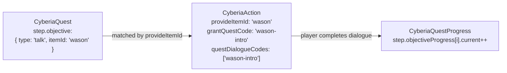
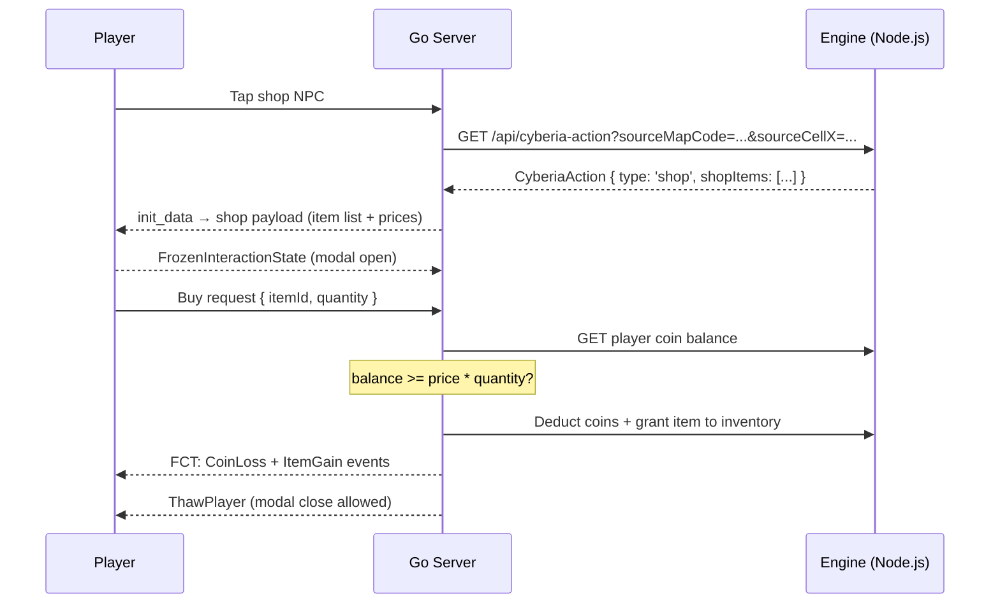
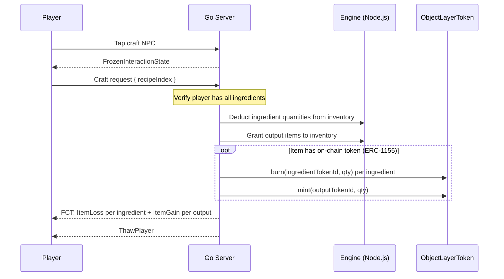

# Action System

**Module:** `src/api/cyberia-action` · `src/api/cyberia-dialogue`

---

## Overview

The Action System defines how NPC entities interact with players. An **Action** is a spatial, typed payload attached to a map entity that the player activates by tapping the NPC. Actions drive dialogue, shops, crafting, storage, and quest grant events.

> **Implementation status — Pre-alpha:** The CyberiaAction and CyberiaDialogue MongoDB schemas and Engine REST API (`src/api/cyberia-action`, `src/api/cyberia-dialogue`) are defined. Go server integration (NPC tap routing to action handlers, shop/craft transaction processing, quest grant on dialogue completion) is planned for the **Alpha milestone**. The `freeze_start`/`freeze_end` WS messages for modal protection are implemented in the Go server today.

---

## Data Model

### CyberiaAction Schema

```
CyberiaAction {
  code:         String  // stable unique slug
  type:         String  // see Action Types below
  label:        String  // display label on interaction button

  // Spatial origin — NPC entity cell providing this action
  sourceMapCode: String
  sourceCellX:   Number
  sourceCellY:   Number

  // Identity — used to match quest objectives of type 'talk'
  provideItemId: String  // entity's active skin ObjectLayer item ID (e.g. 'wason', 'alex')

  // Quest grant — first interaction with this NPC starts the linked quest chain
  grantQuestCode: String  // empty = no quest granted

  // Dialogue
  dialogCode:        String    // greeting dialogue shown on tap
  questDialogueCodes: [String] // ordered dialogue codes that satisfy 'talk' quest objectives

  // Type-specific payloads:
  shopItems: [{
    itemId:      String  // ObjectLayer item ID being sold
    priceItemId: String  // currency item ID (default: 'coin')
    priceQty:    Number  // price quantity
  }]

  craftRecipes: [{
    outputItems: [{ itemId: String, qty: Number }]
    ingredients: [{ itemId: String, qty: Number }]
  }]

  storageSlots: Number  // storage capacity (type='storage' only)
}
```

### CyberiaDialogue Schema

```
CyberiaDialogue {
  code:    String  // grouping key (e.g. "wason-intro")
  order:   Number  // 0-based sequence within the group
  speaker: String  // display name above the dialogue line
  text:    String  // dialogue line content
  mood:    String  // emotion hint: neutral | angry | sad | happy | ...
}
```

A single `code` groups many ordered dialogue lines. The C client fetches all lines for a given code in one request, then displays them sequentially.

---

## Action Types

| Type         | Description                                                    | Active Payload                                       |
| ------------ | -------------------------------------------------------------- | ---------------------------------------------------- |
| `quest-talk` | Grants a quest on first interaction, then shows dialogue       | `grantQuestCode`, `dialogCode`, `questDialogueCodes` |
| `talk`       | NPC dialogue only — satisfies `talk` quest objectives          | `dialogCode`, `questDialogueCodes`                   |
| `shop`       | Item shop — player buys items with in-game currency            | `shopItems[]`                                        |
| `craft`      | Crafting station — consume ingredients to produce output items | `craftRecipes[]`                                     |
| `storage`    | Personal item storage vault                                    | `storageSlots`                                       |

---

## Action–Quest Integration

The Action System and Quest System are linked through `provideItemId` and `questDialogueCodes`:



**Talk objective satisfaction flow:**

1. Player taps NPC → interaction bubble shown.
2. Player taps interaction bubble → Action is fetched by spatial coordinates.
3. Client displays `dialogCode` dialogue sequence.
4. On first tap, if `grantQuestCode` is set → server grants the quest.
5. After viewing all `questDialogueCodes` dialogue lines → server increments the matching `talk` objective's `current` counter.

---

## Shop Transaction Flow



---

## Craft Transaction Flow



---

## Spatial Binding and Instance Init

`sourceMapCode + sourceCellX + sourceCellY` links an Action to a specific entity cell in a specific map. During instance initialization:

1. `instance_loader.go` reads each `CyberiaEntity` at its `initCellX/initCellY`.
2. For entities with matching Action source coordinates, the Go server attaches the Action payload to the runtime entity.
3. The entity's `entityStatus` is set to `action-provider` (ESI id=8) — the bouncing chat icon renders above its nameplate.

---

## Dialogue System

Dialogue groups allow multi-line sequential NPC speech:

```json
[
  {
    "code": "wason-intro",
    "order": 0,
    "speaker": "Wason",
    "text": "Young traveler... you've finally arrived.",
    "mood": "neutral"
  },
  {
    "code": "wason-intro",
    "order": 1,
    "speaker": "Wason",
    "text": "The village is in danger. I need your help.",
    "mood": "sad"
  },
  {
    "code": "wason-intro",
    "order": 2,
    "speaker": "Wason",
    "text": "Collect 5 herbs from the forest and return to me.",
    "mood": "neutral"
  }
]
```

The C client fetches the full `code` group sorted by `order`, then renders lines one at a time in `modal_dialogue.c`. The player advances through lines by tapping.

---

## Indexes

```javascript
// CyberiaAction
{ code: 1 }           // unique
{ provideItemId: 1 }
{ grantQuestCode: 1 } // sparse
{ sourceMapCode: 1, sourceCellX: 1, sourceCellY: 1 }

// CyberiaDialogue
{ code: 1 }
{ code: 1, order: 1 }
```

---

## Example Action Document

```json
{
  "code": "wason-npc",
  "type": "quest-talk",
  "label": "Talk",
  "sourceMapCode": "cyberia-village",
  "sourceCellX": 12,
  "sourceCellY": 8,
  "provideItemId": "wason",
  "grantQuestCode": "wason-intro",
  "dialogCode": "wason-intro",
  "questDialogueCodes": ["wason-intro"],
  "shopItems": [],
  "craftRecipes": [],
  "storageSlots": 0
}
```
