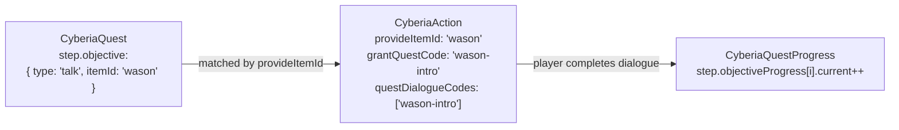
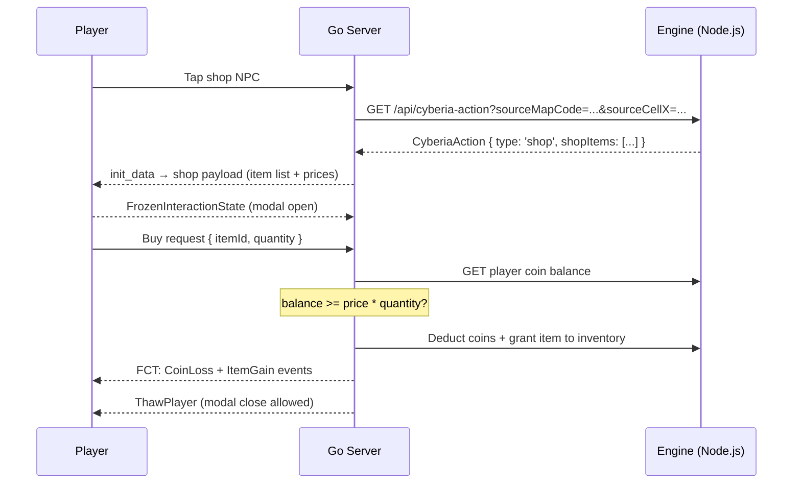
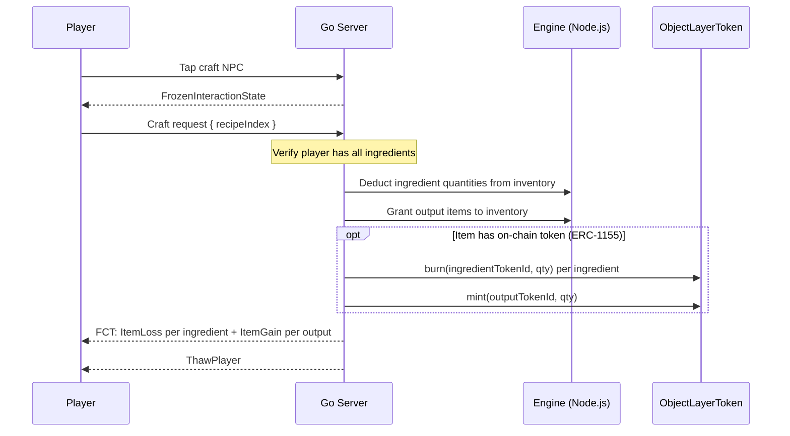

# Action System

**Module:** `src/api/cyberia-action` · `src/api/cyberia-dialogue`

---

## Overview

The Action System defines how NPC entities interact with players. An **Action** is a spatial, typed payload attached to a map entity that the player activates by tapping the NPC. Actions drive dialogue, shops, crafting, storage, and quest grant events.

> **Implementation status — Alpha (talk / quest-talk):** The CyberiaAction and CyberiaDialogue MongoDB schemas and Engine REST API (`src/api/cyberia-action`, `src/api/cyberia-dialogue`) are defined. The `talk` and `quest-talk` paths are wired end-to-end: the Go server binds actions to entities at instance init, validates dialogue completion, grants quests, and advances `talk` objectives (see **Dialogue Interaction Protocol** below). Shop / craft / storage transaction processing remains planned for a later Alpha increment. The `freeze_start`/`freeze_end` WS messages for modal protection are implemented; dialogue freeze now rides on the `dlg_*` frames.

---

## Data Model

### CyberiaAction Schema

```
CyberiaAction {
  code:         String  // stable unique slug
  type:         String  // see Action Types below
  label:        String  // display label on interaction button

  // Spatial origin — NPC entity cell providing this action
  sourceMapCode: String
  sourceCellX:   Number
  sourceCellY:   Number

  // Identity — used to match quest objectives of type 'talk'
  provideItemId: String  // entity's active skin ObjectLayer item ID (e.g. 'wason', 'alex')

  // Quest grant — first interaction with this NPC starts the linked quest chain
  grantQuestCode: String  // empty = no quest granted

  // Dialogue
  dialogCode:        String    // greeting dialogue shown on tap
  questDialogueCodes: [String] // ordered dialogue codes that satisfy 'talk' quest objectives

  // Type-specific payloads:
  shopItems: [{
    itemId:      String  // ObjectLayer item ID being sold
    priceItemId: String  // currency item ID (default: 'coin')
    priceQty:    Number  // price quantity
  }]

  craftRecipes: [{
    outputItems: [{ itemId: String, qty: Number }]
    ingredients: [{ itemId: String, qty: Number }]
  }]

  storageSlots: Number  // storage capacity (type='storage' only)
}
```

### CyberiaDialogue Schema

```
CyberiaDialogue {
  code:    String  // grouping key (e.g. "wason-intro")
  order:   Number  // 0-based sequence within the group
  speaker: String  // display name above the dialogue line
  text:    String  // dialogue line content
  mood:    String  // emotion hint: neutral | angry | sad | happy | ...
}
```

A single `code` groups many ordered dialogue lines. The C client fetches all lines for a given code in one request, then displays them sequentially.

---

## Action Types

| Type         | Description                                                    | Active Payload                                       |
| ------------ | -------------------------------------------------------------- | ---------------------------------------------------- |
| `quest-talk` | Grants a quest on first interaction, then shows dialogue       | `grantQuestCode`, `dialogCode`, `questDialogueCodes` |
| `talk`       | NPC dialogue only — satisfies `talk` quest objectives          | `dialogCode`, `questDialogueCodes`                   |
| `shop`       | Item shop — player buys items with in-game currency            | `shopItems[]`                                        |
| `craft`      | Crafting station — consume ingredients to produce output items | `craftRecipes[]`                                     |
| `storage`    | Personal item storage vault                                    | `storageSlots`                                       |

---

## Action–Quest Integration

The Action System and Quest System are linked through `provideItemId` and `questDialogueCodes`:



**Talk objective satisfaction flow:**

1. Player taps NPC → interaction bubble shown.
2. Player taps interaction bubble → Action is fetched by spatial coordinates.
3. Client displays `dialogCode` dialogue sequence.
4. On first tap, if `grantQuestCode` is set → server grants the quest.
5. After viewing all `questDialogueCodes` dialogue lines → server increments the matching `talk` objective's `current` counter.

---

## Shop Transaction Flow



---

## Craft Transaction Flow



---

## Dialogue Interaction Protocol (talk / quest-talk)

Tapping an interaction bubble opens the Raylib-native **`modal_interact`** modal
(top half of the screen). It has a tab strip — **stack** (active item slots),
**stats** (six-stat stack totals), and **action** (mission interface, shown only
for action-provider entities, ESI 8) — over a fixed bottom bar of right-aligned
integration buttons (**Chat**, **Integration**) that open the JS overlay. The
action tab's **Talk / Take mission** opens `modal_dialogue` (bottom half).

The client is identical for `talk` and `quest-talk`; the **server** branches after
`dlg_complete`. The client never declares the action type, quest code, or quest
dialogue codes — the server resolves the bound action from its own
`entityId → CyberiaAction` cache (bound at instance init).

### Wire messages

| Direction | Message        | When                                  | Payload                              |
| --------- | -------------- | ------------------------------------- | ------------------------------------ |
| C → S     | `dlg_start`    | `modal_dialogue` opens                | `{ entityId, itemId }`               |
| C → S     | `dlg_complete` | player reads all lines, closes        | `{ entityId, itemId, dialogCode }`   |
| C → S     | `dlg_cancel`   | player dismisses early (✕ / outside)  | `{ entityId, itemId }`               |
| S → C     | `dlg_ack`      | after `dlg_complete` is processed     | `{ questGranted, objectivesDone, quests[] }` |

Binary uplink opcodes: `dlg_start` `0x17`, `dlg_complete` `0x18`, `dlg_cancel`
`0x19` (JSON aliases of the same names are also accepted).

`dlg_ack` is notify-only — it carries the affected quest snapshot entries the
client upserts into its local `quest_store` (Quest Journal); it never gates
simulation state.

### Server `dlg_complete` handling

1. Validate `player.activeDialogueEntityID == msg.entityId`; drop otherwise.
2. Clear the dialogue context and thaw the player (modal protection off).
3. Resolve the action from `actionCache[entityId]`. `talk` → ack only.
4. `quest-talk`: on first contact grant `grantQuestCode`; then for every active
   quest whose **current step** has a `{ type: 'talk', itemId == provideItemId }`
   objective, increment it — **only** when `msg.dialogCode` is in the action's
   `questDialogueCodes`. On quest completion, deliver rewards (FCT) and unlock
   successors.

> **Dialogue-code contract.** The C client fetches dialogue groups at
> `/api/cyberia-dialogue/code/default-<itemId>`, so the code it reports on
> `dlg_complete` is `default-<provideItemId>`. For a `quest-talk` objective to
> advance, the action's `questDialogueCodes` must contain that code.

### Freeze semantics

| Event                              | Player state              |
| ---------------------------------- | ------------------------- |
| `modal_interact` open              | Active (no freeze)        |
| `dlg_start` sent                   | Frozen — immune to damage |
| `dlg_complete` / `dlg_cancel` sent | Unfrozen                  |

---

## Fallback World mission instantiation

The default mission system is playable in the procedural **Fallback World**.
`DefaultCyberiaActions` carry `sourceMapCode` / `sourceCellX` / `sourceCellY`
(all on `fallback-map-0`), and the world generator's
`generateActionProviderBots()` places one passive NPC bot per action at those
exact cells (skin = `provideItemId`, zero spawn/aggro radius). The fallback map
builder reserves those cells (dropping any overlapping obstacle) so the NPCs
always stand on walkable ground. The Go server then binds each bot back to its
action by `sourceMapCode + sourceCellX + sourceCellY` at instance init and keeps
an **ephemeral** per-session `CyberiaQuestProgress` (no persistence) — matching
the ROADMAP Road-to-Alpha-Open contract. `scp-2040` kill targets spawn from the
random bot pool, so the intro quest's talk → collect → kill loop is reachable.

---

## Spatial Binding and Instance Init

`sourceMapCode + sourceCellX + sourceCellY` links an Action to a specific entity cell in a specific map. During instance initialization:

1. `instance_loader.go` reads each `CyberiaEntity` at its `initCellX/initCellY`.
2. For entities with matching Action source coordinates, the Go server attaches the Action payload to the runtime entity.
3. The entity's `entityStatus` is set to `action-provider` (ESI id=8) — the bouncing chat icon renders above its nameplate.

---

## Dialogue System

Dialogue groups allow multi-line sequential NPC speech:

```json
[
  {
    "code": "wason-intro",
    "order": 0,
    "speaker": "Wason",
    "text": "Young traveler... you've finally arrived.",
    "mood": "neutral"
  },
  {
    "code": "wason-intro",
    "order": 1,
    "speaker": "Wason",
    "text": "The village is in danger. I need your help.",
    "mood": "sad"
  },
  {
    "code": "wason-intro",
    "order": 2,
    "speaker": "Wason",
    "text": "Collect 5 herbs from the forest and return to me.",
    "mood": "neutral"
  }
]
```

The C client fetches the full `code` group sorted by `order`, then renders lines one at a time in `modal_dialogue.c`. The player advances through lines by tapping.

---

## Indexes

```javascript
// CyberiaAction
{ code: 1 }           // unique
{ provideItemId: 1 }
{ grantQuestCode: 1 } // sparse
{ sourceMapCode: 1, sourceCellX: 1, sourceCellY: 1 }

// CyberiaDialogue
{ code: 1 }
{ code: 1, order: 1 }
```

---

## Example Action Document

```json
{
  "code": "wason-npc",
  "type": "quest-talk",
  "label": "Talk",
  "sourceMapCode": "cyberia-village",
  "sourceCellX": 12,
  "sourceCellY": 8,
  "provideItemId": "wason",
  "grantQuestCode": "wason-intro",
  "dialogCode": "wason-intro",
  "questDialogueCodes": ["wason-intro"],
  "shopItems": [],
  "craftRecipes": [],
  "storageSlots": 0
}
```
