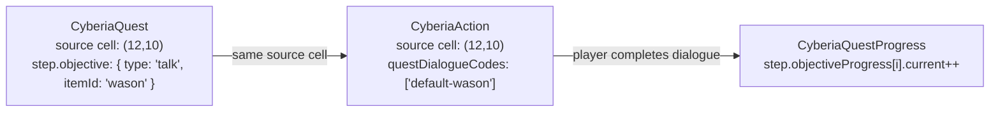
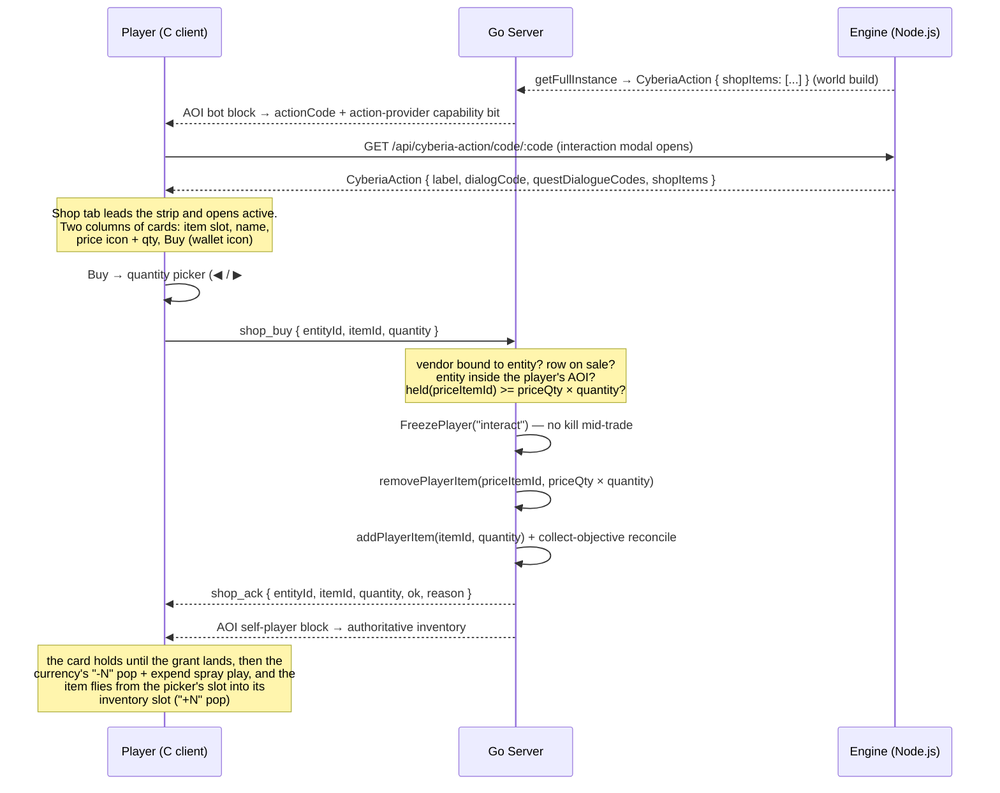
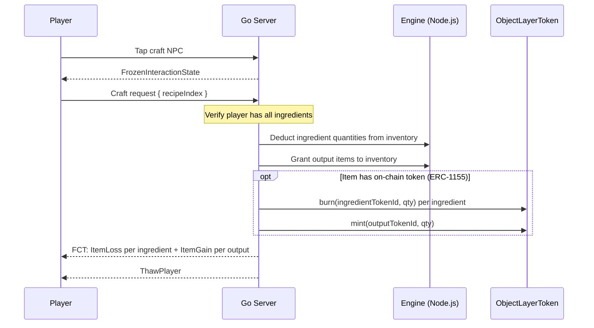

# Action System

**Module:** `src/api/cyberia-action` · `src/api/cyberia-dialogue`

---

## Overview

The Action System defines how NPC entities interact with players. An **Action** is a spatial, typed payload attached to a map entity that the player activates by tapping the NPC. Actions drive dialogue, shops, crafting, storage, and quest grant events.

> **Implementation status — Alpha (talk / quest-talk / shop):** The CyberiaAction and CyberiaDialogue MongoDB schemas and Engine REST API (`src/api/cyberia-action`, `src/api/cyberia-dialogue`) are defined. The `talk` and `quest-talk` paths are wired end-to-end: the Go server binds actions to entities at instance init, validates dialogue completion, grants quests, and advances `talk` objectives (see **Dialogue Interaction Protocol** below). The `shop` path is wired end-to-end as well (see **Shop Transaction Flow**). Craft / storage transaction processing remains planned for a later Alpha increment. The `freeze_start`/`freeze_end` WS messages for modal protection are implemented; dialogue freeze now rides on the `dlg_*` frames.

---

## Data Model

### CyberiaAction Schema

```
CyberiaAction {
  code:         String  // stable unique, location-scoped slug
  label:        String  // NPC overhead nameplate (there is no `type` field —
                        // see Action Capabilities below)

  // Spatial origin — NPC entity cell providing this action
  sourceMapCode: String
  sourceCellX:   Number
  sourceCellY:   Number

  // Identity — the NPC skin is derived from the `default-<skin>` dialogue code
  // (no stored field); 'talk' objectives match the talked-to bot's active skin.

  // Quest award — NOT stored on the action. The quest(s) this action awards are
  // the CyberiaQuest documents whose (sourceMapCode, sourceCellX, sourceCellY)
  // match this action's cell; the runtime offers the next acceptable one.

  // Dialogue
  dialogCode:        String    // greeting dialogue shown on tap
  questDialogueCodes: [String] // ordered dialogue codes that satisfy 'talk' quest objectives

  // Type-specific payloads:
  shopItems: [{
    itemId:      String  // ObjectLayer item ID being sold
    priceItemId: String  // currency item ID (default: 'coin')
    priceQty:    Number  // price quantity
  }]

  craftRecipes: [{
    outputItems: [{ itemId: String, qty: Number }]
    ingredients: [{ itemId: String, qty: Number }]
  }]

  storageSlots: Number  // vault capacity in slots; 0 disables the capability
}
```

### CyberiaDialogue Schema

```
CyberiaDialogue {
  code:    String  // grouping key (e.g. "wason-intro")
  order:   Number  // 0-based sequence within the group
  speaker: String  // display name above the dialogue line
  text:    String  // dialogue line content
  mood:    String  // emotion hint: neutral | angry | sad | happy | ...
}
```

A single `code` groups many ordered dialogue lines. The C client fetches all lines for a given code in one request, then displays them sequentially.

---

## Action Capabilities

An action has **no type**. Its capabilities are whatever payloads are populated,
resolved per player at interaction time — one action can be a shop and a
quest-talk giver at once.

| Capability   | Active when                                                     | Payload                                              |
| ------------ | --------------------------------------------------------------- | ---------------------------------------------------- |
| `quest-talk` | CyberiaQuests are bound to this action's cell                   | quests bound by cell, `dialogCode`, `questDialogueCodes` |
| `talk`       | always — satisfies `talk` quest objectives                      | `dialogCode`, `questDialogueCodes`                   |
| `shop`       | `shopItems[]` is non-empty — player buys items with a currency  | `shopItems[]`                                        |
| `craft`      | `craftRecipes[]` is non-empty — player assembles outputs        | `craftRecipes[]`                                     |
| `storage`    | `storageSlots > 0` — player banks items in a personal vault     | `storageSlots`                                       |

---

## Action–Quest Integration

The Action System and Quest System are linked by **cell** (the action and the
quest it awards share `sourceMapCode/sourceCellX/sourceCellY`) and by the NPC's
active **skin** (which `talk` objectives match):


```mermaid
graph LR
    Quest["CyberiaQuest\nsource cell: (12,10)\nstep.objective: { type: 'talk', itemId: 'wason' }"]
    Action["CyberiaAction\nsource cell: (12,10)\nquestDialogueCodes: ['default-wason']"]
    Progress["CyberiaQuestProgress\nstep.objectiveProgress[i].current++"]

    Quest -->|same source cell| Action
    Action -->|player completes dialogue| Progress
```

**Talk objective satisfaction flow:**

1. Player taps NPC → interaction bubble shown.
2. Player taps interaction bubble → `modal_interact` opens; the offered quest is the one bound to the NPC's cell.
3. Accepting is explicit: the **Take Quest** button sends `quest_accept` and the server grants the acceptable quest bound to that cell (prerequisites met, not active/completed).
4. Talk objectives advance only after the player reads **all** `questDialogueCodes` lines (`dlg_complete`), validated server-side; never by a button.

---

## Shop Transaction Flow

An action carrying a non-empty `shopItems[]` is a **vendor** — there is no type
flag. The catalog reaches the two runtimes on their own transports: the Go
server receives it with the world over gRPC (`CyberiaActionMessage.shop_items`),
the C client fetches it by action code over REST and renders the **Shop** tab.
Only the server prices a purchase.

A live vendor also lights the **action-provider** capability bit
(`InteractionFlagAction`), so it carries the same overhead attention icon,
orbiting particles, and coloured interaction-column border as a pending
action-talk — the player can see there is something to do before tapping.


```mermaid
sequenceDiagram
    participant P as Player (C client)
    participant G as Go Server
    participant E as Engine (Node.js)

    E-->>G: getFullInstance → CyberiaAction { shopItems: [...] } (world build)
    G-->>P: AOI bot block → actionCode + action-provider capability bit
    P->>E: GET /api/cyberia-action/code/:code (interaction modal opens)
    E-->>P: CyberiaAction { label, dialogCode, questDialogueCodes, shopItems }
    Note over P: Shop tab leads the strip and opens active.<br/>Two columns of cards: item slot, name,<br/>price icon + qty, Buy (wallet icon)

    P->>P: Buy → quantity picker (◀ / ▶ #N, 1..10, capped by what the player<br/>can pay) with a running total, then Cancel or Buy
    P->>G: shop_buy { entityId, itemId, quantity }
    Note over G: vendor bound to entity? row on sale?<br/>entity inside the player's AOI?<br/>held(priceItemId) >= priceQty × quantity?
    G->>G: FreezePlayer("interact") — no kill mid-trade
    G->>G: removePlayerItem(priceItemId, priceQty × quantity)
    G->>G: addPlayerItem(itemId, quantity) + collect-objective reconcile
    G-->>P: shop_ack { entityId, itemId, quantity, ok, reason }
    G-->>P: AOI self-player block → authoritative inventory
    Note over P: the card holds until the grant lands, then the<br/>currency's "-N" pop + expend spray play, and the<br/>item flies from the picker's slot into its<br/>inventory slot ("+N" pop)
```

The picker deliberately waits for the grant before animating: a first copy has
no inventory slot until the server delivers it, so launching the flight on the
button press would aim at the bar's fallback centre instead of the item's own
slot. Waiting also fixes the ordering — the spend is seen leaving before the
goods arrive.

Binary uplink opcode: `shop_buy` `0x1C` — `[u8 kind][str entityId][str itemId][u8 quantity]`.
The quantity is clamped server-side to `[1, shopBuyMaxQty]` (10); a client that
sends 0 means one unit. A purchase is all-or-nothing: an unaffordable total is
rejected rather than partially filled.

Rejection reasons on `shop_ack`: `no_vendor`, `not_for_sale`, `out_of_range`,
`insufficient_funds`.

`shop_ack` is notify-only, and only a rejection is surfaced (as a toast). The
inventory itself always arrives through the AOI self-player block, so a dropped
ack costs the player nothing.

---

## Craft Transaction Flow


```mermaid
sequenceDiagram
    participant P as Player
    participant G as Go Server
    participant E as Engine (Node.js)
    participant BC as ObjectLayerToken

    P->>G: Tap craft NPC
    G-->>P: FrozenInteractionState
    P->>G: Craft request { recipeIndex }
    Note over G: Verify player has all ingredients
    G->>E: Deduct ingredient quantities from inventory
    G->>E: Grant output items to inventory
    opt Item has on-chain token (ERC-1155)
        G->>BC: burn(ingredientTokenId, qty) per ingredient
        G->>BC: mint(outputTokenId, qty)
    end
    G-->>P: FCT: ItemLoss per ingredient + ItemGain per output
    G-->>P: ThawPlayer
```

---

## Dialogue Interaction Protocol (talk / quest-talk)

Tapping an interaction bubble opens the Raylib-native **`modal_interact`** modal
(top half of the screen). It has a tab strip — **shop** (vendor catalog, shown
only when its action carries `shopItems`), **quest** (mission interface, shown
only when the entity provides quest codes), **stack** (active item slots), and
**stats** (six-stat stack totals) — over a fixed bottom bar of right-aligned
integration buttons (**Chat**, **Integration**) that open the JS overlay. The
paired `modal_dialogue` (bottom half) carries the talk flow.

Capability tabs lead the strip, and the leading one opens active — Shop for a
vendor, else Quest. Because the catalog resolves through an async REST fetch
after the modal is already open, the active tab keeps tracking the leading
capability until the player picks a tab themselves. Switching tabs plays a
pop-in transition, during which content taps are ignored.

The client is identical for `talk` and `quest-talk`; the **server** branches after
`dlg_complete`. The client never declares the action type, quest code, or quest
dialogue codes — the server resolves the bound action from its own
`entityId → CyberiaAction` cache (bound at instance init).

### Wire messages

| Direction | Message        | When                                  | Payload                              |
| --------- | -------------- | ------------------------------------- | ------------------------------------ |
| C → S     | `dlg_start`    | `modal_dialogue` opens                | `{ entityId, itemId }`               |
| C → S     | `dlg_complete` | player reads all lines, closes        | `{ entityId, itemId, dialogCode }`   |
| C → S     | `dlg_cancel`   | player dismisses early (✕ / outside)  | `{ entityId, itemId }`               |
| S → C     | `dlg_ack`      | after `dlg_complete` is processed     | `{ questGranted, objectivesDone, quests[] }` |

Binary uplink opcodes: `dlg_start` `0x17`, `dlg_complete` `0x18`, `dlg_cancel`
`0x19` (JSON aliases of the same names are also accepted).

`dlg_ack` is notify-only — it carries the affected quest snapshot entries the
client upserts into its local `quest_store` (Quest Journal); it never gates
simulation state.

### Provider freeze

A dialogue is one step of a provider session, not the whole of it: the interact
modal stays open afterwards with its shop and quest tabs live. So when the
talked-to entity has a bound `CyberiaAction`, `dlg_complete` / `dlg_cancel`
re-bridge the freeze to `"interact"` instead of thawing, and `shop_buy` asserts
the same freeze before it mutates anything. The player therefore cannot be
killed anywhere inside a provider session, whether or not the client
re-asserted the freeze itself.

The client half holds up its end for as long as a modal is open. `modal_interact`,
`inventory_modal` and `modal_instance_map` each own a freeze reason
(`"interact"`, `"inventory"`, `"instance-map"`) and call
`local_player_keep_freeze()` every frame they stay open — without that renewal
the 30-second freeze watchdog auto-sends `freeze_end`, and a player browsing a
shop longer than that would silently become killable. A modal closing over
another one that still owns a freeze re-bridges to it rather than ending the
freeze, so there is never a thawed frame between them.

### Server `dlg_complete` handling

1. Validate `player.activeDialogueEntityID == msg.entityId`; drop otherwise.
2. Clear the dialogue context and thaw the player (modal protection off).
3. Resolve the action from `actionCache[entityId]`. `talk` → ack only.
4. `quest-talk`: `dlg_complete` NEVER grants — it advances every active quest
   whose **current step** has a `{ type: 'talk', itemId == bot active skin }`
   objective, **only** when `msg.dialogCode` is in the action's
   `questDialogueCodes`. Granting is a separate explicit `quest_accept`, which
   grants the acceptable quest bound to the NPC's cell. On quest completion,
   deliver rewards (FCT); successors are NOT auto-granted (the player accepts
   each from its NPC).

> **Dialogue-code contract.** The C client fetches dialogue groups at
> `/api/cyberia-dialogue/code/default-<itemId>`, so the code it reports on
> `dlg_complete` is `default-<provideItemId>`. For a `quest-talk` objective to
> advance, the action's `questDialogueCodes` must contain that code.

### Freeze semantics

| Event                              | Player state              |
| ---------------------------------- | ------------------------- |
| `modal_interact` open              | Active (no freeze)        |
| `dlg_start` sent                   | Frozen — immune to damage |
| `dlg_complete` / `dlg_cancel` sent | Unfrozen                  |

---

## Fallback World mission instantiation

The default mission system is playable in the procedural **Fallback World**.
`DefaultCyberiaActions` carry `sourceMapCode` / `sourceCellX` / `sourceCellY`
(all on `fallback-map-0`), and the world generator's
`generateActionProviderBots()` places one passive NPC bot per action at those
exact cells (skin = `provideItemId`, zero spawn/aggro radius). The fallback map
builder reserves those cells (dropping any overlapping obstacle) so the NPCs
always stand on walkable ground. The Go server then binds each bot back to its
action by `sourceMapCode + sourceCellX + sourceCellY` at instance init and keeps
an **ephemeral** per-session `CyberiaQuestProgress` (no persistence) — matching
the ROADMAP Road-to-Alpha-Open contract. `scp-2040` kill targets spawn from the
random bot pool, so the intro quest's talk → collect → kill loop is reachable.

---

## Spatial Binding and Instance Init

`sourceMapCode + sourceCellX + sourceCellY` links an Action to a specific entity cell in a specific map. During instance initialization:

1. `instance_loader.go` reads each `CyberiaEntity` at its `initCellX/initCellY`.
2. For entities with matching Action source coordinates, the Go server attaches the Action payload to the runtime entity.
3. The entity's `entityStatus` is set to `action-provider` (ESI id=8) — the bouncing chat icon renders above its nameplate.

---

## Dialogue System

Dialogue groups allow multi-line sequential NPC speech:

```json
[
  {
    "code": "wason-intro",
    "order": 0,
    "speaker": "Wason",
    "text": "Young traveler... you've finally arrived.",
    "mood": "neutral"
  },
  {
    "code": "wason-intro",
    "order": 1,
    "speaker": "Wason",
    "text": "The village is in danger. I need your help.",
    "mood": "sad"
  },
  {
    "code": "wason-intro",
    "order": 2,
    "speaker": "Wason",
    "text": "Collect 5 herbs from the forest and return to me.",
    "mood": "neutral"
  }
]
```

The C client fetches the full `code` group sorted by `order`, then renders lines one at a time in `modal_dialogue.c`. The player advances through lines by tapping.

---

## Indexes

```javascript
// CyberiaAction
{ code: 1 }           // unique
{ sourceMapCode: 1, sourceCellX: 1, sourceCellY: 1 }

// CyberiaDialogue
{ code: 1 }
{ code: 1, order: 1 }
```

---

## Example Action Document

```json
{
  "code": "loc-fallback-map-0-18-16",
  "label": "Punk",
  "sourceMapCode": "fallback-map-0",
  "sourceCellX": 18,
  "sourceCellY": 16,
  "dialogCode": "default-punk",
  "questDialogueCodes": [],
  "shopItems": [{ "itemId": "tim-knife", "priceItemId": "coin", "priceQty": 10 }],
  "craftRecipes": [],
  "storageSlots": 0
}
```

This is the vendor shipped in the canonical defaults
(`DefaultCyberiaActions`): the `punk`-skinned NPC on `fallback-map-0` at
(18, 16) sells `tim-knife` for 10 coins. `bin/cyberia run-workflow
seed-actions-quests` upserts it; the procedural fallback world serves it
unpersisted.
