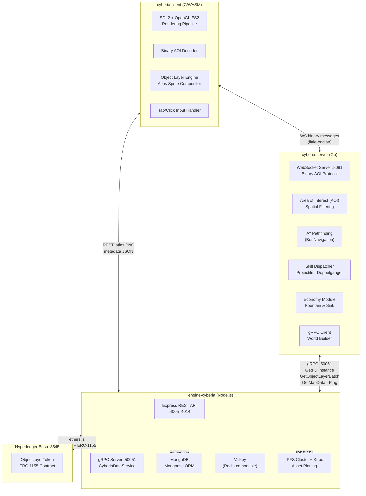
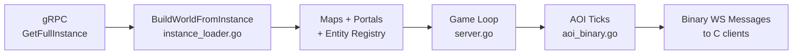
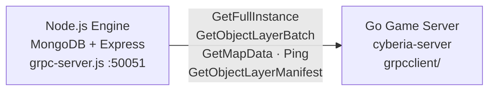

# Cyberia Online — System Architecture

**Version:** 3.0.3 | **Status:** Current

---

## Overview

Cyberia Online is a real-time tap-based sandbox MMORPG built on three independent service layers communicating through well-defined binary and gRPC protocols. The system separates concerns across:

1. **Engine-Cyberia** (Node.js) — data persistence, gRPC data service, REST API, CI/CD tooling.
2. **cyberia-server** (Go) — real-time multiplayer game logic, binary WebSocket AOI protocol.
3. **cyberia-client** (C/WASM) — game rendering client compiled to WebAssembly.

---

## High-Level System Diagram



---

## Component Details

### Engine-Cyberia (Node.js)

The authoritative backend providing all persistent game data through two transport layers:

**REST APIs (Express):**

| API                          | Description                                         |
| ---------------------------- | --------------------------------------------------- |
| `object-layer`               | CRUD for ObjectLayer documents (AtomicPrefab)       |
| `object-layer-render-frames` | Atlas frame matrix and color palette documents      |
| `atlas-sprite-sheet`         | Consolidated atlas PNG + metadata                   |
| `cyberia-instance`           | Instance graph (maps + portal topology)             |
| `cyberia-map`                | Map grid, entity placements, metadata               |
| `cyberia-entity`             | Entity definitions                                  |
| `cyberia-instance-conf`      | Instance configuration (skills, economy, equipment) |
| `cyberia-quest`              | Quest definitions                                   |
| `cyberia-quest-progress`     | Per-player quest progress                           |
| `cyberia-action`             | NPC action definitions                              |
| `cyberia-dialogue`           | Dialogue lines                                      |

**gRPC Service (`CyberiaDataService`):**

| RPC                             | Description                                                      |
| ------------------------------- | ---------------------------------------------------------------- |
| `GetFullInstance(instanceCode)` | Instance graph + maps + entities + ObjectLayers + InstanceConfig |
| `GetMapData(mapCode)`           | Single map grid and entity data                                  |
| `GetObjectLayerBatch()`         | Stream all ObjectLayers (cache warm-up)                          |
| `GetObjectLayer(itemId)`        | Single ObjectLayer by item ID                                    |
| `GetObjectLayerManifest()`      | All `itemId + sha256` pairs (hot-reload diff)                    |
| `Ping()`                        | Engine liveness check                                            |

**Fallback Instance:** When `GetFullInstance` is called with an unknown instance code, the Engine returns a minimal playable fallback (1 empty 64×64 map, no bots, no ObjectLayers) instead of `NOT_FOUND`.

---

### cyberia-server (Go)

Real-time multiplayer game server. Consumes gRPC data at startup, then runs independently:



**Key source files:**

| File                    | Responsibility                                        |
| ----------------------- | ----------------------------------------------------- |
| `server.go`             | WebSocket lifecycle, game loop, player registry       |
| `aoi_binary.go`         | Binary AOI wire format encoder/decoder                |
| `object_layer.go`       | ObjectLayer Go types mirroring the MongoDB schema     |
| `collision.go`          | Grid collision detection, portal transitions          |
| `pathfinding.go`        | A\* pathfinding for bot navigation                    |
| `skill.go`              | Skill entry points: tap action trigger, on-kill hooks |
| `skill_dispatcher.go`   | Skill registry: `InitSkills`, `DispatchSkill`         |
| `skill_projectile.go`   | Projectile skill handler                              |
| `skill_doppelganger.go` | Doppelganger skill handler                            |
| `economy.go`            | Fountain & Sink coin economy                          |
| `frozen_state.go`       | FrozenInteractionState (modal protection)             |
| `entity_status.go`      | Entity Status Indicator (ESI) computation             |
| `life_regen.go`         | HP regeneration loop                                  |
| `ai.go`                 | Bot AI behavior (hostile/passive)                     |
| `stats.go`              | Stat aggregation and sum-stats limit enforcement      |
| `instance_loader.go`    | World reconstruction from gRPC data                   |
| `handlers.go`           | WebSocket message handlers                            |
| `grpcclient/`           | gRPC client implementation                            |

---

### cyberia-client (C/WASM)

Game client compiled to WebAssembly with Emscripten. Runs in the browser.

**Key source files:**

| File                         | Responsibility                          |
| ---------------------------- | --------------------------------------- |
| `main.c`                     | Entry point, game loop                  |
| `game_render.c`              | Main rendering pipeline                 |
| `game_state.c`               | Client-side game state management       |
| `network.c`                  | WebSocket connection + message dispatch |
| `binary_aoi_decoder.c`       | Binary AOI message parser               |
| `object_layer.c`             | ObjectLayer metadata store              |
| `object_layers_management.c` | Multi-layer management per entity       |
| `entity_render.c`            | Per-entity layer compositing            |
| `layer_z_order.c`            | Z-order sorting for rendering           |
| `ol_as_animated_ico.c`       | Animated Object Layer rendering         |
| `ol_stack_ico.c`             | Stacked icon rendering                  |
| `texture_manager.c`          | Atlas texture loading and caching       |
| `input.c`                    | Tap/click input handling                |
| `floating_combat_text.c`     | FCT event rendering                     |
| `inventory_bar.c`            | Bottom inventory bar UI                 |
| `inventory_modal.c`          | Full inventory modal                    |
| `entity_overhead_ui.c`       | Nameplate + status icon rendering       |
| `interaction_bubble.c`       | NPC interaction prompt bubble           |
| `tap_effect.c`               | Tap visual feedback animation           |
| `modal_dialogue.c`           | NPC dialogue modal                      |
| `modal_player.c`             | Player info modal                       |
| `message_parser.c`           | Server message routing                  |

**Build system:**

```bash
# Development build
make -f Web.mk clean && make -f Web.mk web

# Production / release build
make -f Web.mk clean && make -f Web.mk web BUILD_MODE=RELEASE
```

---

## Binary AOI Wire Protocol

The Go server and C client communicate via a custom little-endian binary WebSocket protocol. Only render-essential data is transmitted; atlas binaries are fetched from the Engine REST API independently.

```
Header (5 bytes):
  [0]     u8   msgType
            0x01 = aoi_update   (partial delta update)
            0x02 = init_data    (full game config on connect)
            0x03 = full_aoi     (complete world snapshot)
            0x04 = FCT          (Floating Combat Text, 14 bytes fixed)
            0x05 = ItemFCT      (Item quantity FCT, variable)
  [1..2]  u16  reserved (0)
  [3..4]  u16  entityCount

Per-entity block (variable):
  [0]     u8   flags
               bits 0-2: entity type (0=player, 1=bot, 2=floor, 3=obstacle, 4=portal, 5=foreground)
               bit 3:    removed (entity left AOI)
               bit 4:    has life data
               bit 5:    has respawn timer
               bit 6:    has behavior string
               bit 7:    has color data (RGBA)
  [1..36] 36B  entity UUID (zero-padded)
  -- if not removed: --
  f32  posX, posY, dimW, dimH
  u8   direction (0–8: UP, UP_RIGHT, RIGHT, DOWN_RIGHT, DOWN, DOWN_LEFT, LEFT, UP_LEFT, NONE)
  u8   mode (0=idle, 1=walking, 2=teleporting)
  -- if bit 4: f32 life, f32 maxLife --
  -- if bit 5: f32 respawnIn --
  -- if bit 6: u8 behaviorLen + str behavior --
  -- if bit 7: u8 r, g, b, a --
  -- item ID stack: --
  u8   itemIdCount
  per item: u8 len + str itemId

Self-player section (appended after entity blocks):
  <entity block fields>
  f32  aoiMinX, aoiMinY, aoiMaxX, aoiMaxY
  u8   onPortal
  u16  sumStatsLimit
  u16  activeStatsSum
  u8+str mapCode
  u8   pathLen
  per path point: i16 x, i16 y
  i16  targetPosX, targetPosY
  u8+str activePortalID
  u32  coinBalance
  <full inventory>
  u8   frozen (FrozenInteractionState)
```

**FCT message (14 bytes fixed):**

| `fctType` | Constant          | Color  | Display        |
| --------- | ----------------- | ------ | -------------- |
| `0x00`    | `FCTTypeDamage`   | Red    | `-N` HP lost   |
| `0x01`    | `FCTTypeRegen`    | Green  | `+N` HP gained |
| `0x02`    | `FCTTypeCoinGain` | Yellow | `+N` coins     |
| `0x03`    | `FCTTypeCoinLoss` | Yellow | `-N` coins     |
| `0x04`    | `FCTTypeItemGain` | Cyan   | `+N ItemID`    |
| `0x05`    | `FCTTypeItemLoss` | Purple | `-N ItemID`    |

---

## gRPC Data Pipeline



**Data flow:**

```
MongoDB (CyberiaInstance + CyberiaMap + ObjectLayer)
  │
  ▼
Node.js Engine (grpc-server.js)
  │  GetFullInstance → instance graph + maps + entities + ObjectLayers + InstanceConfig
  │  GetObjectLayerBatch → stream all ObjectLayers
  │  GetObjectLayerManifest → itemId + sha256 pairs (hot-reload diffing)
  │  Ping → liveness check
  ▼
Go Game Server (world_builder.go → instance_loader.go → server.go)
  │  ApplyInstanceConfig → sets all game parameters from gRPC
  │  BuildWorldFromInstance → builds maps, entities, portals
  │  ReplaceObjectLayerCache → caches ObjectLayer metadata
  ▼
C/WASM Client (WebSocket binary AOI protocol)
  │  init_data → game config, player state, grid dimensions
  │  metadata → ObjectLayer cache (delivered once after connect)
  │  aoi_update → binary-encoded entity positions, directions, modes, colors, item stacks
```

---

## Instance Topology

A `CyberiaInstance` is a directed graph:

- **Vertices** = `CyberiaMap` documents (grid-based maps).
- **Edges** = `PortalEdge` records connecting source cell → target map/cell.

**Portal modes:**

| Mode           | Behavior                                    |
| -------------- | ------------------------------------------- |
| `inter-portal` | Teleport to specific cell on target map     |
| `inter-random` | Teleport to random valid cell on target map |
| `intra-portal` | Teleport within same map to specific cell   |
| `intra-random` | Teleport within same map to random cell     |

**Topology modes:** `linear`, `hub-spoke`, `open`, `grid`.

---

## Entity Types and Status Indicators

### Entity Types

| Type           | Behavior              | Description                 |
| -------------- | --------------------- | --------------------------- |
| `player`       | interactive           | Local player (self)         |
| `other_player` | interactive           | Remote players in AOI       |
| `bot`          | `hostile` / `passive` | AI-controlled entities      |
| `skill`        | `skill`               | Runtime-spawned projectile  |
| `coin`         | `coin`                | Runtime-spawned collectible |
| `floor`        | static                | Terrain tile                |
| `obstacle`     | static                | Collision tile              |
| `portal`       | static                | Zone transition trigger     |
| `foreground`   | static                | Foreground decoration       |
| `resource`     | extractable           | Exploitable world object    |

### Entity Status Indicator (ESI)

The Go server computes a status `u8` per entity on each AOI tick. The C client renders the corresponding icon above the entity nameplate:

| `id` | Name                 | Icon            | Description                      |
| ---- | -------------------- | --------------- | -------------------------------- |
| 0    | `none`               | —               | Skill/coin bots, world objects   |
| 1    | `passive`            | arrow-down-gray | Non-aggressive bot               |
| 2    | `hostile`            | arrow-down-red  | Aggressive bot (will aggro)      |
| 3    | `frozen`             | chat            | Player in FrozenInteractionState |
| 4    | `player`             | arrow-down      | Normal alive player              |
| 5    | `dead`               | skull           | Dead / respawning entity         |
| 6    | `resource`           | arrow-down-gray | Static exploitable resource      |
| 7    | `resource-extracted` | clock           | Depleted resource (respawning)   |
| 8    | `action-provider`    | chat (bounce)   | NPC with available actions       |

---

## FrozenInteractionState

When a player opens a modal (dialogue, inventory, shop, craft), they enter **FrozenInteractionState**:

- Cannot deal or receive damage.
- Cannot send or receive movement events.
- The rest of the world continues normally.
- Managed exclusively by `FreezePlayer` / `ThawPlayer` in `frozen_state.go`.

---

## Skill System

### Item → Skill Mapping

```
CyberiaInstanceConf.skillConfig[]:
  triggerItemId:  "atlas_pistol_mk2"   ← item in player's active object layers
  logicEventIds: ["projectile"]        ← ordered handler keys executed in sequence
```

### Skill Handlers

| `logicEventId`             | Handler                      | Description                                      |
| -------------------------- | ---------------------------- | ------------------------------------------------ |
| `projectile`               | `executeProjectileSkill()`   | Spawn a directional projectile entity            |
| `doppelganger`             | `executeDoppelgangerSkill()` | Spawn a temporary allied duplicate               |
| `coin_drop_or_transaction` | economy handler              | Spawn a coin entity at target position (economy) |

### Skill Parameters (SkillRules)

| Parameter                         | Description                                      |
| --------------------------------- | ------------------------------------------------ |
| `projectileSpawnChance`           | Probability of spawning a projectile per trigger |
| `projectileLifetimeMs`            | Projectile lifetime in milliseconds              |
| `projectileWidth/Height`          | Projectile entity dimensions                     |
| `projectileSpeedMultiplier`       | Speed relative to base entity speed              |
| `doppelgangerSpawnChance`         | Probability of spawning a doppelganger           |
| `doppelgangerLifetimeMs`          | Doppelganger lifetime                            |
| `doppelgangerSpawnRadius`         | Max spawn distance from player                   |
| `doppelgangerInitialLifeFraction` | Initial HP as fraction of player max HP          |

---

## Development Setup

```bash
# Terminal 1: Engine (Node.js)
cd /home/dd/engine
npm run dev
# Starts Express :4005+, gRPC :50051, connects to MongoDB

# Terminal 2: Go game server
cd /home/dd/engine/cyberia-server
cat > .env << 'EOF'
ENGINE_GRPC_ADDRESS=localhost:50051
INSTANCE_CODE=cyberia-main
ENGINE_API_BASE_URL=http://localhost:4005
SERVER_PORT=8081
EOF
go run main.go

# Terminal 3: C/WASM client
cd /home/dd/engine/cyberia-client
# Edit src/config.h: WS_URL="ws://localhost:8081/ws", API_BASE_URL="http://localhost:4005"
source ~/.emsdk/emsdk_env.sh
make -f Web.mk clean && make -f Web.mk web
make -f Web.mk serve-development   # http://localhost:8082
```

**Startup order is required:** Engine must start before the Go server dials gRPC; Go server must be running before the C client connects.

### Dev Port Summary

| Component           | Port  | Protocol  |
| ------------------- | ----- | --------- |
| Engine Express      | 4005+ | HTTP/REST |
| Engine gRPC         | 50051 | gRPC      |
| Go server           | 8081  | HTTP + WS |
| C client dev server | 8082  | HTTP      |

---

## Production Deployment

### Kubernetes Deployment Order

```
1. Engine (dd-cyberia)    ← Express :4005–4014, gRPC :50051 (cluster-internal)
2. Go server (mmo-server) ← ENGINE_GRPC_ADDRESS=<engine-clusterIP>:50051
3. C client (mmo-client)  ← static WASM files served on :8082
```

### Environment Variables

**Go Server:**

| Variable                          | Default           | Description                                                               |
| --------------------------------- | ----------------- | ------------------------------------------------------------------------- |
| `ENGINE_GRPC_ADDRESS`             | `localhost:50051` | Engine gRPC address (required)                                            |
| `INSTANCE_CODE`                   | `default`         | Instance code to load on startup                                          |
| `SERVER_PORT`                     | `8081`            | WebSocket + HTTP server listen port                                       |
| `STATIC_DIR`                      | `./public`        | Directory for static WASM client files                                    |
| `ENGINE_GRPC_RELOAD_INTERVAL_SEC` | _(disabled)_      | ObjectLayer hot-reload polling interval                                   |
| `READY_CMD`                       | _(empty)_         | Shell command to run after server starts (orchestration readiness signal) |

**C Client (compile-time, `src/config.h`):**

| Constant       | Development              | Production                          |
| -------------- | ------------------------ | ----------------------------------- |
| `WS_URL`       | `ws://localhost:8081/ws` | `wss://server.cyberiaonline.com/ws` |
| `API_BASE_URL` | `http://localhost:4005`  | `https://www.cyberiaonline.com`     |
