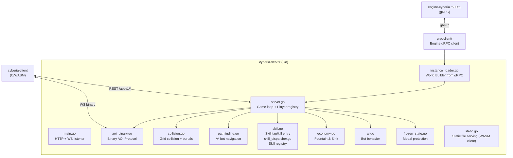
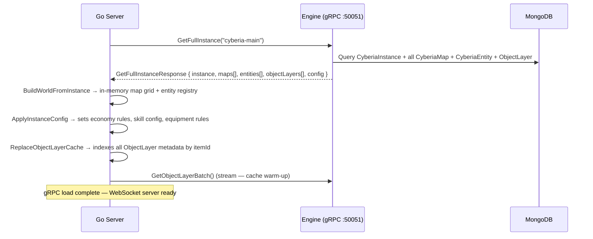

# Cyberia Server

**Path:** `cyberia-server/` | **Language:** Go

---

## Overview

`cyberia-server` is the real-time multiplayer game server for Cyberia Online. It maintains the authoritative game state, runs the AI and physics simulation, and communicates with clients via a custom binary WebSocket protocol. It connects to the Node.js Engine at startup via gRPC to load the game world and Object Layer data.

---

## Architecture



---

## Source Files

| File                    | Responsibility                                                                                 |
| ----------------------- | ---------------------------------------------------------------------------------------------- |
| `main.go`               | Entry point — HTTP/WS server, signal handling                                                  |
| `server.go`             | WebSocket lifecycle, game loop, player/bot registry                                            |
| `types.go`              | Core data structures (PlayerState, BotState, ObjectLayer, etc.)                                |
| `aoi_binary.go`         | Binary AOI wire format encoder + message type constants                                        |
| `object_layer.go`       | ObjectLayer Go types mirroring MongoDB schema                                                  |
| `instance_loader.go`    | Reconstructs world from gRPC `GetFullInstanceResponse`                                         |
| `collision.go`          | Grid collision detection, portal transitions, death handling                                   |
| `pathfinding.go`        | A\* pathfinding for bot/player navigation                                                      |
| `skill.go`              | Skill entry points: `HandlePlayerTapAction`, `HandleOnKillSkills`, `GetAssociatedSkillItemIDs` |
| `skill_dispatcher.go`   | Skill registry: `InitSkills()`, `DispatchSkill()`, `dispatchSkillsForEntity()`                 |
| `skill_projectile.go`   | Projectile skill handler (spawns `skill` bot entities)                                         |
| `skill_doppelganger.go` | Doppelganger skill handler (spawns allied clone bots)                                          |
| `economy.go`            | Fountain & Sink coin economy — all economy methods                                             |
| `life_regen.go`         | HP regeneration ticker                                                                         |
| `ai.go`                 | Bot AI — aggro, wander, target selection                                                       |
| `stats.go`              | Active stat aggregation, sum-stats limit enforcement                                           |
| `entity_status.go`      | Entity Status Indicator (ESI) computation                                                      |
| `frozen_state.go`       | FrozenInteractionState — modal protection for players                                          |
| `handlers.go`           | WebSocket message handlers (move, action, inventory, etc.)                                     |
| `static.go`             | Static file serving for the WASM client                                                        |
| `grpcclient/`           | gRPC client for the Engine data service                                                        |

---

## gRPC World Loading

At startup, the Go server dials the Engine gRPC endpoint and calls `GetFullInstance(instanceCode)`:



**Fallback:** If the `instanceCode` doesn't match any MongoDB record, the Engine returns a minimal playable fallback (empty 64×64 map) instead of `NOT_FOUND`. If the Engine is unreachable, the Go server exits with a fatal error (gRPC is required).

---

## WebSocket Message Handlers

Incoming client messages dispatch through `handlers.go`:

| Message Type                      | Description                                                                                                   |
| --------------------------------- | ------------------------------------------------------------------------------------------------------------- |
| `player_action`                   | Player tap action — carries `targetX`/`targetY`; triggers `HandlePlayerTapAction` (movement + skill dispatch) |
| `item_activation`                 | Equip/unequip an Object Layer item; enforces one-per-type and `maxActiveLayers` rules                         |
| `get_items_ids`                   | Given an `itemId`, returns the list of associated skill entity item IDs (`skill_item_ids` response)           |
| `freeze_start` / `dialogue_start` | Enter FrozenInteractionState (blocks movement and damage); `dialogue_start` accepted for backward compat      |
| `freeze_end` / `dialogue_end`     | Exit FrozenInteractionState                                                                                   |
| `chat`                            | Pure relay — forward JSON chat message to target player, no game-state mutation                               |

> **Pre-alpha scope:** Action/quest/shop/craft/portal WS handlers are not yet implemented in the Go server. These systems are defined in the Node.js Engine API (`src/api/cyberia-action`, `src/api/cyberia-quest`) and are planned for the alpha milestone.

---

## Area of Interest (AOI)

The AOI system ensures each client receives only data about nearby entities, reducing bandwidth and server load:

- Each player has a rectangular AOI bounding box centered on their position.
- AOI size is configured per instance (`aoi_width`, `aoi_height` in `CyberiaInstanceConf`).
- On each tick, the server computes the delta (entities entered/left AOI) and sends a binary `aoi_update` (0x01) message.
- On initial connect, the server sends a full AOI snapshot (`full_aoi`, 0x03) plus `init_data` (0x02).

---

## Skill System

### Trigger Pipeline

```
player_action WS message
  → HandlePlayerTapAction(player, mapState, target)
    → dispatchSkillsForEntity(player, mapState, target)
      → iterate player.ObjectLayers (active items)
        → build skillMap: itemId → []SkillDefinition
          → for each SkillDefinition:
              DispatchSkill(logicEventId, SkillContext)
                "projectile"            → skill_projectile.go handler
                "doppelganger"          → skill_doppelganger.go handler
                "coin_drop_or_transaction" → economy.go handler
```

### Skill Rules (SkillRules proto message → server fields)

| Field                             | Description                                            |
| --------------------------------- | ------------------------------------------------------ |
| `projectileSpawnChance`           | Probability [0–1] of spawning a projectile per trigger |
| `projectileLifetimeMs`            | Projectile lifetime in milliseconds                    |
| `projectileWidth/Height`          | Entity dimensions (in cells)                           |
| `projectileSpeedMultiplier`       | Speed multiplier relative to base entity speed         |
| `doppelgangerSpawnChance`         | Probability of spawning a doppelganger                 |
| `doppelgangerLifetimeMs`          | Doppelganger lifetime                                  |
| `doppelgangerSpawnRadius`         | Max spawn distance from triggering player (cells)      |
| `doppelgangerInitialLifeFraction` | Starting HP as fraction of player max HP               |

---

## Bot AI

Bots are spawned from `CyberiaEntity` records with `entityType: "bot"`. The `ai.go` module drives their behavior:

| Behavior  | Description                                                                              |
| --------- | ---------------------------------------------------------------------------------------- |
| `hostile` | Has a weapon; will pathfind to and attack players/other bots within `aggroRange`         |
| `passive` | No weapon; wanders randomly within `spawnRadius`                                         |
| `skill`   | Projectile entity — moves in a fixed direction, despawns on collision or lifetime expiry |
| `coin`    | Static collectible — grants coins on player contact, then despawns                       |

**Bot respawn:** Dead bots respawn at their `spawnPoint` after a configurable delay. Each respawn calls `FountainInitBot(bot)` to reset the coin wallet to `botSpawnCoins`.

---

## FrozenInteractionState

While a player has a modal open (dialogue, shop, inventory, craft), they enter **FrozenInteractionState**:

```go
// frozen_state.go
FreezePlayer(player, reason string)  // freezes: no damage, no movement, no events
ThawPlayer(player)                   // unfreezes: returns to normal gameplay
```

The player's `Frozen` flag is broadcast to clients on each AOI tick so other players see the frozen (chat-icon) status indicator.

---

## Hot-Reload

The Go server supports **incremental ObjectLayer hot-reload** without restart:

1. At interval `ENGINE_GRPC_RELOAD_INTERVAL_SEC`, the server calls `GetObjectLayerManifest()`.
2. It diffs the returned `{ itemId, sha256 }` pairs against the cached manifest.
3. For changed items, it calls `GetObjectLayer(itemId)` to fetch updated data.
4. `ReplaceObjectLayerCache` atomically replaces the stale entry.

---

## REST API

The Go server exposes a metrics and health REST API under `/api/v1/`:

| Endpoint                    | Method | Description                                                   |
| --------------------------- | ------ | ------------------------------------------------------------- |
| `/api/v1/health`            | GET    | Simple health check — `{"status":"ok"}`                       |
| `/api/v1/metrics`           | GET    | Complete server metrics snapshot                              |
| `/api/v1/metrics/health`    | GET    | Detailed health with entity/player counts                     |
| `/api/v1/metrics/entities`  | GET    | Entity type breakdown and active counts                       |
| `/api/v1/metrics/websocket` | GET    | Active WebSocket connections, message rates                   |
| `/api/v1/metrics/workload`  | GET    | Per-map entity workload (players, bots, floors, ObjectLayers) |

All other game data (ObjectLayer metadata, instance config, file blobs) is served by the **Node.js Engine REST API** directly to the client — the Go server does not proxy Engine data.

---

## Environment Variables

| Variable                          | Default           | Description                                                                          |
| --------------------------------- | ----------------- | ------------------------------------------------------------------------------------ |
| `ENGINE_GRPC_ADDRESS`             | `localhost:50051` | Engine gRPC address (**required**)                                                   |
| `INSTANCE_CODE`                   | `default`         | Instance code to load on startup                                                     |
| `ENGINE_GRPC_RELOAD_INTERVAL_SEC` | _(disabled)_      | ObjectLayer hot-reload polling interval                                              |
| `SERVER_PORT`                     | `8081`            | HTTP + WS listen port                                                                |
| `STATIC_DIR`                      | `./public`        | Directory for static WASM client files                                               |
| `READY_CMD`                       | _(empty)_         | Shell command to run after server starts (used by orchestration to signal readiness) |

---

## Build and Run

```bash
# Development
cd cyberia-server
go run main.go

# Production binary
go build -o cyberia-server .
./cyberia-server

# Docker
docker build -t cyberia-server .
docker run -e ENGINE_GRPC_ADDRESS=engine:50051 -e INSTANCE_CODE=cyberia-main cyberia-server
```

---

## Kubernetes Deployment

The Go server deploys as `mmo-server` in the Kubernetes cluster:

```yaml
# Key environment variables in deployment.yaml
- name: ENGINE_GRPC_ADDRESS
  value: 'dd-cyberia-service:50051' # cluster-internal Engine service
- name: INSTANCE_CODE
  value: 'cyberia-main'
- name: SERVER_PORT
  value: '8081'
```
