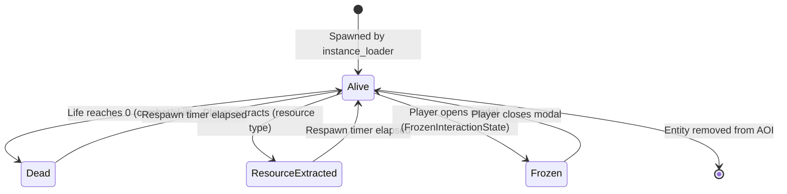

# Entity Profile

**Module:** `src/api/cyberia-entity` · `src/api/cyberia-instance-conf`

---

## Overview

An **Entity** is any object in the Cyberia Online game world — players, bots, NPCs, resource nodes, terrain tiles, portals, and skill-spawned projectiles. Every entity is represented as an ordered stack of **Object Layer** item IDs, a position on the grid, a type discriminator, and a runtime state.

---

## CyberiaEntity Schema (MongoDB)

```
CyberiaEntity {
  entityType:         String  // see Entity Type Registry below
  initCellX:          Number  // initial grid column
  initCellY:          Number  // initial grid row
  dimX:               Number  // width in cells (default: 1)
  dimY:               Number  // height in cells (default: 1)
  color:              String  // RGBA fallback color (no active OL texture)
  objectLayerItemIds: [String] // ordered list of ObjectLayer item IDs

  // Bot-specific (ignored for non-bot entities)
  spawnRadius:  Number  // max wander / respawn radius in cells
  aggroRange:   Number  // attack range in cells (0 = passive)
  maxLife:      Number  // maximum HP (0 = immortal)
  lifeRegen:    Number  // HP regeneration per tick
}
```

---

## Entity Type Registry

| `entityType`   | Behavior              | Map-placed | Description                                           |
| -------------- | --------------------- | ---------- | ----------------------------------------------------- |
| `player`       | interactive           | no         | Local (self) player                                   |
| `other_player` | interactive           | no         | Remote players in AOI                                 |
| `bot`          | `hostile` / `passive` | yes        | AI-controlled bot                                     |
| `skill`        | `skill`               | no         | Runtime-spawned projectile (created by skill system)  |
| `coin`         | `coin`                | no         | Runtime-spawned collectible (dropped on entity death) |
| `floor`        | static                | yes        | Terrain tile (walkable)                               |
| `obstacle`     | static                | yes        | Collision tile (blocks movement)                      |
| `portal`       | static                | yes        | Zone transition trigger                               |
| `foreground`   | static                | yes        | Foreground decoration layer                           |
| `resource`     | extractable           | yes        | Exploitable world object (drops items on extraction)  |

---

## Runtime PlayerState (Go)

```go
type PlayerState struct {
    ID                string             // Go server player UUID
    MapCode           string             // current map
    Pos               Point              // world position (float64 X, Y)
    Dims              Dimensions         // entity size
    Color             ColorRGBA          // fallback solid color
    Direction         Direction          // UP, UP_RIGHT, RIGHT, DOWN_RIGHT, DOWN, DOWN_LEFT, LEFT, UP_LEFT, NONE
    Mode              ObjectLayerMode    // IDLE, WALKING, TELEPORTING
    ObjectLayers      []ObjectLayerState // active OL stack: { ItemID, Active, Quantity }
    MaxLife           float64
    Life              float64
    LifeRegen         float64
    Coins             uint32             // flat coin balance (single source of truth)
    Frozen            bool               // FrozenInteractionState active
    FreezeReason      string             // "dialogue" | "inventory" | ...
    Path              []PointI           // A* path (for smooth movement)
    AOI               Rectangle          // current area-of-interest bounds
    SumStatsLimit     int                // max aggregate stat sum (equipment rules)
}
```

---

## ObjectLayer State

Each entity carries an ordered stack of `ObjectLayerState` entries:

```go
type ObjectLayerState struct {
    ItemID   string  // references ObjectLayer.data.item.id
    Active   bool    // equipped/activated (only activable types can be true)
    Quantity int     // inventory quantity (for stackable items)
}
```

The **active layers** determine the entity's rendered appearance and mechanical stats. The `Active` field is managed by the equipment rules.

---

## Equipment Rules

Equipment rules govern which item types may be simultaneously active on a character:

```javascript
EQUIPMENT_RULES_DEFAULTS = {
  activeItemTypes: ['skin', 'breastplate', 'weapon'], // only these types may be activated
  onePerType: true, // at most one active item per type
  requireSkin: true, // player must always have an active skin if they own any
};
```

**Validation on `item_activation` request:**

1. Reject if `item.type` not in `activeItemTypes`.
2. If `onePerType`, deactivate any currently active item of the same type before activating the new one.
3. If `requireSkin`, ensure a skin remains active after the change.

---

## Z-Order Rendering

The C client composites layers bottom-to-top by `item.type`:

```
z-order  type
──────   ───────────────────
  0      floor / obstacle / portal / foreground
  1      skin  (base character body)
  2      breastplate (armor overlay)
  3      weapon (weapon overlay)
```

`get_priority_for_type()` in `entity_render.c` maps item type → z-order integer. Multiple layers of the same type are rendered in declared order within that z-level.

---

## Stat Aggregation

Stats are aggregated across all **active** Object Layers on an entity. The server enforces a `sumStatsLimit` — the maximum sum of all stat values allowed for the player. Attempting to equip items that would exceed this limit is rejected.

**Active stats sum:**

$$\text{activeStatsSum} = \sum_{\text{active layers}} (\text{effect} + \text{resistance} + \text{agility} + \text{range} + \text{intelligence} + \text{utility})$$

The `sumStatsLimit` and `activeStatsSum` are sent to the client on each AOI update so the inventory UI can show remaining equip budget.

---

## Entity Status Indicator (ESI)

The Go server computes a status `u8` per entity each AOI tick. The C client renders the corresponding icon above the entity nameplate.

```go
// Status constants (entity_status.go) — MUST stay in sync with JS STATUS_ICONS array
StatusNone              = 0  // skill/coin bots, world objects
StatusPassive           = 1  // passive bot
StatusHostile           = 2  // hostile bot
StatusFrozen            = 3  // player in FrozenInteractionState
StatusPlayer            = 4  // normal alive player
StatusDead              = 5  // dead / respawning entity
StatusResource          = 6  // static exploitable resource
StatusResourceExtracted = 7  // depleted resource (respawning)
StatusActionProvider    = 8  // NPC with available actions (bouncing chat icon)
```

---

## Per-EntityType Defaults

Instance configuration (`CyberiaInstanceConf`) defines canonical defaults per entity type:

| Field         | Description                                                                       |
| ------------- | --------------------------------------------------------------------------------- |
| `liveItemIds` | ObjectLayer item IDs applied when entity is alive with no explicit items assigned |
| `deadItemIds` | ObjectLayer item IDs for dead/ghost/respawning state                              |
| `dropItemIds` | Items granted to the extractor when a resource entity is depleted                 |
| `colorKey`    | Named palette color used as solid fallback when no active OL texture is available |

---

## Bot Entity Profile

Bot entities extend the base schema with runtime AI state:

```go
type BotState struct {
    // Inherits all PlayerState fields
    Behavior      string     // "hostile" | "passive" | "skill" | "coin"
    SpawnRadius   int        // wander / respawn radius
    AggroRange    int        // attack range (0 = passive)
    SpawnPoint    PointI     // original spawn cell
    RespawnTimer  time.Time  // next respawn timestamp
}
```

**Bot behaviors:**

| Behavior  | AI Actions                              | Description              |
| --------- | --------------------------------------- | ------------------------ |
| `hostile` | pathfind to player, attack              | Aggressive enemy bot     |
| `passive` | random wander                           | Non-aggressive world NPC |
| `skill`   | move in direction, despawn on collision | Projectile entity        |
| `coin`    | static, collectible                     | Coin drop entity         |

---

## Resource Entity Profile

Resource entities have a specific lifecycle:

```
Alive (StatusResource)
  → Player extracts (tap interaction)
    → dropItemIds granted to player inventory
    → Entity transitions to StatusResourceExtracted
      → Respawn timer starts
        → Entity returns to StatusResource
```

---

## Entity Lifecycle Diagram



---

## Coin Balance Architecture

Coins use a **flat + display split** design to avoid O(N) inventory traversal:

| Field                         | Type               | Purpose                                                                                            |
| ----------------------------- | ------------------ | -------------------------------------------------------------------------------------------------- |
| `entity.Coins`                | `uint32`           | **Single source of truth** — all economy operations read/write this field O(1)                     |
| `coinItemId ObjectLayer slot` | `ObjectLayerState` | **Display only** — `Active: false`, `Quantity = Coins`, synced by `syncCoinOL()` on every mutation |

The `coin` item type is never activable. The inventory UI automatically renders it with a lock indicator.
