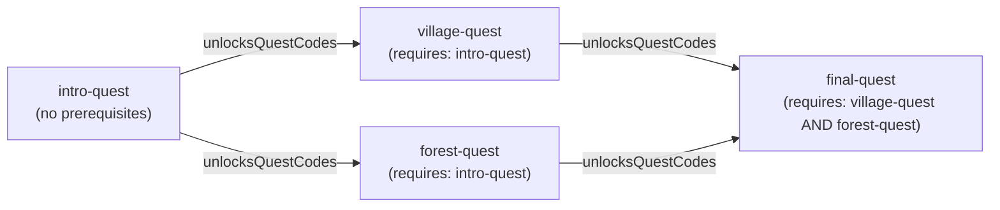
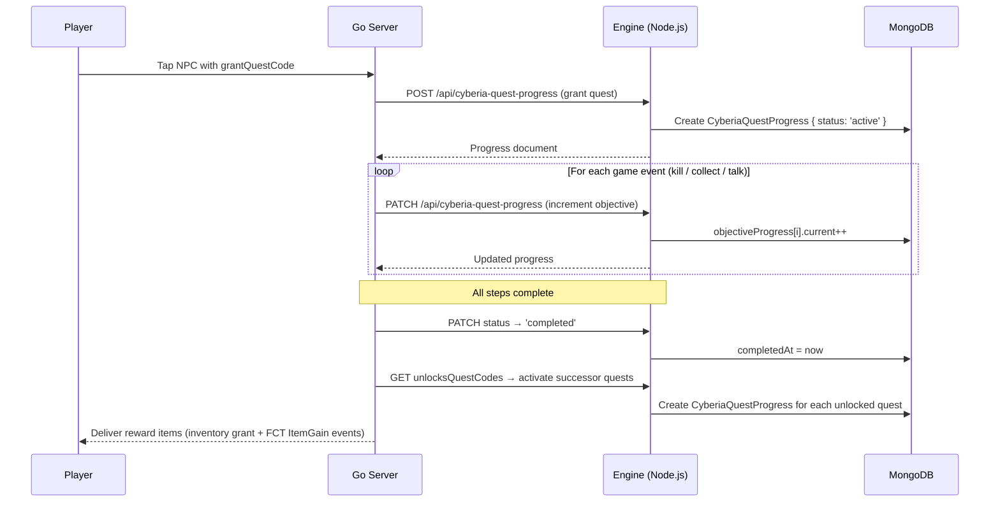

# Quest System

**Module:** `src/api/cyberia-quest` · `src/api/cyberia-quest-progress`

---

## Overview

The Quest System is a **chain/tree-structured progression framework** linking NPC entities, player actions, map coordinates, and item rewards. Quests are the primary mechanism for guided player progression in Cyberia Online.

Quests are defined server-side as MongoDB documents and delivered to the client through the Engine REST API. Progress is tracked per-player in `CyberiaQuestProgress` documents.

> **Implementation status — Pre-alpha:** The Quest and QuestProgress MongoDB schemas and Engine REST API (`src/api/cyberia-quest`, `src/api/cyberia-quest-progress`) are defined and seeded. Go server integration (quest tracking, objective evaluation, reward delivery via FCT) is planned for the **Alpha milestone**. For pre-alpha, quest progress is ephemeral: it lives in the client session only and resets on page reload.

---

## Data Model

### CyberiaQuest Schema

```
CyberiaQuest {
  code:              String   // stable slug, e.g. "fallback-intro-quest"
  title:             String
  description:       String

  // Spatial origin — the NPC/entity cell that grants this quest
  sourceMapCode:     String
  sourceCellX:       Number
  sourceCellY:       Number

  // Chain / tree unlock structure
  prerequisiteCodes: [String] // AND logic — all must be completed to unlock
  unlocksQuestCodes: [String] // quests activated on completion (chain or tree)

  // Ordered linear step sequence
  steps: [{
    id:          String
    description: String
    objectives: [{
      type:     String  // 'collect' | 'talk' | 'kill'
      itemId:   String  // semantic target (see Objective Types below)
      quantity: Number  // default: 1
    }]
  }]

  // Rewards granted on quest completion
  rewards: [{
    itemId:   String
    quantity: Number
  }]
}
```

### CyberiaQuestProgress Schema

```
CyberiaQuestProgress {
  playerId:   String   // Go server player UUID
  questCode:  String   // references CyberiaQuest.code
  status:     String   // 'active' | 'completed'

  stepProgress: [{
    stepId: String
    objectiveProgress: [{
      current:  Number  // current count toward objective
      required: Number  // denormalized from quest definition
    }]
  }]

  startedAt:   Date
  completedAt: Date | null
}
```

**Completeness is always computed, never stored.** A step is complete when all `objectiveProgress[i].current >= objectiveProgress[i].required`. The active step is always the first step where not all objectives are done.

---

## Objective Types

| `type`    | `itemId` semantics                                             | Completion trigger                                                                                 |
| --------- | -------------------------------------------------------------- | -------------------------------------------------------------------------------------------------- |
| `collect` | ObjectLayer item ID that must appear in the player's inventory | Player inventory contains `>= quantity` of `itemId`                                                |
| `talk`    | `CyberiaAction.provideItemId` of the NPC to interact with      | Player triggers a talk action where `provideItemId === itemId` and all `questDialogueCodes` viewed |
| `kill`    | Skin item ID of the target entity (e.g. `"wason"`)             | Player kills an entity whose active skin matches `itemId`                                          |

---

## Quest Graph (Chain and Tree)

Quests form a **directed acyclic graph** via `prerequisiteCodes` → `unlocksQuestCodes`:



**AND logic on prerequisites:** A quest only becomes available when **all** listed `prerequisiteCodes` are completed.

**Tree branching:** A quest can list multiple `unlocksQuestCodes`, enabling parallel quest branches that reconverge later.

---

## Quest Lifecycle



---

## Spatial Binding

Each `CyberiaQuest` can declare `sourceMapCode + sourceCellX + sourceCellY`, linking it to the map entity at that cell. This binding is used during instance initialization:

- `instance_loader.go` reads `CyberiaEntity.initCellX/initCellY` and correlates with quest `sourceCellX/sourceCellY` to assign quest-granting behaviors to the correct NPC entity at world construction time.
- The `ObjectLayerEngineModal` (Engine UI) allows editors to assign quest codes to entity cells visually.

---

## Reward Delivery

On quest completion, the Engine grants each `rewards[].{itemId, quantity}` to the player's inventory:

- Off-chain items are added to the player's `ObjectLayers` array in the Go server.
- If the item has an on-chain ERC-1155 token, the server relayer calls `mint(playerAddress, tokenId, quantity)` on the `ObjectLayerToken` contract.
- FCT `ItemGain` events (`MsgTypeItemFCT`, `FCTTypeItemGain`) are broadcast to the client for visual feedback.

---

## Step Progression Rules

1. Steps are always processed in **declared order** — step N cannot advance until step N-1 is complete.
2. Within a step, all objectives must be satisfied (any order).
3. Quests do not fail — they remain `active` until completed or explicitly abandoned.
4. The `required` count is **denormalized** from the quest definition into each `objectiveProgress` record at quest grant time, enabling O(1) progress checks without re-fetching the quest definition.

---

## Indexes

```javascript
// CyberiaQuest
{ code: 1 }  // unique
{ sourceMapCode: 1, sourceCellX: 1, sourceCellY: 1 }

// CyberiaQuestProgress
{ playerId: 1, questCode: 1 }  // unique
{ playerId: 1, status: 1 }
```

---

## Example Quest Document

```json
{
  "code": "wason-intro",
  "title": "Meet Wason",
  "description": "Find the village elder to begin your journey.",
  "sourceMapCode": "cyberia-village",
  "sourceCellX": 12,
  "sourceCellY": 8,
  "prerequisiteCodes": [],
  "unlocksQuestCodes": ["wason-collection"],
  "steps": [
    {
      "id": "step-talk",
      "description": "Speak with Wason.",
      "objectives": [{ "type": "talk", "itemId": "wason", "quantity": 1 }]
    }
  ],
  "rewards": [{ "itemId": "health-potion", "quantity": 2 }]
}
```
