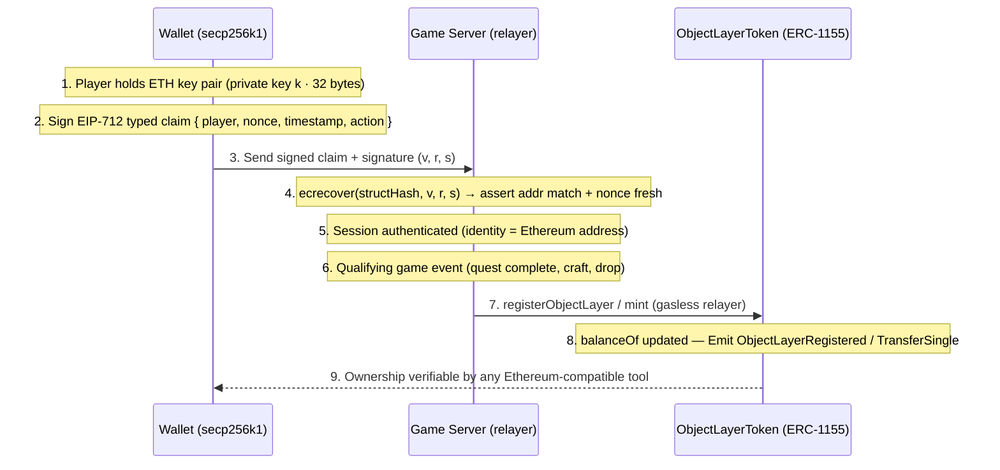
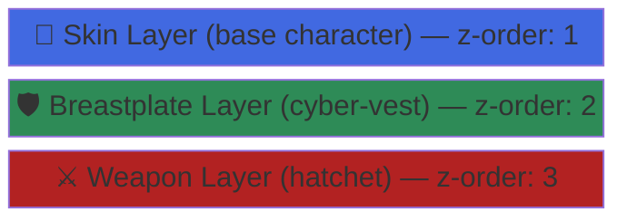
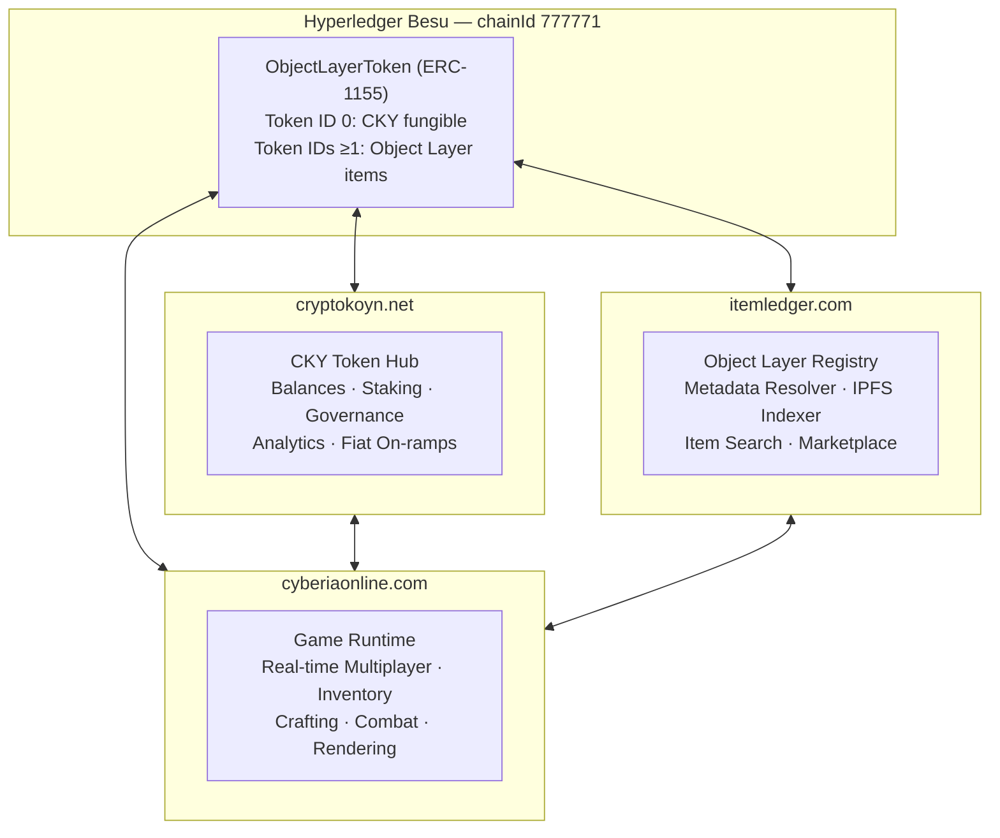
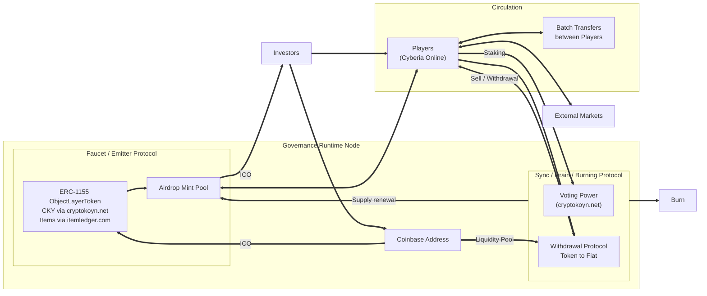
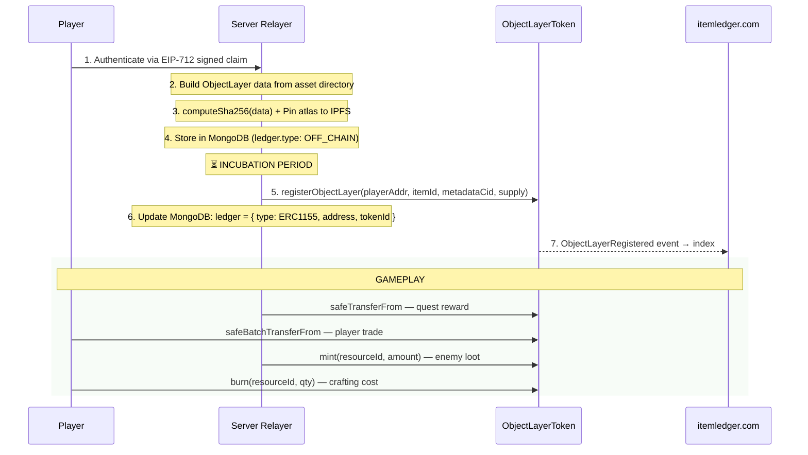

# Object Layer Token: A Semantic Interoperability Protocol for Composable Digital Entities

<p align="center">
  
</p>

<div align="center">

### CYBERIA

**Network Object Layers**

_Stackable Rendering Layers as a Unified Tokenized Reality_

[](https://www.npmjs.org/package/cyberia)

</div>

---

**Version:** 3.2.9 | **Status:** Draft | **Authors:** Underpost Engineering

---

## Abstract

This paper introduces the **Object Layer Protocol** — a semantic interoperability standard that defines digital entities as literally stackable rendering layers. Each layer carries four bound realities: mechanical (stats), presentational (rendering), experiential (UX), and economic (on-chain ownership). The protocol enables composable, verifiable, and interoperable digital objects across decentralized runtimes.

A reference implementation is provided through **Cyberia Online**, a browser-based real-time tap-based sandbox MMORPG deployed on Hyperledger Besu. The protocol uses the **Ethereum secp256k1** key pair as the universal identity primitive. On-chain economy is split across two dedicated service domains: **cryptokoyn.net** (fungible CKY currency) and **itemledger.com** (semi-fungible and non-fungible Object Layer registry), both backed by a single `ObjectLayerToken` ERC-1155 contract.

---

## Table of Contents

1. [Executive Summary](#1-executive-summary)
2. [Introduction](#2-introduction)
3. [Ethereum Identity and Authentication](#3-ethereum-identity-and-authentication)
4. [The Object Layer Protocol](#4-the-object-layer-protocol)
5. [Three-Domain Service Architecture](#5-three-domain-service-architecture)
6. [Technology Stack](#6-technology-stack)
7. [Tokenomics](#7-tokenomics)
8. [Blockchain Network and Deployment](#8-blockchain-network-and-deployment)
9. [On-Chain Lifecycle and Game Mechanics](#9-on-chain-lifecycle-and-game-mechanics)
10. [Off-Chain Economy: Fountain & Sink](#10-off-chain-economy-fountain--sink)
11. [Incubation System](#11-incubation-system)
12. [Security and Transparency](#12-security-and-transparency)
13. [Future Directions](#13-future-directions)

---

## 1. Executive Summary

Current approaches to digital asset tokenization treat tokens as isolated ledger entries — a balance, a URI, a metadata pointer — lacking a coherent semantic model that binds what an object _does_, what it _looks like_, how a _human understands it_, and what it _is worth_ into a single interoperable unit.

The **Object Layer Protocol** solves this by defining a **semantic interoperability standard** where each digital entity is composed of literally stackable rendering layers, each carrying four bound realities:

| Reality               | Semantic Role                                                             | Schema Path   |
| --------------------- | ------------------------------------------------------------------------- | ------------- |
| **Mechanical**        | What the layer _does_ — statistical attributes governing behavior         | `data.stats`  |
| **Presentational**    | What the layer _looks like_ — IPFS-addressed atlas sprite sheets          | `data.render` |
| **Experiential (UX)** | What the layer _means to a human_ — identifiers, descriptions, activation | `data.item`   |
| **Economic**          | What the layer _is worth_ — on-chain ledger binding and ownership proof   | `data.ledger` |

**Key architectural decisions:**

- **Ethereum secp256k1 keys** serve as the single identity primitive — the same key pair authenticates with the game server, signs EIP-712 claims, and owns on-chain tokens.
- **Fungible currency (CKY)** is managed via **cryptokoyn.net** — a dedicated financial portal for staking, governance, analytics, and fiat bridges.
- **Object Layer items** are managed via **itemledger.com** — the canonical registry, metadata resolver, and IPFS indexer for all item tokens.
- **A single `ObjectLayerToken` (ERC-1155) contract** on Hyperledger Besu backs both domains.

---

## 2. Introduction

### 2.1 Problem Statement

The Ethereum ecosystem established the foundational primitives for digital ownership but has failed to solve the _meaning_ problem. Existing token standards (ERC-721, ERC-1155) conflate **ownership** with **identity**: owning a token proves you hold a balance, but says nothing structural about what the asset _is_, what it _does_, how it _renders_, or how a human _understands_ it.

**Cascading failures:**

- **No structural interoperability** — Two applications cannot share assets because there is no common semantic schema.
- **Presentation is disconnected from ownership** — Visual representation lives on centralized servers with no formal binding to mechanical or economic identity.
- **Composition is impossible** — There is no standard way to express "this entity is composed of five independently-owned layers stacked in this order."
- **Gas cost barriers** — Public Ethereum mainnet gas fees make per-item minting economically infeasible for game economies with thousands of items.
- **Lack of true ownership** — Centralized game operators unilaterally control in-game economies without accountability.

### 2.2 Solution

The Object Layer Protocol addresses the entire problem stack by leveraging Ethereum's existing cryptographic primitives — secp256k1 keys, EIP-712 typed data signatures, and ERC-1155 multi-token contracts — and extending them with a **semantic interoperability standard** that gives tokens structural meaning.

---

## 3. Ethereum Identity and Authentication

### 3.1 secp256k1 Key Pairs as Universal Identity

A player generates a single Ethereum secp256k1 key pair. That key pair:

1. **Authenticates** with the game server via EIP-712 signed claims (no passwords, no OAuth).
2. **Owns** on-chain tokens in the `ObjectLayerToken` ERC-1155 contract.
3. **Authorizes** off-chain actions (crafting, trading, staking) via signed messages.
4. **Interoperates** across all three service domains with a single identity.

| Layer              | Function         | How the Key Is Used                                               |
| ------------------ | ---------------- | ----------------------------------------------------------------- |
| **On-chain**       | Token ownership  | Ethereum address holds ERC-1155 balances                          |
| **Authentication** | Server login     | EIP-712 signed claim replaces username/password                   |
| **Authorization**  | Action signing   | Off-chain crafting, trading, staking carry a signature            |
| **Cross-domain**   | Unified identity | Same key across cryptokoyn.net, itemledger.com, cyberiaonline.com |

### 3.2 EIP-712 Signed Claims and Gasless Authentication

**EIP-712 Domain Separator:**

```json
{
  "name": "CyberiaObjectLayer",
  "version": "1",
  "chainId": 777771,
  "verifyingContract": "0x<ObjectLayerToken address>"
}
```

**Authentication flow:**



**Key properties:**

- **Players never pay gas.** Besu network runs with gas price zero; server relays transactions.
- **Players never expose private keys.** Authentication is purely signature-based.
- **Sessions are stateless.** Each request carries a fresh EIP-712 signature.

---

## 4. The Object Layer Protocol

### 4.1 Semantic Interoperability Through Stackable Layers

A digital entity is not a single atomic thing — it is a **stack of semantically complete layers**. A player character is:



Each layer is **independently complete**: it can be rendered, owned, simulated, and understood independently. This is **semantic interoperability** — any system that understands the Object Layer schema can fully render, simulate, display, and trade any layer from any source.

### 4.2 Four Realities of an Object Layer

| Reality               | Schema Path   | Role                                                             | Example                                                                               |
| --------------------- | ------------- | ---------------------------------------------------------------- | ------------------------------------------------------------------------------------- |
| **Mechanical**        | `data.stats`  | Governs behavior in the runtime simulation                       | `{ effect: 7, resistance: 8, agility: 0, range: 4, intelligence: 8, utility: 2 }`     |
| **Presentational**    | `data.render` | Governs visual appearance via IPFS-addressed atlas sprite sheets | `{ cid: "bafkrei...", metadataCid: "bafkreia..." }`                                   |
| **Experiential (UX)** | `data.item`   | Governs human comprehension — names, types, descriptions         | `{ id: "hatchet", type: "weapon", description: "A rusted hatchet", activable: true }` |
| **Economic**          | `data.ledger` | Governs ownership via on-chain token binding                     | `{ type: "ERC1155", address: "0x...", tokenId: "uint256" }`                           |

**The protocol requires all four realities for an Object Layer to be complete and interoperable.**

### 4.3 AtomicPrefab: The Protocol Atom

An **AtomicPrefab** is a self-contained Object Layer with all four realities, content-addressed on IPFS:

```json
{
  "data": {
    "stats": { "effect": 7, "resistance": 8, "agility": 0, "range": 4, "intelligence": 8, "utility": 2 },
    "item": { "id": "hatchet", "type": "weapon", "description": "A rusted hatchet", "activable": true },
    "ledger": { "type": "ERC1155", "address": "0x...", "tokenId": "12345" },
    "render": { "cid": "bafkrei...atlas.png", "metadataCid": "bafkreia...meta.json" }
  },
  "cid": "bafk...json",
  "sha256": "a1b2c3..."
}
```

**IPFS CID structure per Object Layer:**

| CID Field                 | Content                                        | Usage                 |
| ------------------------- | ---------------------------------------------- | --------------------- |
| `cid` (top-level)         | `keccak256(fast-json-stable-stringify(data))`  | On-chain metadata CID |
| `data.render.cid`         | Consolidated atlas sprite sheet PNG            | Client rendering      |
| `data.render.metadataCid` | Atlas metadata JSON (frame coords, animations) | Client rendering      |

The `ObjectLayerToken` contract maps each `tokenId` → canonical `cid` on-chain via `_tokenCIDs[tokenId]`, enabling trustless metadata resolution.

### 4.4 Canonical Stats Schema

Stats govern mechanical behavior across all game systems (combat, movement, skills, drops):

```
Stats {
  effect:       int  // damage output / skill power
  resistance:   int  // damage reduction
  agility:      int  // movement speed modifier
  range:        int  // attack / interaction range
  intelligence: int  // skill cooldown / mana modifier
  utility:      int  // general-purpose utility bonus
}
```

### 4.5 Item Type Registry

Object Layer items are classified by `data.item.type`, which determines z-order rendering, equipment slot, and activability:

| Type          | z-order | Activable | Description                     |
| ------------- | ------- | --------- | ------------------------------- |
| `skin`        | 1       | yes       | Base character body layer       |
| `breastplate` | 2       | yes       | Armor overlay                   |
| `weapon`      | 3       | yes       | Weapon overlay                  |
| `floor`       | 0       | no        | Terrain tile                    |
| `obstacle`    | 0       | no        | Collision tile                  |
| `resource`    | 0       | no        | Extractable world object        |
| `coin`        | -       | no        | In-game currency (display only) |

### 4.6 Entity as Layer Stack

In the runtime, every entity is represented as an ordered stack of Object Layer IDs:

```
PlayerState {
  objectLayers: [
    { itemId: "skin-hero-1",   active: true,  quantity: 1 },
    { itemId: "cyber-vest",    active: true,  quantity: 1 },
    { itemId: "hatchet",       active: true,  quantity: 1 },
    { itemId: "coin",          active: false, quantity: 120 }
  ]
}
```

**Equipment rules** enforce consistency:

- Only `skin`, `breastplate`, `weapon` types may be activated.
- `onePerType: true` — activating an item auto-deactivates any same-type item.
- `requireSkin: true` — player must always have an active skin if they own any skin.

---

## 5. Three-Domain Service Architecture

The Cyberia economy is served through three dedicated service domains sharing the same Besu blockchain, MongoDB off-chain store, and Ethereum key-based identity:



### 5.1 cryptokoyn.net — CKY Token Hub

Manages **Token ID 0 (CRYPTOKOYN)** — the fungible in-game currency.

**Scope:** All CKY-denominated operations: balance queries, staking, governance voting, withdrawal (token-to-fiat), liquidity pool, and fiat on-ramp bridges.

**Token ID 0 contract binding:**

```solidity
uint256 public constant CRYPTOKOYN = 0;
uint256 public constant INITIAL_CRYPTOKOYN_SUPPLY = 10_000_000 * 1e18;
```

### 5.2 itemledger.com — Object Layer Registry

Manages **Token IDs ≥ 1** — all semi-fungible and non-fungible Object Layer items.

**API surface:**

| Endpoint                                | Method | Description                                  |
| --------------------------------------- | ------ | -------------------------------------------- |
| `/api/token/{tokenId}`                  | GET    | Returns full AtomicPrefab JSON               |
| `/api/item/{itemId}`                    | GET    | Resolves `itemId` → `tokenId` → AtomicPrefab |
| `/api/metadata/{tokenId}`               | GET    | IPFS-resolved atlas metadata                 |
| `/api/search`                           | GET    | Full-text search across item names and types |
| `/api/registry/events`                  | GET    | Paginated `ObjectLayerRegistered` event log  |
| `/api/ipfs/pin`                         | POST   | Pin atlas PNG + metadata JSON to IPFS        |
| `/api/marketplace/listings`             | GET    | Active peer-to-peer listings                 |
| `/api/marketplace/buy`                  | POST   | Execute `safeTransferFrom` via relayer       |
| `/api/marketplace/provenance/{tokenId}` | GET    | Full ownership history                       |

**On-chain events indexed:**

- `ObjectLayerRegistered(tokenId, itemId, metadataCid, initialSupply)`
- `TransferSingle(operator, from, to, id, value)`
- `MetadataUpdated(tokenId, metadataCid)`

### 5.3 cyberiaonline.com — Game Runtime

The live game runtime where Object Layers are rendered, stacked, simulated, and interacted with in real time.

**Runtime operations:**

1. **Authentication:** Player signs EIP-712 claim → server verifies → session established.
2. **Inventory loading:** `balanceOf(playerAddress, tokenId)` for all registered tokens → resolve AtomicPrefab.
3. **Layer rendering:** Object Layer Engine processes atlas sprite sheets into renderable layer stacks.
4. **Crafting:** Server burns consumed tokens + mints crafted item + indexes on itemledger.com.
5. **Trading:** `safeBatchTransferFrom` via server relayer.

---

## 6. Technology Stack

### 6.1 Go Game Server (cyberia-server)

High-performance real-time multiplayer server written in Go:

- **WebSocket binary AOI protocol** — custom little-endian wire format delivering only render-essential data.
- **gRPC client** — reads world data from the Node.js Engine at startup and on hot-reload.
- **AOI (Area of Interest)** system — spatial filtering so each client receives only nearby entities.
- **Pathfinding** — A\* implementation for bot navigation.
- **Skill dispatcher** — item-triggered skill pipeline (`projectile`, `doppelganger`).
- **Economy module** — Fountain & Sink coin economy with FCT (Floating Combat Text) events.

### 6.2 C/WASM Client (cyberia-client)

Game client compiled to WebAssembly via Emscripten:

- **SDL2 + OpenGL ES2** rendering pipeline.
- **Binary AOI decoder** — parses the Go server's binary WebSocket messages.
- **Object Layer engine** — composites atlas sprite sheets in z-order per entity.
- **Tap-based input** — all player movement and interaction via tap events (desktop mouse + mobile touch).
- **Floating combat text** — renders FCT events (damage, regen, coin gain/loss, item gain/loss).
- **Inventory modal** — item management UI with equip/unequip interactions.

### 6.3 Node.js Engine (engine-cyberia)

Backend engine providing REST APIs, gRPC data service, and CI/CD tooling:

- **Express** REST API server.
- **MongoDB / Mongoose** — canonical data store for all game data.
- **gRPC server** — exposes `GetFullInstance`, `GetObjectLayerBatch`, `GetMapData`, `Ping`, `GetObjectLayerManifest`.
- **Valkey (Redis-compatible)** — session/cache layer.
- **IPFS integration** — pins atlas PNGs and metadata JSON to IPFS Cluster + Kubo.
- **Cyberia CLI** (`cyberia.js`) — object layer import/generation, blockchain lifecycle.

### 6.4 Hyperledger Besu

Enterprise-grade Ethereum client for the permissioned network:

- **IBFT2 / QBFT consensus** — deterministic finality, 2–5 second block periods.
- **Gas price = 0** — gasless relayer model; permissioning provides economic security.
- **ChainId: 777771** — unique identity for the Cyberia network.
- **secp256k1 compatibility** — identical key format to Ethereum mainnet.

### 6.5 Hardhat

Ethereum development environment for smart contract lifecycle:

- Compile, test, and deploy `ObjectLayerToken` to Besu RPC endpoints.
- Deployment artifacts consumed by the Cyberia CLI.

### 6.6 OpenZeppelin ERC-1155

`ObjectLayerToken` inherits from:

- `ERC1155` — core multi-token standard.
- `ERC1155Burnable` — token holders can destroy tokens.
- `ERC1155Pausable` — owner can freeze all transfers (emergency governance).
- `ERC1155Supply` — on-chain total supply tracking per token ID.
- `Ownable` — access control for mint, pause, register.

### 6.7 MongoDB Schemas

Off-chain canonical store for all four realities. Key collections:

| Collection                | Purpose                                                       |
| ------------------------- | ------------------------------------------------------------- |
| `ObjectLayer`             | AtomicPrefab documents with `data.{stats,item,ledger,render}` |
| `ObjectLayerRenderFrames` | Per-frame tile matrix and color palette                       |
| `AtlasSpriteSheet`        | Consolidated atlas PNG + frame coordinate metadata            |
| `CyberiaInstance`         | Instance graph (maps + portal edges)                          |
| `CyberiaMap`              | Grid data, entity placements, map metadata                    |
| `CyberiaEntity`           | Entity definitions (type, position, item IDs, bot stats)      |
| `CyberiaInstanceConf`     | Instance configuration (skills, economy, equipment rules)     |
| `CyberiaQuest`            | Quest definitions (steps, objectives, rewards)                |
| `CyberiaQuestProgress`    | Per-player quest progress tracking                            |
| `CyberiaAction`           | NPC action definitions (shop, craft, dialogue, quest-talk)    |
| `CyberiaDialogue`         | Dialogue line groups                                          |

### 6.8 IPFS Storage

Content-addressed distributed storage for all Object Layer assets:

- Atlas PNG and metadata JSON pinned to IPFS Cluster + Kubo.
- `itemledger.com` provides a caching resolver layer (avoids gateway latency).
- The `ObjectLayerToken` contract maps `tokenId` → canonical CID on-chain.

### 6.9 Protocol Buffers (gRPC)

Internal data pipeline between Node.js Engine and Go game server:

- Read-only RPCs: no create/update/delete over the channel.
- Batch-friendly: large collections streamed.
- Hot-reload aware: manifest-based incremental update (`sha256` diff).

---

## 7. Tokenomics

### 7.1 ObjectLayerToken Contract

```solidity
contract ObjectLayerToken is ERC1155, ERC1155Burnable, ERC1155Pausable, ERC1155Supply, Ownable {
    uint256 public constant CRYPTOKOYN = 0;
    uint256 public constant INITIAL_CRYPTOKOYN_SUPPLY = 10_000_000 * 1e18;

    // Deterministic token ID assignment
    // computeTokenId(itemId) = uint256(keccak256("cyberia.object-layer:" || itemId))
    mapping(uint256 => string) private _tokenCIDs;   // tokenId → canonical IPFS CID
    mapping(uint256 => string) private _itemIds;      // tokenId → itemId string
    mapping(bytes32 => uint256) private _itemIdToTokenId;
}
```

### 7.2 Token Classification

| Token Type               | Token ID                                | Supply             | Managed By     | Example                     |
| ------------------------ | --------------------------------------- | ------------------ | -------------- | --------------------------- |
| Fungible currency        | 0 (CRYPTOKOYN)                          | 10,000,000 × 10^18 | cryptokoyn.net | In-game CKY                 |
| Semi-fungible resource   | `computeTokenId("gold-ore")`            | 1,000,000          | itemledger.com | Stackable crafting material |
| Semi-fungible consumable | `computeTokenId("health-potion")`       | 100,000            | itemledger.com | Stackable consumable        |
| Non-fungible unique gear | `computeTokenId("legendary-hatchet")`   | 1                  | itemledger.com | Unique weapon               |
| Non-fungible skin        | `computeTokenId("cyber-punk-skin-001")` | 1                  | itemledger.com | Unique character skin       |

### 7.3 Token Distribution and Allocation

**CryptoKoyn (CKY) — Token ID 0:**

- **Total Supply:** 10,000,000 CKY (18-decimal precision)
- **90%** → Airdrop Pool + Mint Pool (distributed through gameplay, events, rewards)
- **10%** → Direct Investor Wallets (proportional to financial participation)

**Object Layer Items — Token IDs ≥ 1:**

- **Variable supply** per item type based on game design requirements.
- Earned through quests, achievements, events (minted on-chain via `registerObjectLayer`).
- Crafted in-game (server calls `mint` to issue ERC-1155 token).
- Freely tradeable via `safeTransferFrom` / `safeBatchTransferFrom`.

### 7.4 Governance and Circulation



**Staking vote weight formula:**

$$\text{Vote Weight} = 0.5 \times \frac{\text{Amount Staked}}{\text{Total Staked}} + 0.5 \times \frac{\text{Staking Duration}}{\text{Max Staking Duration}}$$

---

## 8. Blockchain Network and Deployment

### 8.1 Hyperledger Besu IBFT2/QBFT Network

**Genesis configuration:**

```json
{
  "config": {
    "chainId": 777771,
    "berlinBlock": 0,
    "londonBlock": 0,
    "qbft": {
      "epochLength": 30000,
      "blockPeriodSeconds": 5,
      "requestTimeoutSeconds": 10
    }
  },
  "gasLimit": "0x1fffffffffffff",
  "difficulty": "0x1",
  "coinbase": "0x44e298766B94B53AdA033FE920748a398CC7cE63"
}
```

**Key design decisions:**

- **Gas price = 0** — permissioning layer handles access control; players never pay gas.
- **Deterministic finality** — IBFT2/QBFT blocks are never reverted once committed.
- **Fast block times** — 2–5 second block periods for near-real-time confirmation.

### 8.2 Hardhat Deployment Workflow

```bash
# Compile contracts
cd hardhat && npx hardhat compile

# Deploy ObjectLayerToken to Besu
npx hardhat run scripts/deployObjectLayerToken.js --network besu-ibft2

# Run contract tests
npx hardhat test
```

The deployment script:

1. Connects to Besu RPC using the coinbase secp256k1 key.
2. Deploys `ObjectLayerToken`.
3. Mints 10M CKY to the deployer.
4. Writes deployment artifact to `hardhat/deployments/` for CLI consumption.

---

## 9. On-Chain Lifecycle and Game Mechanics

### 9.1 On-Chain Lifecycle: Register → Mint → Transfer → Burn



### 9.2 Decentralized Player Progression

A player's complete game state reconstructable from their Ethereum address:

1. **CKY balance:** `balanceOf(playerAddress, 0)` via cryptokoyn.net.
2. **Item inventory:** `balanceOf(playerAddress, tokenId)` for each registered token via itemledger.com.
3. **Semantic completeness:** Each token resolves to a full AtomicPrefab with all four realities.

A player's inventory exists cryptographically independent of game servers — verifiable from any Ethereum-compatible tool.

### 9.3 Crafting, Trading, and Item Minting Fee

- **Crafting:** Server burns consumed semi-fungible resource tokens + mints the crafted item token. itemledger.com auto-indexes the new item.
- **Trading:** `safeBatchTransferFrom` for multi-layer atomic trades via the server relayer. itemledger.com marketplace provides the UI.
- **Minting Fee:** Converting off-chain items to on-chain ERC-1155 requires a CKY fee (token ID 0), creating a CKY sink that supports token value.

---

## 10. Off-Chain Economy: Fountain & Sink

The off-chain economy runs on the **Fountain & Sink** model — the industry standard for sustainable in-game economies (pioneered by _Ultima Online_, perfected by _EVE Online_ and _World of Warcraft_).

```
                ┌─────────────────────────────┐
                │         FOUNTAINS           │
                │  botSpawnCoins  ──► Bot      │
                │  playerSpawnCoins ► Player   │
                └──────────────┬──────────────┘
                               │ new coins
                               ▼
                ┌──────────────────────────────┐
                │      CIRCULATING SUPPLY      │
                └──────┬───────────────────────┘
                       │
          ┌────────────┴────────────┐
          │   KILL TRANSFER         │  (zero-sum redistribution)
          │  PvE: coinKillPercentVsBot    │
          │  PvP: coinKillPercentVsPlayer │
          └────────────┬────────────┘
                       │
                ┌──────▼──────────────────────┐
                │           SINKS             │
                │  respawnCostPercent         │
                │  portalFee                  │
                │  craftingFeePercent         │
                └─────────────────────────────┘
```

### Economy Parameters (CyberiaInstanceConf.economyRules)

| Parameter                 | Default | Description                                           |
| ------------------------- | ------- | ----------------------------------------------------- |
| `botSpawnCoins`           | 50      | Coins on bot spawn/respawn (infinite mint)            |
| `playerSpawnCoins`        | 50      | Guest starting wallet                                 |
| `coinKillPercentVsBot`    | 0.40    | 40% of bot wallet → killer on PvE kill                |
| `coinKillPercentVsPlayer` | 0.15    | 15% of player wallet → killer on PvP kill             |
| `coinKillMinAmount`       | 10      | Minimum coins per kill (hard floor)                   |
| `respawnCostPercent`      | 0.0     | Fraction burned on player death (alpha: disabled)     |
| `portalFee`               | 0       | Flat coins burned per portal use (alpha: disabled)    |
| `craftingFeePercent`      | 0.0     | Fraction burned per crafting action (alpha: disabled) |

### Kill Transfer Logic

```
ExecuteKillTransfer(caster, victim):
  rate = coinKillPercentVsBot   if victim is bot
         coinKillPercentVsPlayer if victim is player
  transfer = max(floor(victim.coins * rate), coinKillMinAmount)
  transfer = min(transfer, victim.coins)
  victim.coins  -= transfer
  caster.coins  += transfer
  → sendFCT(caster, FCTTypeCoinGain)
  → sendFCT(victim, FCTTypeCoinLoss)
```

---

## 11. Incubation System

Items earned in-game undergo a **variable incubation period** before being minted on-chain as ERC-1155 tokens.

**Design goals:**

- Prevent instant sell-off of newly earned items.
- Reward sustained gameplay engagement.
- Create a natural gate between off-chain farming and on-chain ownership.

**Incubation states:**

| State          | `data.ledger.type` | Description                                                     |
| -------------- | ------------------ | --------------------------------------------------------------- |
| **Off-chain**  | `"OFF_CHAIN"`      | Item earned but not yet registered on-chain                     |
| **Incubating** | `"OFF_CHAIN"`      | Waiting for incubation period + optional CKY fee                |
| **On-chain**   | `"ERC1155"`        | Registered via `registerObjectLayer`, indexed by itemledger.com |

**Incubation duration** scales with item rarity:

- Common resources (wood, stone): short incubation.
- Unique weapons and legendary skins: longer incubation.

**CKY minting fee**: Farm/dropped/crafted items require a CryptoKoyn fee to convert to on-chain tokens. This creates a CKY sink proportional to item activity.

---

## 12. Security and Transparency

- **Permissioned Network:** Hyperledger Besu IBFT2/QBFT — only authorized validators produce blocks.
- **secp256k1 Key Security:** Identity secured by the same ECC used on Ethereum mainnet.
- **EIP-712 Replay Protection:** Domain separator binds signatures to specific contract, chain, and protocol version.
- **Smart Contract Access Control:** `Ownable` restricts mint, register, and pause to the governance address.
- **Pausability:** Emergency freeze on all token transfers (circuit breaker).
- **Deterministic Finality:** Blocks are never reverted once committed.
- **IPFS Content Addressing:** Asset integrity guaranteed by content-addressed CIDs.
- **Semantic Integrity:** `sha256` hash covers the complete AtomicPrefab — no single reality can be tampered with independently.

---

## 13. Future Directions

- **Mainnet Bridge:** Migrate CKY and Object Layer tokens to Ethereum mainnet or L2 via bridge contracts (secp256k1 key compatibility already in place).
- **Dynamic Metadata:** On-chain metadata upgrade protocol for evolving item stats (governance-gated).
- **Cross-Instance Interoperability:** Object Layers from one Cyberia instance usable in other Object Layer Protocol-compatible runtimes.
- **DAO Governance:** Transition governance address from server relayer to a multi-sig / DAO contract on Besu.
- **Procedural Asset Generation:** Extend CLI procedural generator to support user-directed item creation with on-chain registration.
- **Sink Graduation:** Activate economy pressure levers (respawn cost, portal fee, crafting fee) as the player base grows.

---

_© Underpost Engineering. All rights reserved. Cyberia Online and the Object Layer Protocol are trademarks of Underpost._
