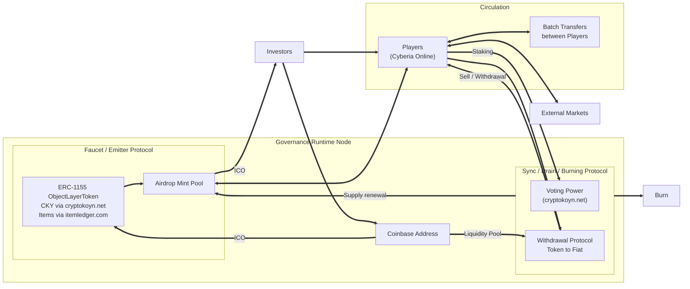
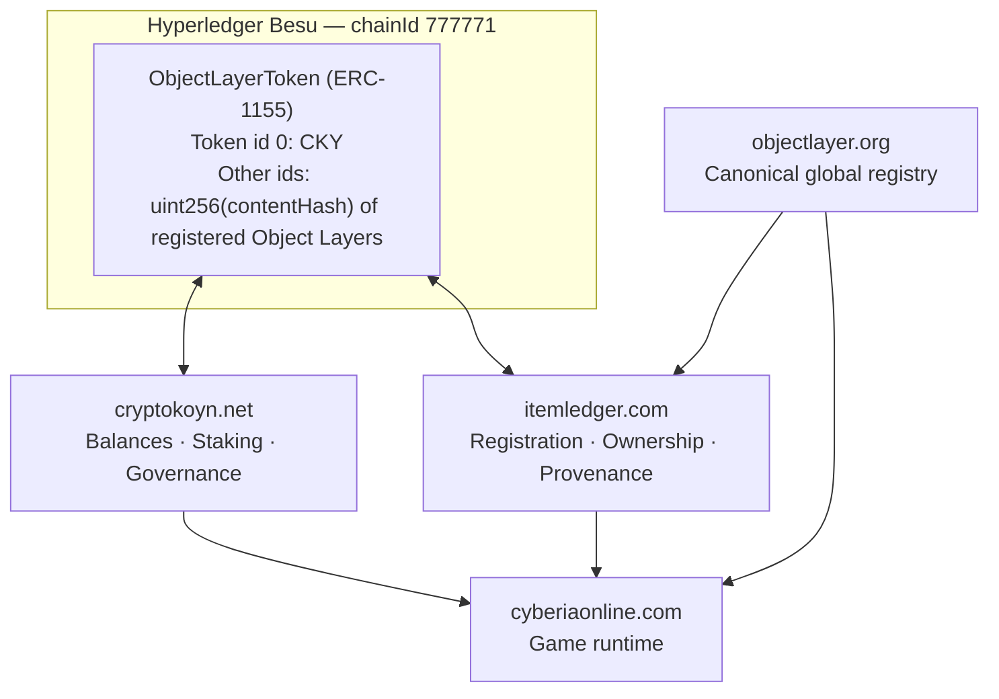

<p align="center">
  
</p>

<div align="center">

# CryptoKoyn

### Governance Constitution of the CKY Economy

**Version:** 3.4.5 Draft  
**Status:** Technical Proposal  
**Authors:** Underpost Engineering

</div>

---

## Abstract

**CryptoKoyn (CKY)** is the fungible currency of the platform, and **cryptokoyn.net** is the domain
that serves it. This paper is the governance constitution of the CKY economy. It states the
principles the economy keeps, who holds each power over the currency and its contract, and the
limit of each power.

CryptoKoyn is a service of the Cyberia runtime. Cyberia is the first runtime that prices work in
CKY; it is not the definition of the currency. CryptoKoyn consumes the canonical global registry,
the Object Layer, that the [Object Layer Protocol White Paper](../../object-layer/explanation/white-paper.md)
defines. One `ObjectLayerToken` ERC-1155 contract carries CKY as token id 0 and every registered
Object Layer as a token id above zero. The registry side of that contract belongs to ItemLedger,
and the [ItemLedger White Paper](../../item-ledger/explanation/white-paper.md) defines it.

---

## 1. Scope

This constitution governs:

- CKY: token id 0 of the `ObjectLayerToken` contract;
- the powers over that contract: mint, pause and ownership;
- staking, voting power and the vote;
- the supply, the distribution and the sinks of CKY;
- the transition of the governance address.

It does not govern:

| Subject                                                 | Owner                                                                       |
| ------------------------------------------------------- | --------------------------------------------------------------------------- |
| Canonical schema, canonicalization and content identity | The Object Layer Protocol                                                   |
| Registration and ownership of token ids above zero      | ItemLedger                                                                  |
| Content releases, world economy and the off-chain coins | Cyberia ([content releases](../../cyberia/explanation/content-releases.md)) |

---

## 2. Principles

1. **The key is the holder.** A holder is a secp256k1 address. A session token is not an
   identity, and a signature is not a credential.
2. **The chain holds the balance.** A CKY balance is `balanceOf(address, 0)`. No database row is a
   CKY balance.
3. **Progress is not currency.** The coin balance of a Cyberia world is progress state. It never
   becomes CKY without an on-chain act.
4. **No domain holds a key.** No server and no domain database stores private key material or a
   recovery phrase.
5. **One contract, two owners.** CKY and the registered Object Layers share one contract and one
   chain. CryptoKoyn and ItemLedger never share a database.
6. **Every power has a holder and a limit.** Section 4 names both.
7. **No claim without proof.** Until a contract is deployed and indexed, a balance is
   unavailable, never zero.

---

## 3. Identity of a Holder

One secp256k1 key pair is one holder on every domain. A CAIP-10 account id
(`eip155:<chainId>:<address>`) names the account, and each domain stores its own public account
record.

| Act       | Standard        | Rule                                                             |
| --------- | --------------- | ---------------------------------------------------------------- |
| Sign in   | ERC-4361 (SIWE) | One signature per session, with a single-use nonce and an expiry |
| Authorize | EIP-712         | One typed signature per action, with a nonce and a deadline      |
| Hold      | ERC-1155        | The address holds the balances                                   |

The EIP-712 domain binds an action signature to one chain and one contract:

```json
{
  "name": "Cyberia",
  "version": "1",
  "chainId": 777771,
  "verifyingContract": "0x<ObjectLayerToken address>"
}
```

Sessions use ERC-4361 and actions use EIP-712. A sign-in signature never moves a token, and an
action signature never opens a session. [Wallet integration](wallet-integration.md) holds the
provider contract and the custody rules.

---

## 4. Governance

### 4.1 Powers and Holders

| Power                        | Holder                             | Limit                                                                               |
| ---------------------------- | ---------------------------------- | ----------------------------------------------------------------------------------- |
| Mint, register and pause     | The governance address (`Ownable`) | Contract access control. A pause freezes every transfer; it is not a ledger edit    |
| Produce blocks               | The authorized Besu validators     | IBFT2/QBFT finality: a committed block is never reverted                            |
| Submit an action of a holder | The relayer                        | Only with a valid EIP-712 signature of the holder. It pays gas and signs for nobody |
| Burn CKY                     | The holder                         | Only from the balance of the holder                                                 |
| Vote                         | CKY stakers, on cryptokoyn.net     | The weight of 4.3. The scope of a vote is an [open decision](open-decisions.md)     |

The power to register an Object Layer is a contract power of the same governance address. The
ItemLedger White Paper states when it applies.

### 4.2 Governance and Circulation



### 4.3 Vote Weight

$$\text{Vote Weight} = 0.5 \times \frac{\text{Amount Staked}}{\text{Total Staked}} + 0.5 \times \frac{\text{Staking Duration}}{\text{Max Staking Duration}}$$

Half of the weight comes from the stake, and half from the time the stake stays locked.

### 4.4 Transition

Today the governance address is the server relayer. The intended holder is a multi-sig or DAO
contract on Besu, so that no single key holds the contract powers of 4.1.

---

## 5. Supply and Distribution

| Fact           | Value                                          |
| -------------- | ---------------------------------------------- |
| Token id       | `0` (`uint256 public constant CRYPTOKOYN = 0`) |
| Initial supply | 10,000,000 CKY (`10_000_000 * 1e18`)           |
| Decimals       | 18                                             |

- **90%** goes to the airdrop and mint pool, which gameplay, events and rewards release.
- **10%** goes to direct investor wallets, in proportion to financial participation.

CKY leaves circulation through three sinks:

- **Minting fee:** a player pays CKY to bring an off-chain item on chain as an ItemLedger asset.
- **Burn:** the sync protocol burns CKY and renews the supply of the airdrop and mint pool.
- **Withdrawal:** the liquidity pool converts CKY to fiat.

The release schedule, the fee price and the fiat bridge are
[open decisions](open-decisions.md). [The CKY token](cky-token.md) holds the contract facts.

---

## 6. Service for the Cyberia Runtime

Cyberia consumes CryptoKoyn. CryptoKoyn computes nothing of the game simulation.

- A Cyberia player is a CKY holder by the same address.
- Cyberia prices on-chain acts in CKY: the minting fee of a registration, and the price of a
  market order (`MarketOrder.priceTokenId`).
- The coin balance of a Cyberia world is progress state in the Cyberia database. The
  [off-chain economy](../../cyberia/explanation/off-chain-economy.md) defines it, and its
  `economyRules` belong to each world, not to a CKY vote.
- A chain outage stops transfers. It does not stop play.



| Domain            | Serves                                                    |
| ----------------- | --------------------------------------------------------- |
| objectlayer.org   | The canonical definitions and their identity              |
| cryptokoyn.net    | Token id 0: balances, staking and governance votes        |
| itemledger.com    | Token ids above zero: registration, ownership, provenance |
| cyberiaonline.com | The game runtime that consumes the three                  |

---

## 7. Network

The contract runs on a permissioned Hyperledger Besu network:

| Property     | Value                                                 |
| ------------ | ----------------------------------------------------- |
| Chain id     | `777771`                                              |
| Consensus    | IBFT2 / QBFT, deterministic finality                  |
| Block period | 2–5 seconds                                           |
| Gas price    | `0`: the permissioning layer controls access, not gas |

[The Hardhat module](../../item-ledger/reference/object-layer-token-contract.md) holds the
networks, the deployment and the artifact the CLI reads.

---

## 8. Security

- **Sign-in replay protection:** an ERC-4361 message carries a single-use nonce, an issue time and
  an expiry. The server checks them against the domain, the uri and the chain.
- **Action replay protection:** the EIP-712 domain binds a signature to one contract and one
  chain. The payload carries a nonce and a deadline.
- **Key custody:** the signing key stays in the wallet. Player, relayer and validator keys are
  three separate sets.
- **Access control:** `Ownable` limits mint, register and pause to the governance address.
- **Circuit breaker:** `pause()` freezes every transfer of every token id.

---

## 9. Current State

Pre-Alpha. The wallet, the sign-in and the account record work. The `ObjectLayerToken` contract is
written and tested, and no public network holds a deployment. CKY balances, staking, governance
and fiat bridges open in Phase 3 of the [roadmap](../../cyberia/explanation/roadmap.md).

---

## 10. Future Directions

- **DAO governance:** move the governance address to a multi-sig or DAO contract on Besu.
- **Mainnet bridge:** bridge CKY to Ethereum mainnet or an L2. The secp256k1 keys are already
  compatible.
- **Fiat bridge:** an on-ramp and a withdrawal path with a declared custody model.
- **Wider runtime use:** CKY as the settlement currency of every runtime that consumes the Object
  Layer, not only Cyberia.

---

_© Underpost Engineering. All rights reserved._
