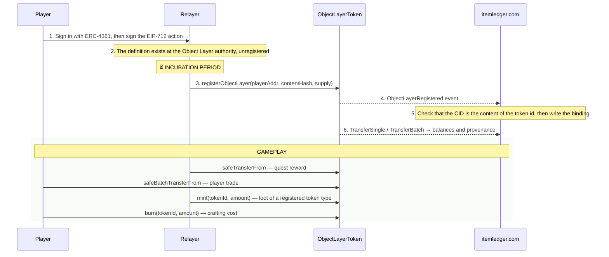

<p align="center">
  
</p>

<div align="center">

# ItemLedger

### Ownership and Object Layer Integration

**Version:** 3.4.5 Draft  
**Status:** Technical Proposal  
**Authors:** Underpost Engineering

</div>

---

## Abstract

**ItemLedger** is the registry that binds canonical Object Layers to on-chain token types, and
projects their ownership and provenance. **itemledger.com** is the domain that serves it. This
paper states how ItemLedger integrates the Object Layer, how a definition becomes an owned asset,
and the rules that keep identity and ownership apart.

ItemLedger is a service of the Cyberia runtime. Cyberia is the first runtime that owns assets
through it; it is not the definition of the ledger. ItemLedger consumes the canonical global
registry, the Object Layer, that the
[Object Layer Protocol White Paper](../../object-layer/explanation/white-paper.md) defines. One
`ObjectLayerToken` ERC-1155 contract carries every registered Object Layer as a token id above
zero, and CKY as token id 0. CKY belongs to CryptoKoyn, and the
[CryptoKoyn White Paper](../../cryptokoyn/explanation/white-paper.md) governs the contract powers.

---

## 1. Scope

ItemLedger governs:

- the registration of a canonical Object Layer as a token type;
- the binding of a CID to a chain, a contract and a token id;
- the projection of ownership, balances and provenance from the chain;
- the lifecycle of an asset: register, mint, transfer and burn;
- the registration-safety rule that protects a registered definition.

It does not govern:

| Subject                                                 | Owner                     |
| ------------------------------------------------------- | ------------------------- |
| Canonical schema, canonicalization and content identity | The Object Layer Protocol |
| CKY, token id 0, and the contract powers                | CryptoKoyn                |
| Item labels, game content and progress                  | Cyberia                   |

---

## 2. Principles

1. **The CID is the object.** A token type represents exactly one canonical Object Layer, named by
   its CID.
2. **The token id is the content.** `tokenId = uint256(contentHash)`. No label, owner, contract or
   chain takes part.
3. **The chain holds ownership.** Balances and transfers are chain state. The ItemLedger
   collections are a projection of it.
4. **Ownership never enters the object.** A registration, a balance or a transfer never changes
   the canonical bytes of a definition, or its CID.
5. **A label is not an identity.** Two definitions that share a label register as two token types.
6. **A registered definition stays.** No operation removes a definition that a token type names.
7. **Registration is a separate act.** An Object Layer exists whether or not ItemLedger registers
   it. An empty registry is a valid state.

---

## 3. Object Layer Integration

### 3.1 The Split

The Object Layer defines what an object is. ItemLedger records who owns it.

| The Object Layer owns                  | ItemLedger owns                                     |
| -------------------------------------- | --------------------------------------------------- |
| The canonical definition               | The registration of a definition as a token type    |
| Canonicalization                       | The binding of a CID to a chain, contract and token |
| The content hash and the CID           | Ownership and balance projections                   |
| Storage and resolution of a definition | Provenance and discovery of the registered assets   |

ItemLedger reads a definition by its CID at the Object Layer authority, read only. It never
writes an Object Layer, and it never mirrors the Object Layer database.

### 3.2 The Binding

One binding names one asset:

```json
{
  "objectLayerCid": "bafkrei…",
  "chainId": 777771,
  "contractAddress": "0x…",
  "tokenId": "9713…"
}
```

- `chainId + contractAddress + tokenId` is the fully qualified on-chain asset identity.
- `objectLayerCid` is the definition the token type represents.
- A definition binds at most once per contract.

The binding is an integration record. It is not part of the canonical definition.
[Registration and ownership](registration-and-ownership.md) holds the full record.

### 3.3 Token Id Derivation

```text
contentHash = sha2-256(canonical Object Layer bytes)
tokenId     = uint256(contentHash)
```

The token id is the digest that the CID carries, so each one gives the other back. Token id `0`
is CKY. It is outside the registry, and the contract refuses a zero content hash.

### 3.4 Registration Safety

A token type names content that must stay resolvable. So every operation that removes a
definition asks ItemLedger first:

- A registered definition is never purged and never deleted.
- When ItemLedger does not answer, the operation fails closed with status 503. No definition is
  removed while its registration is unknown.
- The contract has no metadata update function: the token id is the content.

---

## 4. Ownership

### 4.1 Token Classification

| Token type               | Token id                                      | Supply    | Example                     |
| ------------------------ | --------------------------------------------- | --------- | --------------------------- |
| Semi-fungible resource   | `uint256(contentHash of gold-ore)`            | 1,000,000 | Stackable crafting material |
| Semi-fungible consumable | `uint256(contentHash of health-potion)`       | 100,000   | Stackable consumable        |
| Non-fungible unique gear | `uint256(contentHash of legendary-hatchet)`   | 1         | Unique weapon               |
| Non-fungible skin        | `uint256(contentHash of cyber-punk-skin-001)` | 1         | Unique character skin       |

The supply of a token type follows the design of the runtime that registers it.

### 4.2 Projection

Ownership is chain state. The indexer projects the contract events into three collections, so a
reader never calls `balanceOf` per request:

| Collection             | Holds                                           |
| ---------------------- | ----------------------------------------------- |
| `ItemLedgerTransfer`   | Provenance: every transfer leg of a token type  |
| `ItemLedgerBalance`    | What one address holds of one token type        |
| `ItemLedgerCheckpoint` | The last block fully projected for one contract |

The projection is idempotent, restartable, finality aware and reconcilable against the chain.
[Registration and ownership](registration-and-ownership.md) states each property.

### 4.3 Holdings of an Address

The holdings of a player come from the address and the chain alone:

1. **Items:** `balanceOf(address, tokenId)` for each registered token id.
2. **Meaning:** each token id resolves to its Object Layer through its CID.
3. **Currency:** `balanceOf(address, 0)` is CKY, and CryptoKoyn serves it.

---

## 5. Lifecycle

### 5.1 Register → Mint → Transfer → Burn



`mint` accepts only CKY and registered token ids. `registerObjectLayer` and `mint` are contract
powers of the governance address.

### 5.2 Incubation

An item earned in play waits a variable incubation period before it is registered on chain.
Incubation prevents an instant sell-off of new items, rewards sustained play, and separates
off-chain farming from on-chain ownership.

| State          | Binding           | Description                                               |
| -------------- | ----------------- | --------------------------------------------------------- |
| **Off-chain**  | none              | Earned in play, not registered                            |
| **Incubating** | none              | Waiting for the incubation period and an optional CKY fee |
| **On-chain**   | `ERC1155` binding | Registered, and indexed by itemledger.com                 |

The period grows with rarity: short for a common resource, long for a unique weapon or skin.

### 5.3 Crafting, Trading and the Minting Fee

- **Crafting:** the relayer burns the consumed resource tokens and mints the crafted item token.
- **Trading:** `safeBatchTransferFrom` moves several token types in one atomic trade.
- **Minting fee:** a player pays CKY to bring an off-chain item on chain. CryptoKoyn prices it.

Each player act is one EIP-712 signature: `ItemTransfer`, `CraftIntent` or `MarketOrder`.

---

## 6. Service for the Cyberia Runtime

Cyberia consumes ItemLedger. ItemLedger computes no combat, no inventory rule and no progress.

```text
Cyberia label ── item catalog ──► Object Layer CID ── uint256(contentHash) ──► token id ── chain ──► balance
```

- The Cyberia item catalog binds each label to one CID. A quest or an action pins the CID it
  means, so a rebound label never changes pinned content.
- The boot wire carries each definition with its binding. An unregistered definition plays: play
  never waits on the ledger.
- Item ownership is chain state. Quest progress, the coin balance and equipment activation stay
  Cyberia state.
- A chain outage stops transfers. It does not stop play.

---

## 7. Security and Integrity

- **Identity check:** the indexer writes a binding only when the CID of the event is the content
  of its token id.
- **Immutability:** a registered definition has no metadata update and is never removed.
- **Fail closed:** a removal stops when ItemLedger does not answer.
- **Access control:** `Ownable` limits register and mint to the governance address.
- **Circuit breaker:** `pause()` freezes every transfer. The CryptoKoyn constitution governs it.
- **Trust:** a CID proves the integrity of content, not its trust. A reader decides which
  registries and issuers it trusts.

---

## 8. Current State

Pre-Alpha. The registration path, the projections and the contract are written and tested. No
public network holds a deployment, and Open Alpha registers no asset. Phase 3 of the
[roadmap](../../cyberia/explanation/roadmap.md) opens on-chain ownership.

---

## 9. Future Directions

- **Several ledgers:** more than one binding for the same Object Layer, on independent chains.
- **Mainnet bridge:** move registered token types to Ethereum mainnet or an L2.
- **Marketplace and search:** discovery and exchange of registered assets on itemledger.com.
- **Cross-runtime ownership:** an asset registered once, owned in every runtime that consumes the
  Object Layer.

---

_© Underpost Engineering. All rights reserved._
