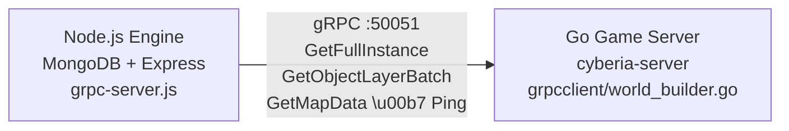
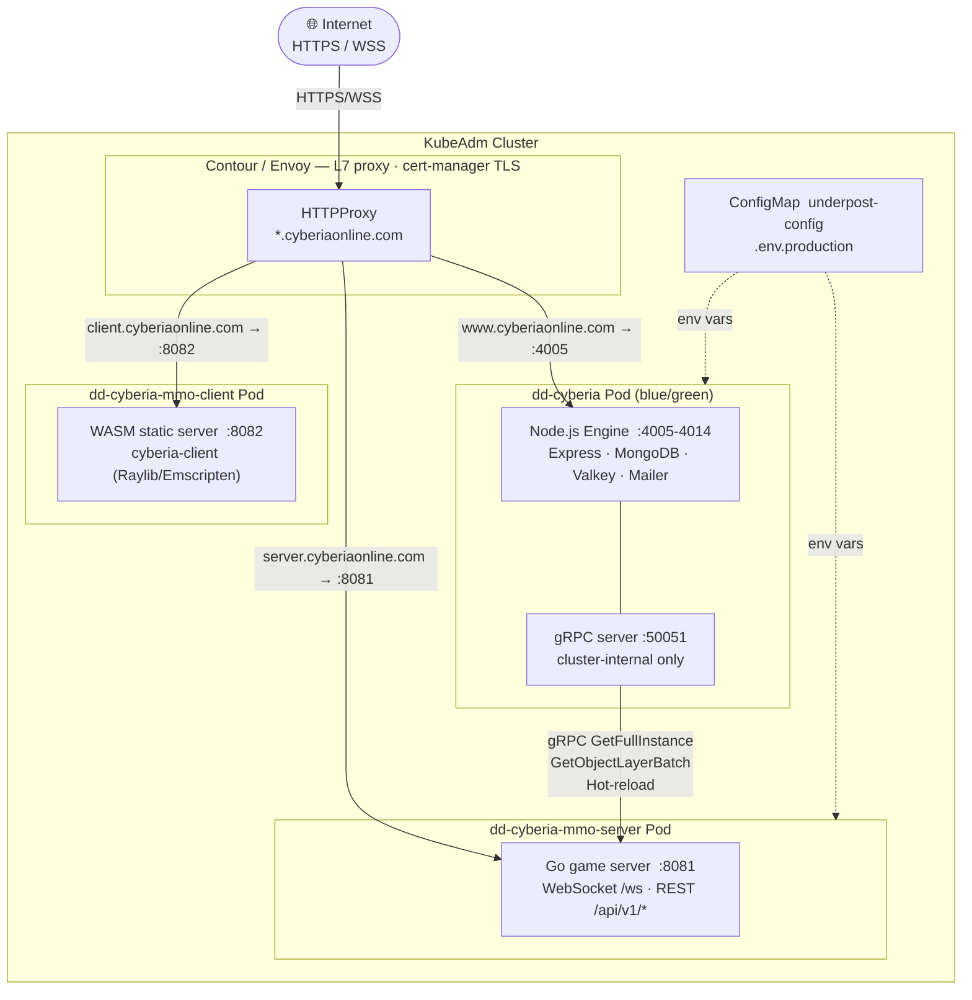

# Cyberia gRPC Data Pipeline

Internal gRPC server that exposes read-only RPCs over MongoDB data for the Go game server (`cyberia-server`).

## Architecture



## Data Flow

```
MongoDB (CyberiaInstance + CyberiaMap + ObjectLayer)
  │
  ▼
Node.js Engine (grpc-server.js)
  │  getFullInstance → instance graph + maps + entities + objectLayers + InstanceConfig
  │  getObjectLayerBatch → stream all ObjectLayers
  │  getObjectLayerManifest → itemId + sha256 pairs (for hot-reload diffing)
  │  ping → liveness check
  ▼
Go Game Server (world_builder.go → instance_loader.go → server.go)
  │  ApplyInstanceConfig → sets all game parameters from gRPC
  │  BuildWorldFromInstance → builds maps, entities, portals from gRPC data
  │  ReplaceObjectLayerCache → caches ObjectLayer metadata
  ▼
C/WASM Client (WebSocket binary AOI protocol)
  │  init_data → game config, player state, grid dimensions
  │  metadata → ObjectLayer cache (delivered once after connect)
  │  aoi_update → binary-encoded entity positions, directions, modes, colors, item stacks
```

### Fallback Instance

When `getFullInstance` is called with an instance code that does not exist in MongoDB, the Engine returns a **minimal playable fallback** instead of `NOT_FOUND`:

- 1 empty map (64×64 floor grid, no obstacles, no bots, no portals)
- No ObjectLayers, no AtlasSpriteSheets
- `buildFallbackConfig()` provides playable defaults (speed, life, AOI, etc.)
- Players are rendered as solid colored rectangles using the `PLAYER` color from the instance's color palette (no sprites needed)

The Go server **always** requires gRPC — if the Engine is unreachable it exits with a fatal error. The fallback is purely Engine-side: `getFullInstance` with an unknown code returns a synthetic response, not `NOT_FOUND`.

### Skill System: itemId → logicEventIds

The skill pipeline maps trigger item IDs to ordered lists of logic handler keys:

```
CyberiaInstanceConf.skillConfig[] (MongoDB)
  ├─ triggerItemId:  "atlas_pistol_mk2"        ← item in player's active object layer
  └─ logicEventIds: ["atlas_pistol_mk2_logic"] ← ordered handler keys executed in sequence

CyberiaInstanceConf.skillRules (MongoDB) → SkillRules proto message → GameServer fields
  ├─ bulletSpawnChance / bulletLifetimeMs / bulletWidth / bulletHeight / bulletSpeedMultiplier
  └─ doppelgangerSpawnChance / doppelgangerLifetimeMs / doppelgangerSpawnRadius / doppelgangerInitialLifeFraction

Go runtime:
  1. Player performs action
  2. Iterate active object layers → s.skillConfig[layer.ItemID] → []SkillDefinition
  3. For each SkillDefinition, iterate LogicEventIDs in order:
       "doppelganger"          → executePlayerDoppelgangerSkill()
       "atlas_pistol_mk2_logic" → executePlayerBulletSkill()  (bullet item ID is internal to the handler)
```

Spawning new entities (e.g. bullets) is handled entirely inside the logic handler — no `spawnedItemIds` config is needed.

## Configuration

Add `grpc` to the host conf in `conf.dd-cyberia.js`:

```js
'www.cyberiaonline.com': {
  '/': {
    db: { provider: 'mongoose', host: 'env:DB_HOST', name: 'env:DB_NAME_CYBERIA' },
    grpc: { port: 50051 },
    // ...
  },
},
```

The gRPC server starts automatically after `DataBaseProvider.load()` when the `grpc` key is present.

### mTLS (optional)

For production environments with network-separated services:

```js
grpc: {
  port: 50051,
  tls: {
    caPath: '/path/to/ca.pem',
    certPath: '/path/to/server-cert.pem',
    keyPath: '/path/to/server-key.pem',
  },
},
```

The Go client (`cyberia-server/src/grpcclient/client.go`) supports the same mTLS config via `CACertPath`, `ClientCertPath`, `ClientKeyPath`.

## Auth

No application-level auth is required. This is a **private cluster-internal** channel:

- Both services run on the same host or within a trusted network
- The Go server is the only consumer — it dials `localhost:50051` by default
- mTLS provides mutual authentication when services are network-separated
- No user credentials or tokens flow over this channel — it's a data relay, not a user-facing API

## Proto

Service definition: [`cyberia-server/proto/cyberia.proto`](../../../cyberia-server/proto/cyberia.proto)

After editing the proto, regenerate Go code:

```sh
cd cyberia-server
export PATH=$PATH:$(go env GOPATH)/bin
protoc --go_out=. --go_opt=paths=source_relative \
       --go-grpc_out=. --go-grpc_opt=paths=source_relative \
       proto/cyberia.proto
```

## Runtime Modes

The gRPC server starts in **all** engine runtime modes that load `conf.server.json`:

| npm script               | NODE_ENV    | gRPC starts? | Notes                               |
| ------------------------ | ----------- | ------------ | ----------------------------------- |
| `npm start`              | _(none)_    | Yes          | Production entry point              |
| `npm run dev`            | development | Yes          | Nodemon auto-restart                |
| `npm run dev:container`  | development | Yes          | Docker development                  |
| `npm run prod:container` | production  | Yes          | Docker production                   |
| `npm run dev:api`        | development | **No**       | API-only mode, no Express lifecycle |

## Environment Variables

### Engine (Node.js) — set in `.env` or `conf.dd-cyberia.js`

| Variable          | Description           |
| ----------------- | --------------------- |
| `DB_HOST`         | MongoDB host          |
| `DB_NAME_CYBERIA` | MongoDB database name |
| `VALKEY_HOST`     | Valkey (Redis) host   |
| `VALKEY_PORT`     | Valkey port           |

### Go Server — set in `.env` or environment

| Variable                          | Default           | Description                                        |
| --------------------------------- | ----------------- | -------------------------------------------------- |
| `ENGINE_GRPC_ADDRESS`             | `localhost:50051` | Engine gRPC server address — **required**          |
| `INSTANCE_CODE`                   | `default`         | Instance code to load on startup                   |
| `ENGINE_API_BASE_URL`             | _(empty)_         | Engine HTTP base URL (forwarded to clients)        |
| `ENGINE_GRPC_RELOAD_INTERVAL_SEC` | _(disabled)_      | ObjectLayer hot-reload polling interval in seconds |
| `SERVER_PORT`                     | `8081`            | HTTP/WS server listen port                         |
| `STATIC_DIR`                      | `./public`        | Directory for static WASM client files             |
| `ENGINE_GRPC_CA_CERT`             | _(empty)_         | CA certificate for mTLS                            |
| `ENGINE_GRPC_CLIENT_CERT`         | _(empty)_         | Client certificate for mTLS                        |
| `ENGINE_GRPC_CLIENT_KEY`          | _(empty)_         | Client private key for mTLS                        |

### C/WASM Client — compile-time constants in `src/config.h`

| Constant        | Development              | Production                          |
| --------------- | ------------------------ | ----------------------------------- |
| `WS_URL`        | `ws://localhost:8081/ws` | `wss://server.cyberiaonline.com/ws` |
| `API_BASE_URL`  | `http://localhost:4005`  | `https://www.cyberiaonline.com`     |
| `GHOST_ITEM_ID` | `ghost`                  | `ghost`                             |

## Development

Run all three components locally in separate terminals:

```sh
# Terminal 1: Engine (Node.js — Express + MongoDB + gRPC :50051)
cd /home/dd/engine
npm run dev

# Terminal 2: Go game server (WS :8081 + REST /api/v1/*)
cd /home/dd/engine/cyberia-server
cat > .env << 'EOF'
ENGINE_GRPC_ADDRESS=localhost:50051
INSTANCE_CODE=cyberia-main
ENGINE_API_BASE_URL=http://localhost:4005
SERVER_PORT=8081
EOF
go run main.go

# Terminal 3: C/WASM client (static :8082)
cd /home/dd/engine/cyberia-client
# Edit src/config.h:
#   WS_URL = "ws://localhost:8081/ws"
#   API_BASE_URL = "http://localhost:4005"
source ~/.emsdk/emsdk_env.sh
make -f Web.mk clean && make -f Web.mk web
make -f Web.mk serve-development   # http://localhost:8082
```

### Startup order

```
1. Engine (npm run dev)       → gRPC server listens on :50051
2. Go server (go run main.go) → dials :50051, loads instance, WS on :8081
3. C client (serve-development) → opens browser, connects WS to :8081
```

If `INSTANCE_CODE` doesn't match a database record, the Engine returns a minimal fallback instance — the Go server starts normally. If the Engine is not running, the Go server exits (gRPC is required).

### Dev ports summary

| Component      | Port  | Protocol  |
| -------------- | ----- | --------- |
| Engine Express | 4005+ | HTTP      |
| Engine gRPC    | 50051 | gRPC      |
| Go server      | 8081  | HTTP + WS |
| C client       | 8082  | HTTP      |

## Production

### Kubernetes deployment order

```
1. Engine (dd-cyberia)      ← Express :4005-4014, gRPC :50051 (cluster-internal)
2. Go server (mmo-server)   ← ENGINE_GRPC_ADDRESS=<engine-clusterIP>:50051
3. C client (mmo-client)    ← static WASM files served on :8082
```

### C client production build

```sh
cd /home/dd/engine/cyberia-client
# Ensure src/config.h has production URLs:
#   WS_URL = "wss://server.cyberiaonline.com/ws"
#   API_BASE_URL = "https://www.cyberiaonline.com"
source ~/.emsdk/emsdk_env.sh
make -f Web.mk clean && make -f Web.mk web BUILD_MODE=RELEASE
make -f Web.mk serve-production   # http://localhost:8082
```

### Go server with embedded client

The Go server can serve the WASM client directly via `STATIC_DIR`:

```sh
# Copy WASM build output to Go server's public dir
cp -r cyberia-client/bin/web/release/* cyberia-server/public/

# Go server serves both WS and static files on :8081
STATIC_DIR=./public go run main.go
```

In Kubernetes, each runs in its own pod behind Contour/Envoy:

```
Contour/Envoy (L7 proxy, TLS termination via cert-manager)
  ├─ www.cyberiaonline.com    → Engine pods (:4005)
│  server.cyberiaonline.com → Go server pod (:8081)  ← WS + REST
│  client.cyberiaonline.com → Client pod (:8082)     ← WASM static
```

Port 50051 (gRPC) is **not** exposed via Contour — it is cluster-internal only.

### TLS

- **External**: cert-manager + LetsEncrypt (ACME HTTP-01) for `*.cyberiaonline.com`
- **Internal gRPC**: No TLS needed for same-cluster. mTLS only if cross-cluster.

### Hot-reload

When `ENGINE_GRPC_RELOAD_INTERVAL_SEC` is set, the Go server periodically:

1. Pings the Engine for liveness
2. Fetches ObjectLayer manifest (itemId + sha256 pairs)
3. Diffs against local cache
4. Re-fetches only changed/new ObjectLayers
5. Removes deleted ObjectLayers

## CD Workflows

All three repos use `workflow_dispatch` for manual triggers + commit-message triggers:

| Repo             | Trigger                              | Job                           |
| ---------------- | ------------------------------------ | ----------------------------- |
| `engine`         | `cd(ssh-engine-cyberia)` or dispatch | deploy, sync-and-deploy, init |
| `cyberia-server` | `cd(ssh-cyberia-server)` or dispatch | deploy                        |
| `cyberia-client` | `cd(ssh-cyberia-client)` or dispatch | deploy                        |

## KubeAdm Cluster Topology


